# 学习目标

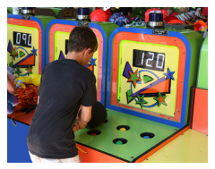

如图3-1所示的“打地鼠”应用将实现以下功能：

* 一只地鼠随机出现在屏幕上，每秒钟移动一次；
* 如果手指触碰到地鼠，则让设备震动，显示的命中数加1，地鼠随机移动到一个新位置；
* 如果手指直接触摸到屏幕但没点击中地鼠，则显示失败数加1；
* 点击“重新开始”按钮，游戏重新开始，命中和失败的计数归零。

# 学习内容

本章内容覆盖了以下的组件及概念：

* ImageSprite组件：具有触感的可移动图像；
* Canvas组件：容纳ImageSprite的平台；
* Clock组件：用来计时，让sprite随即移动；
* Sound组件：击中地鼠时产生震动；
* Button组件：开始新游戏；
* Procedures：用来实现一系列的指令，可以重复调用，如移动地鼠；
* 产生随机数；
* 使用加法块（+）及减法块（-）。

# 准备开始

登陆App Inventor网站，开始新项目“MoleMash ”，将屏幕标题（title）设为“打地鼠”，并连接到测试设备。 下载地鼠图片mole.png。下载方法：控制键+单击（Mac）或单击右键（Windows）并选择“图片另存为”或类似选项。下载成功后，在设计器组件列表下方的Media部分，单击“Upload file…”，找到刚下载的文件mole.png并上传到App Inventor中。

# 设计组件

创建“打地鼠”游戏需要以下组件：

* Canvas组件：用来限定游戏中地鼠的活动区域；
* ImageSprite组件：用来显示地鼠图片，随机移动，并具有触感；
* Sound组件：当地鼠被触摸到时，发出震动；
* Label组件：用来显示“命中： ”、“失败： ”以及命中、失败的次数；
* HorizontalArrangements组件：用来放置Label组件，使组件的布局合理；
* Button组件：用来将命中及失败次数归零（重新开始游戏）；
* Clock组件：使地鼠每秒钟随机移动一次。
  表3-1显示了应用中用到的全部组件。

表3- 1 “打地鼠”应用中的全部组件列表

| 组件类型 | 组件种类 | 命名 | 作用 |
| :--- | :--- | :--- | :--- |
| Canvas | Drawing and Animation | Canvas1 | ImageSprite的容器 |
|  | ImageSprite | Drawing and Animation | Mole    用户点击的目标 |
| Button | User Interface | ResetButton | 重新设置得分 |
| Clock | User Interface | Clock1 | 控制地鼠的移动频率 |
| Sound | Media | Sound1 | 当地鼠被击中时震动 |
| Label | User Interface | HitsLabel | 显示文字“击中： ” |
| Label | User Interface | HitsCountLabel | 显示击中次数 |
| HorizontalArrangement | Layout | HorizontalArrangement1 | 放置HitsLabel及HitsCountLabel |
| Label | User Interface | MissesLabel | 显示文字“失败： ” |
| Label | User Interface | MissesCountLabel | 显示失败次数 |
| HorizontalArrangement | Layout | HorizontalArrangement2 | 放置MissesLabel及MissesCountLabel |

# 设置活动组件

本节将设置游戏中所需的活动组件，下节再来设置显示分数的组件。

* 找到Palette-&gt;Drawing and Animation-&gt;Canvas组件，拖入预览窗口，采用其默认名称Canvas1，设置Width属性为“Fill parent”，即与屏幕等宽，设置Height属性为300像素；
* 找到Palette-&gt;Drawing and Animation-&gt;ImageSprite，将ImageSprite组件拖入到Canvas1中的任何位置，在组件列表底部单击rename，改名为“Mole”，设置其Picture属性为之前上传的mole.png；
* 找到Palette-&gt;User Interface-&gt;Button，拖动Button组件放在Canvas1下面，改名为“ResetButton”，并设置其Text属性为“重新开始”；
* 找到Palette-&gt;User Interface-&gt;Clock，拖入Clock组件，它将落在预览窗口下方的“非可是组件”区域；
* 找到Palette-&gt;Media-&gt;Sound，拖入Sound组件，它也将落在“非可视组件”区域。
* 现在组件设计器看起来应该如图3-2（地鼠的位置有可能不同）。

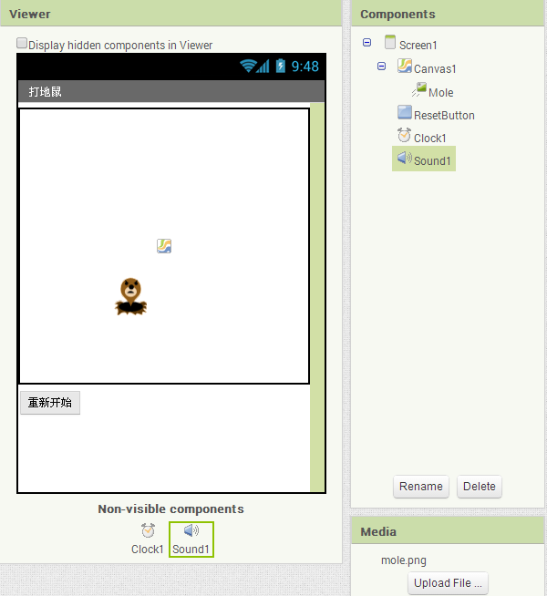

图3-2 组件设计器视图中的所有“活动”组件

# 布置Label组件

现在设置显示用户得分的组件，即，显示命中与失败次数的组件。

1. 找到Palette-&gt;Layout-&gt;HorizontalArrangement，拖动组件放在“重新启动”按钮的下方，保留HorizontalArrangement1的默认名称；
2. 从Palette-&gt;User Interface中拖动两个Label组件到HorizontalArrangement1中；
   * 将左侧Label改名为HitsLabel，设置其Text属性为“命中： ”（确保冒号后有一个空格）；
   * 将右侧Label改名为HitsCountLabel，设置其Text属性为“0”；
3. 拖入第二个HorizontalArrangement，将其放在HorizontalArrangement1下面；
4. 将两个Label拖放在HorizontalArrangement2中；
   * 左侧Label改名为MissesLabel，设置其Text属性为“失败： ”（确保冒号后有一个空格）；
   * 右侧Label改名为MissesCountLabel，设置其Text属性为“0”。

你的屏幕看起来如图3-3。

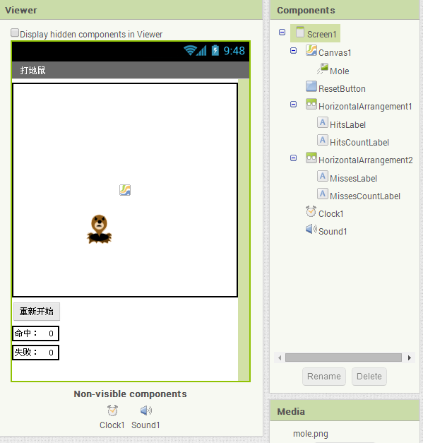

图3-3 组件设计器视图中“打地鼠”应用的所有组件  
为组件添加行为

组件已经创建完成，下面切换到块编辑器来实现程序的行为。设置的目标：①让地鼠每秒钟在Canvas1上随机移动一次；②用户拍打这只随机移动的地鼠，应用显示用户命中或失败的次数（注：建议用手指而不是木槌拍打！）；按下“重新启动”按钮命中及失败次数归零。

# 移动地鼠

在迄今为止完成的应用中，曾经调用过内置过程 ，如HelloPurr中的Sound1.Vibrate（震动）。假如App Inventor中有一个内置过程，可以将ImageSprite移动到屏幕上的某个随机位置，那岂不是很好？可惜没有，不过我们可以自己来创建过程！就像内置过程一样，自己创建的过程会显示在Procedures抽屉中，需要时可以随时调用它。 具体来说，创建一个名为MoveMole的过程，让地鼠在屏幕上移动到某个随机位置。游戏开始时调用一次MoveMole过程，当用户成功地点击到地鼠后，每秒钟执行一次该过程。

# 创建MoveMole过程

要理解地鼠如何移动，需要了解Android的图形定位机制。Canvas（以及Screen）可以看作是由x（水平）坐标和y（垂直）坐标织成的网格，其左上角的（x,y）坐标为（0,0）。 x坐标向右为增大， y坐标向下为增大，如图3-4所示。一个ImageSprite的x、y属性表示它左上角的位置，因此当地鼠位于屏幕左上角时，他的x和y值都是0。

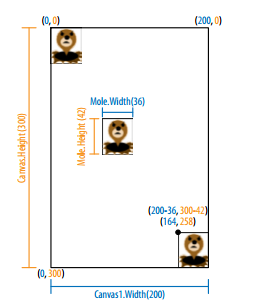

图3-4 屏幕上Mole的位置——坐标、高度和宽度信息，x坐标及宽度以蓝色表示，y坐标和高度以橙色表示  
为了将地鼠的移动限制在屏幕之内，要确定x和y的最大值，这要用到地鼠Mole和画布Canvas1的Width（宽度）及Height（高度）属性。（地鼠的Width和Height属性值与上传的图片的大小相同，而在创建Canvas1时，你设置的高度是300像素，宽度为“Fill parent”，即等于它的“父”容器——屏幕的宽度。）如果地鼠图片的宽度是36像素，画布宽度是200像素，那么Mole的x坐标最低可以为0（靠近屏幕左侧边缘），而最大为164（200 – 36，或Canvas1.Width – Mole.Width），这样才能保证Mole不超出屏幕的右侧边缘。同样，Mole顶部的y坐标范围可从0到Canvas1.Height – Mole.Height。  
图3-5显示了创建的MoveMole过程，图中标有详细注释（可以有选择地添加到过程中）。 为了随机地放置Mole，x坐标要在0到Canvas1.Width – Mole.Width的范围内选择，同样，y坐标要在0到Canvas1.Height – Mole.Height的范围内。使用Math抽屉里的内置过程random integer生成一个随机整数，将“from”参数从改默的1改为0，同样修改“to”参数，如图3-5所示。

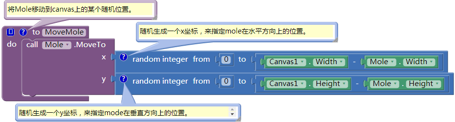

图3-5A MoveMole过程，用于将Mole放在一个随机的位置上  
按如下步骤创建过程：

1. 找到Procedures：单击块编辑器中的Procedures抽屉；
2. 得到to procedure：在Procedures抽屉中点击to procedure块（不带result的to procedure）；
3. 设置过程名称：单击块中的文字“procedure”并输入“MoveMole”；
4. 移动Mole：单击Mole抽屉，将call Mole.MoveTo块拖到procedure块中“do”的右侧；注意：我们还需要提供x和y的坐标；
5. 设定Mole的x坐标：如前所述，x坐标范围在0与Canvas1.Width – Mole.Width之间：
   * 点击Math抽屉；
   * 拖出random integer from块，将左侧插头（突起）插入call Mole.MoveTo块的“x”插槽；
   * 点选from之后的数字1并输入0；
   * 丢弃数字100：点击该块，再按键盘上的Del或Delete键，或直接拖入垃圾箱；
   * 点击Math抽屉，将一个减法块（-）拖入to插槽；
   * 点击Canvas1抽屉，向下滚动直到看见Canvas1.BackgroundColor ，将其拖入到减法块“-”的左侧，然后从BackgroundColor所在的下拉菜单中选择Width选项；
   * 同样，点击Mole抽屉并拖入Mole.Enabled块，然后从Enabled块所在的下拉菜单中选择Width选项，并将它插入到“-”右侧的插槽中；
6. 按类似步骤设定y坐标，应该是一个从0到Canvas1.Height – Mole.Height的随机整数；
7. 对图3-5A（行内输入）或3-5B（外展输入）检查操作结果。
8. random integer from to块的“external inputs”（外展输入）方式：右键点击random块，选择列表第三项external inputs；如果想恢复行内输入，右键点击random块，选择inline inputs。

图3-5B MoveMole过程，用于将Mole放在一个随机的位置上

# 在应用启动时调用MoveMole过程

已经完成了MoveMole过程，现在该调用它了。对于程序员来说，最熟悉的事情就是在应用启动的同时执行某些指令，块Screen1.Initialize就是专为这个目的而设计的：

1. 点击Screen1抽屉，并拖出Screen1.Initialize块；
2. 单击Procedures抽屉，你会看到一个call MoveMole块（这很有趣：你自己创建了一个新块，不是吗?!）。把它拖入Screen1.Initialize，如图3-6所示。

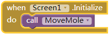

图3-6 在应用启动时调用MoveMole过程

# 每秒钟调用一次MoveMole过程

要让地鼠每一秒移动一次，需要用到Clock组件。设置Clock1的TimerInterval属性为其默认值1000（毫秒），即1秒，我们称每秒一次的计时为计时器的心跳。这意味着，在Clock1.Timer块中，无论设定什么动作，它都会随着计时器的心跳，每秒钟执行一次。以下是具体设置：

1. 单击Clock1抽屉，并拖出Clock1.Timer；
2. 单击Procedures抽屉，将call MoveMole块拖到Clock1.Timer块中，如图3-7所示。

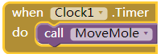

图3-7计时器开始计时后，每次心跳（每秒）都会调用一次MoveMole过程  
如果你觉得心跳得太快或太慢，可以在组件设计器中改变Clock1的TimerInterval属性，来增加或减小地鼠的移动频率。

# 记录成绩

刚才我们创建了两个Label：初始值为0的HitsCountsLabel和MissesCountsLabel，希望以此来记录用户的成绩：当用户命中Mole一次，或失败一次（直接拍打到屏幕）时，对应Label中的数字增加，为此要用到Canvas1.Touched块，它表示Canvas被触摸到，并记录了触摸点的x和y坐标（我们不必关心），以及是否碰到了sprite（这是我们关心的）。图3-8显示了即将创建的代码。

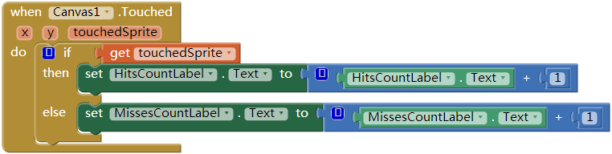

图3-8 触碰到Canvas1时，让命中（HitsCountLabel）或失败（MissesCountLabel）次数递增  
图3-8可以理解为：当触碰到canvas时，检查sprite是否也被碰到。应用中只有一个sprite，即Mole，如果碰到Mole，则HitsCountLabel.Text中的数字+1，否则，MissesCountLabel.Text中的数字+1（如果没碰到sprite，则touchedSprite的值为false ）。 下面介绍如何创建这些块：

1. 点击Canvas1抽屉，并拖出Canvas1.Touched；
2. 单击Control抽屉，拖出Ifelse块（先拖入if块，然后为其添加else块：点击if左边的蓝色方块，在弹出框中将else块拖入if块），并放入Canvas1.Touched块中；
3. 从Variables抽屉中拖出get块，放入ifelse的if插槽内，选择下拉菜单中的touchedSprite选项；或者将鼠标悬停在when Canvas.Touched块的参数touchedSprite上，从中获取get touchedSprite块；
4. 按照我们的设想，如果if检测成功（即Mole被触摸到），则HitsCountLabel.Text递增：
   * 从HitsCountLabel抽屉里拖出set HitsCountLabel.Text to块并放入“then”的右边；
   * 点击Math抽屉，拖出一个加号（+），将其放在“to”插槽中；
   * 点击HitsCountLabel抽屉，拖动HitsCountLabel.Text块到“+”的左边；
   * 点击Math抽屉，并拖动一个“0”块到“+”的右边，将0改为1 ；
5. 在ifelse块的“else”部分，对MissesCountLabel块重复步骤4。

测试：测试你的新代码：在设备上触摸Canvas，命中或错过地鼠，看看分数有什么变化。

# 过程抽象

计算机科学的重要手段之一，就是命名然后调用一组指令（如MoveMole），这种能力被称为过程抽象。之所以叫做“抽象”，是因为过程的调用者（在实际项目中，很有可能不是过程的开发者）只需要知道过程的功能（如移动地鼠），而不需要知道过程的实现方法（生成两个随机整数）。如果没有过程抽象，不可能实现那些大型程序，因为它们的代码量太大，对个人来说是力所不及的，这一点与现实世界中的劳动分工相类似。例如，不同的工程师设计出汽车的不同部件，没有人了解所有的细节，而司机只需要了解接口（例如，踩下制动踏板把车停下来），而无需了解如何实现这些接口。 与复制和粘贴代码相比，过程抽象的优势在于：

* 由于过程的代码独立于其它部分的程序，因此更易于对过程的测试；
* 如果代码中有错误，只需要对局部进行修改；
* 如果需要改变过程的实现 （或功能），如确保地鼠不连续出现在同一个位置，只需要修改一处的代码；
* 可以将过程汇集到一个程序库中，以便在不同的程序中使用。（遗憾的是App Inventor暂时不支持这项功能。）
* 将大块代码拆分成代码片段，有助于对应用做深入剖析，并加以实现（“分而治之”）。
* 给过程一个有意义的命名，将有助于提高代码的可读性，更易被别人（或一个月后的自己）读懂；
  在后面的章节中，还将学到过程更加强大的功能：添加参数，提供返回值，以及调用过程本身。有关内容请参见第21章。

# 重置分数

朋友看到你玩MoleMash，他可能也想试试身手，所以最好能让成绩归零。根据前面学过的内容，不经提示你也有能力把它做出来。阅读之前动脑筋试试看。 我们要在ResetButton.Click块中设置HitsCountLabel.Text和MissesCountLabel.Text的值为0。如图3-9所示。

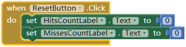

图3-9 按下Reset按钮让命中次数（HitsCountLabel）和失败次数（MissesCountLabel）归零  
此处提供一个技巧，来快速建立ResetButton.Click的事件处理程序：在工作区直接输入0并回车，将生成数字块0，等同于从Math抽屉中拖出。（这种输入方式对其他块也同样有效。）

测试：开始游戏，尝试多次命中及错过地鼠，然后按下“重新启动”按钮。

# 添加触摸地鼠行为

我们希望在触摸到地鼠时，设备能够振动，这要用到Sound1.Vibrate块。如图3-10所示。

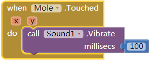

图3-10 碰到地鼠时让设备短暂振动（100毫秒）

测试：当你在设备上实际触摸到地鼠时，看看振动的效果如何。如果你觉得振动时间过长或过短，可以修改Sound1.Vibrate块的毫秒数。

# 完整的MoleMash应用

图3-11中描述了完整的MoleMash应用中所有的块。

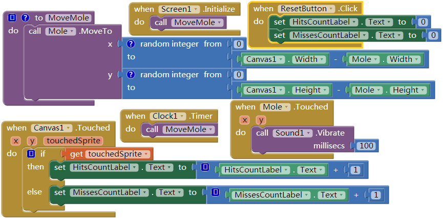

图3-11 完整的MoleMash应用

# 改进

对MoleMash应用还可以做如下补充：

* 添加按钮，让用户可以控制地鼠的移动速度；
* 添加一个Label，随时显示地鼠出现（或移动）的次数；
* 添加另一个ImageSprite，如一朵花的图片：用户不许碰到它，如果碰到将会受到惩罚，减少得分或结束游戏；
* 用ContactPicker组件从用户手机的电话簿中选择图片，来替代地鼠图片。

# 小结

本章介绍了一些非常有用的技巧，适用于普通应用，更适用于游戏：

* Canvas组件使用了直角坐标系，其中x表示水平方向（从左边的0到右边的Canvas.Width -1），y表示垂直方向（从顶部的0到底部的Canvas.Height -1）。从Canvas的高度和宽度中减去某个ImageSprite的高度和宽度，这个范围可以确保sprite在画布上完整地显示；
* 利用Canvas和ImageSprite组件的Touched方法 来实现对设备触感的应用；
* 创建实时交互应用：不仅可以对用户的操作做出实时响应，也可以对设备内部的计时器做出响应。具体地说，Clock.Interval属性用于设定计时器的心跳频率，这个频率也可以用于控制ImageSprite （或其它）组件的移动；
* Label可用于显示得分，根据玩家的操作结果，得分会相应升高（或下降）；
* 通过Sound.Vibrate方法对用户的触摸事件进行反馈，让设备震动一定的毫秒数；
* 不仅可以调用内置过程，也可以通过给一组块设定名称（MoveMole），来创建自己的过程，这些过程也可以像内置过程一样被调用，这就是所谓的过程抽象，在计算机科学中这是一个非常重要的思想，可以实现代码的复用 ，也使得创建复杂应用成为可能；
* 利用Math抽屉中的random integer（随机整数）块，可以产生不可预知行为，让游戏每次开始时都有所不同。
  在第5章（瓢虫快跑）中，将了解更多的游戏制作技巧，包括移动中的ImageSprite组件之间的碰撞检测。

# 附录

# 术语解释

procedure：译为过程、步骤、程序，在早期面向过程的编程语言中，也被称作子程序。它是一段由单行或多行语句组成的代码片段，被包装成一个有名称的单元，相对独立，用于完成某种特定功能。当主程序中需要实现该功能时，就会引用它的名称来实现对它的调用。本书中译为“过程”。 false：中文译为“假”，与true（真）相反，是布尔（Boolean）类型变量的值。 Boolean：译为“布尔数学体系的”，是一个形容词，是为了纪念数学家布尔的伟大贡献。与这个词相关的短语还有boolean algebra\(布尔代数\)、boolean operation\(布尔运算\)、boolean value\(布尔值\)等等。其中计算机软件中使用Boolean表示一种变量类型：布尔型变量，这种变量只有两个值：true\(真\)与false\(假\)。

# 背景知识

George Boole：中文译为“乔治·布尔”，是19世纪一位自学成才的爱尔兰数学家，他创立了布尔代数\(boolean algebra\)。布尔代数用于解决集合运算及逻辑运算问题，是当代计算机硬件设计的理论基础。在软件领域中，逻辑运算\(and,or,not\)是程序编写过程中的关键环节，在App Inventor中具体体现为“if”块，它根据逻辑运算的结果\(true、false\)来决定下一步程序的走向。此外，在“while”块中也用到了逻辑运算。 TI 99/4：由美国德州仪器生产的一款早期的家用电脑，发布于1979年11月，价值$1,150，CPU为TI TMS9900，主频3MHz，16K内存，26K只读存储器，192×256、16色、13英寸监视器，内置TI BASIC语言。（引自[http://oldcomputers.net，顺便说一句，这是一个很有趣的网站！）](http://oldcomputers.net，顺便说一句，这是一个很有趣的网站！）)

中英文对照

George Boole：中文译为“乔治·布尔”，是19世纪一位自学成才的爱尔兰数学家，他创立了布尔代数\(boolean algebra\)。布尔代数用于解决集合运算及逻辑运算问题，是当代计算机硬件设计的理论基础。在软件领域中，逻辑运算\(and,or,not\)是程序编写过程中的关键环节，在App Inventor中具体体现为“if”块，它根据逻辑运算的结果\(true、false\)来决定下一步程序的走向。此外，在“while”块中也用到了逻辑运算。 TI 99/4：由美国德州仪器生产的一款早期的家用电脑，发布于1979年11月，价值$1,150，CPU为TI TMS9900，主频3MHz，16K内存，26K只读存储器，192×256、16色、13英寸监视器，内置TI BASIC语言。（引自[http://oldcomputers.net，顺便说一句，这是一个很有趣的网站！）](http://oldcomputers.net，顺便说一句，这是一个很有趣的网站！）)

# 中英文对照

* button:按钮
* clock:时钟
* control:控制
* count:计数
* false:假
* fill:充满
* hit:击打 命中
* if:如果
* integer:整数
* interface:界面
* interval:间隔
* label:标签
* mash:捣碎
* miss:错过
* media:媒体
* mole:鼹鼠
* procedure:过程
* parent:双亲
* random:随机
* sound:声音
* text:文字
* sprite:精灵
* true:真
* user:用户
* vibrate:震动

# 资源下载

mole.png

