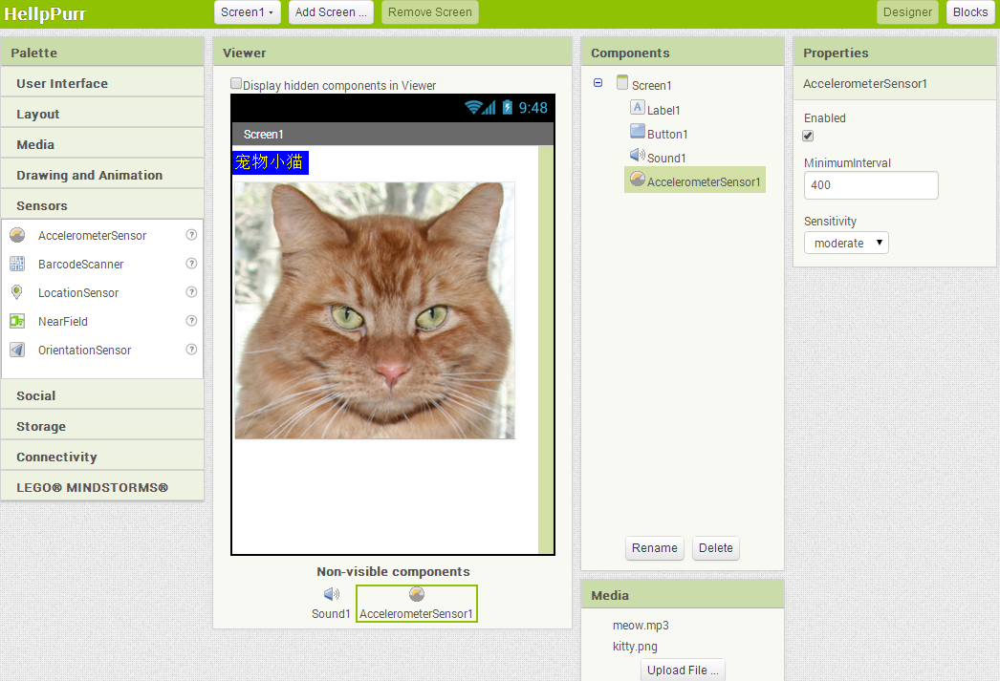
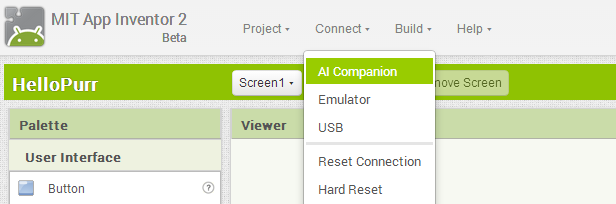
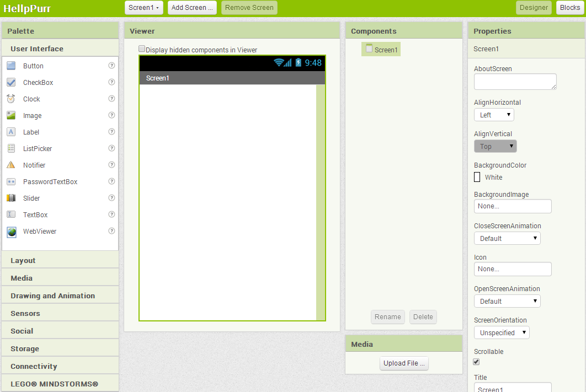
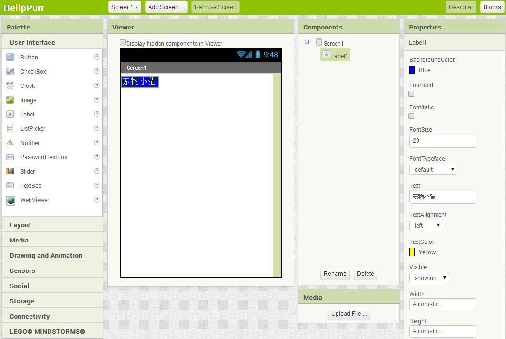
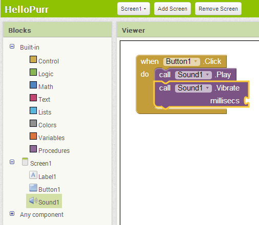
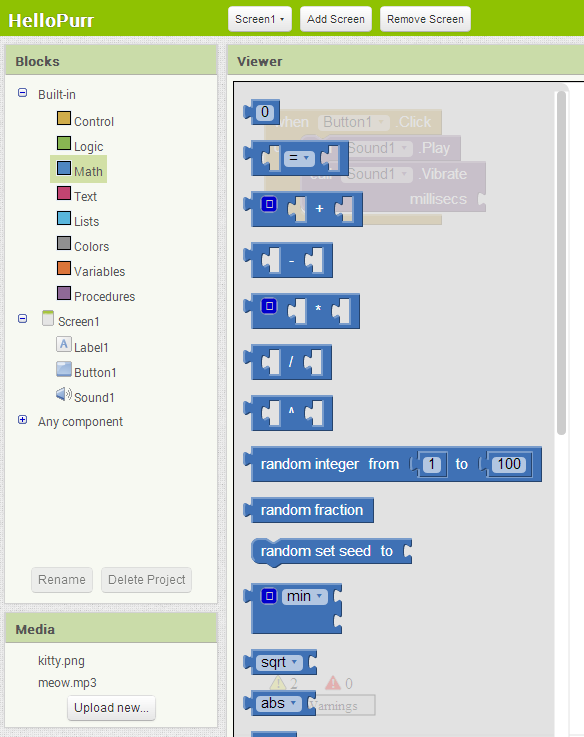
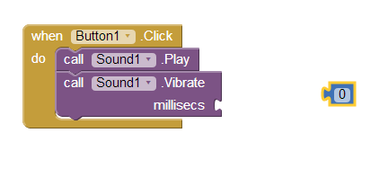
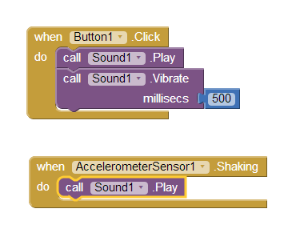

本章将开启你的创建应用之旅。这里介绍了App Inventor的关键要素——组件设计器及块编辑器，并手把手地引导读者创建第一个应用：HelloPurr。在完成本章的学习之后，就可以开始创建自己的应用了。

图1-1 HelloPurr应用
每当搭建了新的开发环境，通常运行的第一个程序就是显示“Hello World”，来证明系统已经就绪。这个传统可以追溯到20世纪70年代，从Brian Kernighan 在贝尔实验室使用C语言开始（Brian现在是谷歌App Inventor团队的访问学者！）。使用App Inventor，即便是创建最简单的应用，也可以实现声音的播放以及对屏幕触摸的响应，而不只是显示文字。想想都令人感到兴奋，那么，让我们马上开始吧。第一个应用是“HelloPurr”（如图1-1），当你触摸这只猫时，它会发出“喵呜”声；当你摇晃它时，则将发出嘟嘟的震颤。
# 学习要点

本章用到了以下组件和概念：

* 选择组件来创建应用：决定了应用 的外观；
* 为组件设定行为：做什么以及何时做；
* 使用组件设计器选择组件，在Android设备上，有些组件可以显示，有些则不可见；
* 从本地计算机加载媒体文件（声音或图像），并添加到应用中；
* 用块编辑器来组装程序块，以此来设定组件行为；
* 用App Inventor的实时测试功能对应用进行测试。你可以一边创建应用，一边在手机上看到它们外观以及运行情况；
* 将应用打包并下载到Android设备上。
# App Inventor的开发环境

App Inventor的编程环境包括以下三个重要组成部分，如图1-2所示：

* 如图1-2A所示，组件设计器运行在浏览器中，创建应用过程中，用它来进行组件的选择，并进行属性设置；
* 如图1-2B所示，像组件设计器一样，块编辑器也在浏览器中运行，用于创建组件的行为；
* 测试设备：在开发应用过程中，可以用Android设备对应用进行同步的运行与测试；如果你手边没有Android设备，你可以使用系统中集成的Android模拟器来测试应用。

图 1-2A 组件设计器

图 1-2B 块编辑器
在浏览器中访问ai2.appinventor.mit.edu即可启动App Inventor。如果你是第一次使用App Inventor，你会看到弹出的项目（Projects）窗口，它多半是空的，因为你还没有创建过任何项目。单击页面左上角的“ProjectStart new project…”创建一个项目，输入“HelloPurr”作为项目名称（注意不带空格），然后单击OK。 打开的第一个窗口是组件设计器（Designer），你可以单击窗口右上角的Blocks按钮来切换到块编辑器。 在Project右侧的Connect下拉菜单中有三个可选项（三类测试设备），如图1-3所示。

图1-3 单击“Connect”并选择“AI Companion”（应用开发伴侣，或简称AI伴侣）

 
如果手边的Android设备可以通过WIFI访问互联网，用该设备访问Google Play，搜索MIT的AICompanion，下载、安装并启动它。然后在“Connect”下拉菜单中选择“AI Companion”，并按照弹出窗口以及AI伴侣中的提示进行操作。除此之外，也可以使用Android模拟器来测试应用，选择“ConnectEmulator”来加载Android模拟器，大约要等30秒钟。 如果一切正常，将会看到组件设计器窗口、块编辑器按钮，如果你选择了Emulator选项，你还可以看到模拟器窗口（屏幕上看起来应该像插图1-2A和1-2B，但窗口中大部分是空的）。如果您还有问题，请重温网站http://ai2.appinventor.mit.edu中的安装说明。

# 设计组件

我们使用的第一个工具就是（也只能是）组件设计器。组件是你用来创建应用的基本元素，就像菜谱中的原料。有些组件非常简单，如“Label”（标签）组件，它用于在屏幕上显示文字；或者如“Button”（按钮）组件，轻按它则引起一个动作。其它组件则要更复杂：一个绘图的“Canvas”（画布）组件可以容纳静止图像或动画；“accelerometerSensor”（加速度传感器）组件是一种运动传感器，它的工作原理类似于Wii 控制器，它可以检测到设备的移动或摇晃；还有的组件用于编写并发送短信、播放音乐和视频以及从网站获取信息等等。 当你打开Designer时，其外观如插图1-4所示。

图1-4 App Inventor的组件设计器
Designer被划分为如下几个区域：

* 中部的白色区域称为预览窗口（Viewer），用于放置应用中所需的组件，你可以按照自己的喜好来安排这些组件。预览窗口只能粗略地显示应用的外观，例如，与测试设备中的应用相比，在预览窗口中，一行文字可能会在不同的地方换行。如果想看到应用的实际外观，可以将应用下载到测试设备上（稍后我们会在“打包应用程序并下载”的部分详细介绍），或者下载App Inventor自带的模拟器。
* 预览窗口的左侧是组件面板（Palette），其中包含了可供选择的各类组件。该面板按类别划分为几个部分，默认情况下，只有用户界面（User Interface）组件可见，可以通过点击其他类别的标题，如Media（媒体）等，来查看其他组件。
* 预览窗口的右侧是组件列表（Components），显示了项目中的所有组件，拖动到预览窗口中的任何组件都将显示在该列表中。目前，该项目中只有一个组件：Screen1，它代表设备的屏幕。
* 组件列表下方是媒体列表（Media），显示项目中的所有媒体资源（图像和声音）。本项目中尚未添加任何媒体资源，不过很快就会添加。
最右边的部分用于显示组件的属性（Properties），在预览窗口中单击某个组件，将在Properties下方看到该组件的一系列属性。属性描述了组件的详细信息（如，单击Label组件可以看到它的颜色、文字内容、字体的属性。），可以修改属性值。当前显示的是屏幕（名为Screen1）的属性，包括背景颜色、背景图像及标题等。 HelloPurr应用中需要两个可视组件（可以理解为应用中确实可见的组件）：Label组件显示文字“宠物小猫”，而Button组件中有一张猫的图片；还需要一个非可视的Sound（声音）组件，用来播放声音，如猫叫声；还有一个AccelerometerSensor（加速度传感器）组件，用于检测设备的移动或摇晃。不必担心，我们将按一步一步地教你使用这些组件。

# 创建一个Label（标签）

添加的第一个组件是Label：

1. 转到组件面板（Palette），单击Label（列表中的第五个），并将其拖动到预览窗口（Viewer）中。你会看到一个矩形框出现在预览窗口中，框里写着Text for Label1。
2. 看组件设计器右侧的Properties（属性）框，它显示了Label的属性。在中间位置有一个Text属性，下面是Label中显示的文字。将文字改为“宠物小猫”并按回车键。你会看到在预览窗口中的文字也改变了。
3. 单击BackgroundColor（背景色）下面的方框来改变Label的背景色，目前属性值为None（无背景色），从显示的颜色列表中选择蓝色，并将Label的TextColor（文字颜色）属性改为黄色。最后将FontSize（字号）属性改为20。
Designer的外观如图1-5所示：

图1-5 应用中有了一个Label（标签）
要确保Android测试设备或模拟器处于连接状态。在设计器中添加的Label会在测试设备上显示出来。在App Inventor中，在设计器中为应用添加组件，等同于在设备上构建应用。这样一来，你可以随时看到应用的外观，这就是所谓的实时测试，你很快就会看到，这样的测试也同样适用于在块编辑器中为组件添加行为。

# 添加Button（按钮）组件

HelloPurr应用中的猫咪用Button组件来实现：创建一个普通Button，然后将Button的图像更改为猫咪。在组件设计器（Designer）的组件面板（Patatte）中单击Button（在列表的顶部），将它拖到预览窗口（Viewer）中，置于Label下方。你会看到一个矩形按钮出现在预览窗口中。几秒钟后，该按钮就会出现在Android设备上。试着轻击设备上的按钮，有什么反应吗？不会的，因为应用没有向Button发布命令。这是理解App Inventor的第一个要点：添加到设计器中的组件，必须在块编辑器中创建相应的程序，才能使组件产生某种行为（在设计器中添加一个组件之后要做这件事）。 我们希望当点击这个Button时，它会发出猫叫声，但我们希望这个button开起来相隔小猫，而不是一个普通的方块，因此需要为button设置图片：

1. 首先，需要下载的小猫的图片，并保存在你的电脑上。从kitty.png下载名为kitty.png的图片文件（png是与jpg、gif等类似的标准图像格式，在App Inventor中，所有这些都是有效的文件类型，与常用的标准声音文件.mpg或.mp3一样），同时从meow.mp3下载声音文件（选择“网页另存为”来保存声音文件）。
2. 在预览窗口中点击该按钮，属性框中将显示其属性。点击中部Image属性（现在显示的是None）。显示“Upload File…”按钮。
3. 点击“Upload File…”按钮，再单击弹出窗口中的“选择文件”按钮，浏览并选择之前下载的文件kitty.png，然后单击确定。
4. 几秒钟之后，kitty.png被列为Button的Image属性的选项，单击“OK”。与此同时，ketty.png也出现在设计器窗口组件列表下面的Media区域中。在测试设备中，也将显示猫咪的图片，此时按钮看起来像一只小猫咪。
5. 注意到猫咪的图片上显示文字“Text for Button1”，我们不希望在应用中看到这些，因此将Button1的Text属性改为“宠物小猫”一类的文字，或者干脆删除所有文字。
现在设计器看起来如图1-6。

图1-6 应用中的一个Label和一个显示为图像的Button
# 添加猫叫声

我们希望当点击按钮时，应用会发出猫叫声。为此需要添加猫叫的声音文件，并通过设定Button的行为来实现这一功能：

1. 如果meow.mp3文件尚未下载，现在点击链接meow.mp3下载；
2. 在左侧的组件面板中，单击Media类的标题打开Media组件列表。向预览窗口中拖放一个Sound组件。无论你把它放在哪里，它都会出现在预览窗口的底部，并被标记为“Non-visible components（非可视组件）”。非可视组件在应用中发挥特定作用，但不会显示在用户界面中；
3. 点击Sound1以显示其属性。设置其Source属性为meow.mp3。同猫咪图片一样，需要从电脑中加载这个声音文件。加载完成后，Media列表中将出现kitty.png与meow.mp3两个文件。表1-1中列出了现有的组件。

表1-1 HelloPurr中的组件

| 组件类型 | 面板中分组 | 命名 | 作用 |
|:--------|:-----------|:---------|:------|
| Button |	User	| Interface	| Button1点击发出猫叫声 |
| Label	User | Interface |	Label1	| 显示文本“宠物小猫” |
| Sound |	Media	| Sound1播放猫叫声	| undefined|

# 添加组件行为

刚刚添加了Button、Label、以及Sound组件来构建我们的第一个应用，现在使用块编辑器来实现点击Button产生猫叫声的功能。单击设计器右上角的“Blocks”按钮切换到块编辑器。 在块编辑器窗口中，可以为组件设定行为：做什么以及何时做。此处是让小猫按钮在用户点击它时播放声音。如果把组件比作菜谱中的原料，那么块（Blocks）则相当于烹饪过程说明。

# 发出猫叫声

在块编辑器窗口的左侧，“Blocks”标题下面，可以看到许多分属不同类别的按钮，其中包括了我们在设计器中创建的所有组件：Screen1、Button1、Label1以及Sound1，点击它们就像打开抽屉，将看到一组适用于该组件的可选程序块（Blocks）。点击Button1打开抽屉，显示了与Button有关的程序块，可以用它们来设置Button的行为，最上面的Block就是Button1.Click，如图1-7所示。

图1-7 点击Button1时显示适用于Button组件的程序块（Blacks）
单击标有Button1.Click的块并将其拖到工作区。注意，Button1.Click这个块上包含了when。凡是包含when的块都被称为事件处理程序，用来定义当组件上发生了某种特定事件时，应用该做什么。在本例中，当用户点击猫咪（其实是按钮）时发生了有趣的事情，如图1-8所示。下面我们将在程序中添加一些块，来响应发生的事件。

图1-8 定义“Button.Click”块来响应用户的点击事件
在块编辑器中点击Sound1打开抽屉，拖出“call Sound1.Play”块（之前将Sound1的Source属性设置为meow.pm3）。注意，块“call Sound1.Play”的形状恰好可以嵌入Button1.Click块中标有“do”的缺口。App Inventor的这种设置，确保只有特定的块可以组合在一起，这样确保了连在一起的块可以协同工作。标有call的块用来定义组件的行为。在本例中，这两个块结合在一起，构成一个单元，如图1-9，两个块连接到一起时，你会听到“啪”的一声。

图1-9 点击按钮将播放猫叫声
不同于传统的程序代码（通常像混乱的“天书”一般），在App Inventor中，Blocks拼出了行为。在本例中，我们等于说，“嘿，App Inventor，当有人点击小猫时，播放猫叫声。”

测试：让我们通过检查来确保一切正常——每当向应用中添加了新东西，就要进行测试，这非常重要。在测试设备上点击该按钮（或在模拟器上单击它）。你应该听到猫叫声。恭喜你，你的第一个应用跑起来了！。
# 添加震动效果

当点击按钮时，让猫咪发出“Purr”声和“meow”声，这里用手机的振动来模拟“Purr”声。这听起来很难，其实非常容易，因为播放“meow”声音组件也可以使设备产生振动。App Inventor可以帮助你挖掘设备的核心功能，而无需考虑它们如何实现振动。现在只需要向“Button1.click”块内添加第二个行为：

1. 进入块编辑器，单击Sound1打开抽屉；
2. 选择call Sound1.Vibrate块，将其拖动到when Button1.Click 块内，置于call Sound1.Play块下，恰好与原来的块吻合；如果不吻合，可尝试拖动它，使call Sound1.Vibrate块顶部的凹陷恰好与call Sound1.Play块底部的凸起相对。

图1-10 Click事件引发了播放声音及振动
3. 注意：在call Sound1.Vibrate块的右下角写着millisecs（毫秒）。块上的开放插槽表示需要插入其他块，来设定行为的具体方式。本例中，需要设定call Sound1.Vibrate块的振动时长。以毫秒（千分之一秒）为单位输入时长，毫秒是多数编程语言中惯用的时长单位。如果想让设备振动半秒钟，需要输入数字块“500”。打开Math（数学）抽屉，其中的第一个块是“0”，这就是数字块，如图1-11所示。

图1-11 打开Math抽屉
4. 点击“0”块，蓝色的“0”块留在了工作区，如图1-12所示。

图11-12 选择一个数字块（0为默认值）
5. 点击数字0，输入新值“500”，如图1-13所示。

图11-13 将默认值0改为500
6. 将“500”数字块插入call Sound1.Vibrate块右侧的插槽内，如图1-14所示。

图1-14 将数字块500插入插槽

测试：试试吧！点击设备上的按钮，你会感觉到半秒钟的嘟嘟声（震动）。
# 摇晃手机

现在来添加最后一项，在Android设备上实现一个很酷的功能：摇晃设备时发出猫叫声。为此要用到AccelerometerSensor（加速度传感器）组件，它可以检测到设备的摇晃或移动。

1. 在设计器中，展开组件面板中的传感器（Sensors）分类，拖出一个AccelerometerSensor（加速度传感器）组件。不必介意把它放到哪里，像任何非可视化组件一样，无论你把它放在预览窗口的什么地方，它都会落到预览窗口底部的“非可视组件”区域。
2. 摇晃设备的事件需要与单击按钮事件分开处理。这意味着需要一个新的事件处理程序。进入块编辑器，打开AccelerometerSensor1抽屉，拖出AccelerometerSensor1.Shaking块。
3. 像点击按钮时播放声音一样，将Sound1.Play块插入AccelerometerSensor1.Shaking插槽，摇动设备试试看。图1-15显示了完整的HelloPurr应用中所用的块。

图1-15 HelloPurr应用中的块
# 将应用打包以供下载

App Inventor是一种云计算工具，这意味着你用谷歌的在线服务器存储你的应用。所以当关闭App Inventor，再重新返回时，你的应用还在；你不必在个人电脑上保存任何东西，像Word文件或音乐文件那样。此外，如果连接了测试设备，无需向设备下载任何文件，就可以轻松地测试应用（称为实时测试）；但问题是，如果设备与App Inventor断开连接，那么应用将停止运行。由于从未在设备上安装过应用，因此无从找到应用的图标。 可以将应用下载并安装到Android设备上，以便在不连接计算机时，应用也能运行。首先，确保设备允许从Android Market以外的地方下载应用。具体做法是：在设备上选择“设置→安全”，并勾选Unknown Source（未知来源）一项。然后回到App Inventor设计器中，单击BuildApp（provide QR code for .apk），此时窗口中出现一个进度条，这个过程大约需要一分钟。进度消失后，几秒钟后，会显示打包应用的QR码。用条码扫描软件获取QR码之后，设备会提示输入谷歌帐户的密码（如果设备之前登陆过google账户，此步骤不会出现）；密码输入后，应用被下载到设备上。如果你的设备中没有条码扫描软件，去Google Play搜索并下载安装一个。下载完成后，会询问你是否安装，请单击安装。（如果设备上已经安装了MIT AI2 Companion，用其中的条码扫描功能，可以顺利实现应用的下载安装。） 安装完成后，设备上出现HelloPurr应用的图标——这就是我们刚刚创建的应用，点击让它开始运行。（请确保运行的是新安装的应用，而不是之前与App Inventor连接的应用。）现在，你可以断开连接甚至重新启动设备，并删除App Inventor中的所有应用，而新应用依然存在。 了解这一点很重要：打包的应用已经与App Inventor中的项目分离。你还可以像之前一样，继续在App Inventor中完善你的应用，并在测试设备上使用AI伴侣做实时测试，但这些都不会改变已经安装在设备上的应用。如果在App Inventor中对应用进行了修改，那么修改结果必须重新打包，并下载安装新版本来替换设备上的原有版本。 马上用Android设备下载安装HelloPurr应用吧，这样，你就可以与家人和朋友一起分享了！

# 分享应用

有两种方式可以分享应用：第一，分享可运行的应用。在App Inventor项目中单击BuildApp（save .apk to my computer），此操作将扩展名为apk的文件保存到电脑。将apk文件上传到web上，让其他人可以下载并安装。需要强调的是，设备的安全设置中“未知来源”一项必须选中，才能安装来源于Android Market之外的应用。 第二，与其它App Inventor开发者共享应用的代码块：点击ProjectMy Projects，选中要共享的应用（本例中是HelloPurr），选择project→Export selected project (.aia) to my computer。此操作将扩展名为aia的文件（HelloPurr.aia）保存到电脑上默认的下载文件夹中。可以用电子邮件把文件发给其他人，他们打开App Inventor，选择Project→Import project，并选择.aia文件。这样，使用者获得了该应用的完整备份，对此备份的任何修改，都不会影响原有版本。 共享应用的过程非常简单，更多有趣的作品在网站gallery.appinventor.mit.edu的分享社区中。

# 改进

现在，应用已经完成，并可以随时运行它（或许还能下载与人分享），也许还会感到什么地方有些欠缺。来看看下面的问题，并思考如何解决它们。随着学习的进展你会发现，通常是先创建一个应用，之后设法改进、完善它，并重新回到程序中来实现你的新想法。不必担心，这很好，这正是一名优秀开发者的必经之路！

* 当摇晃设备时，猫的叫声听起来有点儿奇怪，好像有回声。这是因为在1秒钟内，加速度传感器多次触发摇动事件，所以猫叫声是重叠的。你会发现Sound组件有一个属性Minimum interval（最小间隔），它决定了两次声音播放之间的时间间隔。当前设置为400毫秒（约半秒钟），这个间隔小于单次猫叫的持续时间（500毫秒）。通过改变播放的最小间隔，可以改变声音的重叠。
* 如果你带着安装了应用的手机到处走动，每当你突然移动时，设备就会发出猫叫声，这可能让你觉得尴尬。通常Android应用会保持在运行状态，即使你不去管它们，应用程序与加速度传感器之间的通信也不会间断，因而猫叫声也会相继传来。要想真正退出程序，需要呼出HelloPurr应用并按下设备上的菜单按钮，会呼出两个选项，其中stop this application用来停止并完全关闭应用。
# 小结

以下是本章中涵盖的内容：

* 创建应用的过程：在组件设计器中选择组件，并在块编辑器中设定它们的行为——做什么及何时做；
* 有些组件是可见的，有些则不可见。可见组件会出现在应用的用户界面中；不可见组件执行像播放声音这类的事情；
* 通过在块编辑器中组装“块”来定义组件的行为。先拖出一个像when Button1.doClick这样的事件处理程序，然后将call Sound.Play这样的命令块嵌入其中。这样，当用户点击该按钮时，块Button1.Click中的所有块（命令）都将被执行；
* 有些块（命令）需要附加特定信息才能起作用。例如震动就必须设定振动的毫秒数。这些值被称为参数。
* 数字块用来表示数字。你可以将这些数字块插入到需要参数的命令块中。
* App Inventor提供传感器组件，加速度传感器(Accelerometer Sensor)可以检测到设备的移动。
* 你可以将创建完成的应用打包并下载到手机上，它们将独立于App Inventor而运行。
# 附录

# 译者提示

本章非常重要，一个简单的例子，贯穿了一个完整的开发过程，从界面设计到代码编制，从开发环境到测试设备，从普通媒体（图片）到手机特有的摇晃、震动。对于初学者，这是一个幸福的开端。
