# 第10章 出题及答题

第8章的“总统测验”可以被定制成各种测验，但这种定制只对App Inventor程序员有用。只有程序员可以修改问题和答案，而对于父母、老师或其他用户来说，他们无法创建一个测验或变换问题（除非他们也学App Inventor！）。

本章将构建一个“出题”应用，“老师”可以在输入表单中创建试题。试题和答案将被存储在Web数据库中，以便“学生”可以单独访问“答题”应用并参加考试。通过创建这两个应用，你会在概念上产生更大的飞跃，并学习如何创建一个应用，让用户自行生成数据，并实现用户之间跨应用的数据共享。

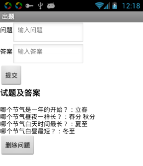

图10-1 出题应用
“出题”与“答题”这两个应用协同工作，让“老师”可以为“学生”出题。父母可以在长途旅行中做一些旅行花絮类的应用，以增加孩子们的乐趣；小学教师可以创建“数学突击”一类的小测验；而大学生们可以创建一系列的测验，帮助他们的学习小组来准备期末考试。本章建立在第8章“总统测验”的基础上，如果你还没学过，在继续本章之前，请先学习第8章。

本章将设计两个应用：针对“老师”的“出题”应用（见图10-1）以及针对“学生”的“答题”应用。在“出题”应用中：

* 用户在输入表单中输入问题及答案；
* 显示输入的一对问答；
* 将问题及答案存储在数据库中。

“答题”应用的功能与之前的“总统测验”类似。事实上，是以“总统测验”为起点创建“答题”应用，不同的是，这里的问题是使用“出题”应用输入并保存在数据库中的。

# 学习要点

“总统测验”是一个使用静态数据的应用范例：不管用户做多少次测验，问题都是一样的，因为问题被写在程序中（称为“硬编码”）。新闻应用、博客以及像Facebook和Twitter这类的社交网络应用采用的是动态数据，这意味着数据随时在改变。通常这种动态信息由用户生成，这类应用允许用户输入、修改并共享信息。在“出题”与“答题”应用中，将学习创建一个应用，来处理用户生成的数据。

在第9章“木琴”应用中，我们首次引入动态列表概念：用户输入的音符被记录在列表中。由用户生成数据的应用更为复杂，而且使用的块也更抽象，因为没有预设的静态数据可供参照。尽管可以定义列表变量，但不能设置具体的项。在编写程序的同时，需要设想最终用户输入的数据被添加到列表中。

本章涵盖了App Inventor中的如下内容：

* 输入表单：允许用户输入信息；
* 显示来自多个列表的数据项；
* 永久保存数据：“出题”应用将问题和答案保存到网络数据库中，“答题”应用将从同一个数据库中加载它们；
* 数据共享：使用TinyWebDB组件（而不是之前的TinyDB）将数据存储在Web数据库中。

# 准备开始

登陆App Inventor网站，创建新项目“MakeQuiz”，屏幕标题设为“出题”，并连接到测试手机或模拟器。

# 设计组件

使用组件设计器来创建用户界面，如图10-2所示（图的后面有更详细的说明），组件清单列于表10-1中。从Palette中拖出组件，将名称改为表中的命名。注意，标题Label的名称（Label1 – Label3）不必改，就用它们的默认值（因为在编辑器中不会使用这些名称）。

表10-1 “出题”应用中的所有组件

|组件类型|	面板中分组|	命名|	作用|
|:------|:---|:------|:------|
|TableArrangement|	Layout|	TableArrangement1	|格式化表单，包括问题及答案|
|Label	|User Interface	|Label1	|提示“问题：”|
|TextBox|	User Interface|	QuestionText	|用户在此输入问题|
|Label|	User Interface	|Label2|	提示“答案：”|
|TextBox	|User Interface|	AnswerText	|用户在此输入答案|
|Button|	User Interface|	SubmitButton|	用户点击提交问题-答案对儿|
|Label|	User Interface|	Label3	|显示“测验的问题及答案。”
|Label	|User Interface|	QuestionAnswersLabel|	显示之前输入的成对的问题答案|
|TinyWebDB	|Storage	|TinyWebDB1|	用数据库保存并提取数据|

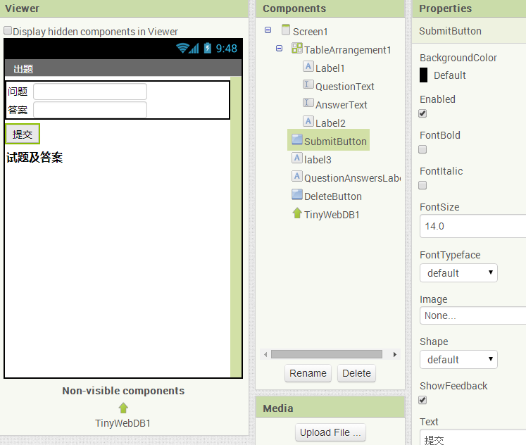

图10-2 组件设计器中的“出题”应用
按以下方式设置组件属性：

1. 设置Text属性：Label1为“问题：”，Label2为“答案：”，Label3为“试题及答案”；
2. 设置Label3的字号为18，并勾选FontBold属性；
3. 设置QuestionText的Hint属性为“输入问题”，AnswerText的Hint属性为“输入回答”；
4. 设置SubmitButton的Text属性为“提交”；
5. 设置QuestionsAnswersLabel的Text属性为“试题及答案”；
6. 将QuestionText、AnswerText以及与它们相关的Label移入TableArrangement1。

# 为组件添加行为

在“总统测验”中，首先定义了两个全局列表变量QuestionList和AnswerList，本章中无需为这两个变量提供预设的问题和答案，如图10-3所示。
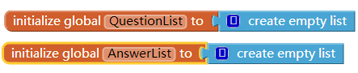

图10-3 列表变量初始化
需要注意，与“总统测验“不同的是，这两个列表没有定义列表项，因为“出题”及“答题”应用中，所有数据都将由用户创建（即动态的、用户生成的数据）。

## 记录用户的输入

首先来处理用户的输入行为。具体来说，当用户输入问题和答案并点击提交时，程序要向列表中添加数据项来更新QuestionList和AnswerList，如下图所示：
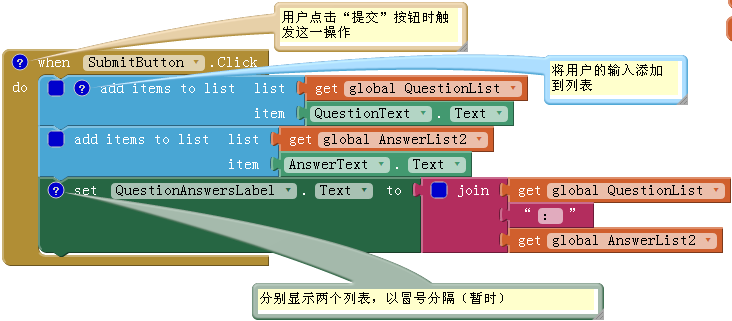

图10-4 向列表中添加新项

### 块的作用

向列表中添加项，意味着向列表的末尾追加新项。如图10-4，程序从QuestionText和AnswerText文本框中获取用户输入的内容，并分别被追加到相应的列表中。

向列表中添加的项更新了列表变量QuestionList和AnswerList，但用户看不到任何变化。第三行的块用来显示这个变化：用冒号将两个列表的内容连接起来。默认情况下，App Inventor用小括号来包围列表内容，列表项之间用空格间隔，像这样：（item1 item2 item3）。当然，这不是显示列表的理想方式，只是暂时用来测试程序的行为。稍后我们将用更高级的方式来显示列表，即，每对问题答案各占一行。

## 清空问题及答案

回忆一下在“总统测验”中，当移动到下一题时，要清空上一题的回答结果。在本应用中，当用户提交了一对问题-答案后，同样要清空QuestionText及AnswerText文本框，以便准备下一题的输入，如下图所示：

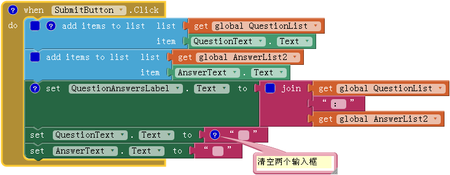
图10-5 提交问题-答案之后清空文本框

### 块的作用  

用户提交的问题-答案，将分别被添加到各自的列表中，并显示出来，这时QuestionText和AnswerText中的文本被清空，如图10-5所示。请注意，可以复制一个有内容的文本块（如上图中的“：”块），通过删除块中的文本，来获得一个空的文本块。

## 用多行文本显示问题-回答

现在是以App Inventor的默认格式来显示问题及答案。假如有一个有关州首府的测验，已经输入了两对问题-答案，则显示成：

（加州首府在哪？ 纽约州首府在哪？）：（萨克拉门托 奥尔巴尼）。

可以想像，如果测验中的问题很多，结果会显得非常混乱。理想的显示方式，应该是每行只显示一对问题-答案：

* 加州首府在哪？ 萨克拉门托
* 纽约州首府在哪？ 奥尔巴尼

第20章讲述了单个列表中项的逐行显示技术，在继续学习之前，可以去阅读一下。

这里的任务稍显复杂，因为涉及到两个列表。为了应对这种复杂性，需要创建过程displayQAs，并从SubmitButton.Click事件处理程序中调用该过程。

逐行显示问题-答案，需要做到以下几点：

* 使用foreach块遍历QuestionList中的每个问题；
* 使用变量answerIndex，在遍历问题的同时，获取与问题对应的答案；
* 使用join块连接每对问题-答案，并用换行符（n）来分开每对问题-答案，如下图所示：

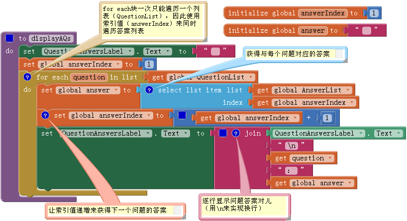

图10-6 创建displayQAs过程

### 块的作用

过程displayQAs封装了所有用于显示数据的块，如图10-6所示，在需要显示列表时，可直接调用displayQAs，而不必再重复使用过程内部的块。

由于foreach块只能遍历一个列表，而本应用中有两个列表，因此要求在遍历问题列表的同时，为每个问题选择对应的答案。这需要定义一个索引变量，就像第8章“总统测试”中的currentQuestionIndex一样，这里定义了answerIndex，当foreach遍历QuestionList时，用来跟踪对应的答案在列表AnswerList中的位置。

在foreach开始遍历之前，设answerIndex的值为1；在foreach遍历过程中，answerIndex用来从AnswerList中选择当前问题的答案，然后递增1。在foreach的每次迭代中，当前的问题-答案被添加到QuestionsAnswersLabel的最后一行，问题与答案之间以冒号分隔。

## 调用新建的过程

已经创建了显示问题-答案的过程displayQAs，但在调用它之前，它起不到任何作用。修改SubmitButton.Click事件处理程序，用displayQAs替代对QuestionsAnswersLabel.Text的简单设置，来显示所有的问题-答案。更新后的块如图10-7所示。

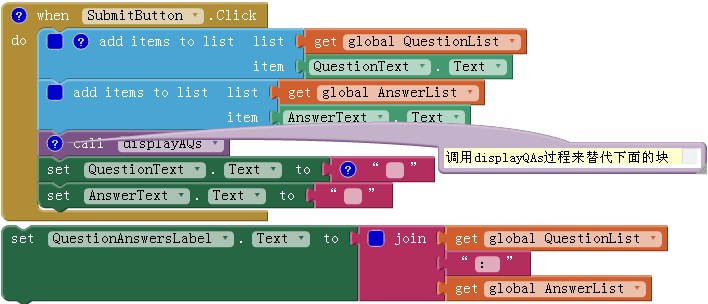

图10-7 在SubmitButton.Click中调用displayQAs过程

## 将数据永久保存到Web数据库

到目前为止，用户输入的问题-答案只是保存在列表中，如果此时用户退出应用，会怎么样呢？正如“开车不发短信”（第4章）或“Android，我的车在哪儿？”（第7章）中所学到的，如果数据不能存储到数据库中，那么当用户退出并重新打开应用时，数据将丢失。只有永久存储数据，才能让出题者在每次打开应用时，都能看到最新版本的数据，并对数据内容进行编辑。同时，永久保存数据也是必要的，因为在“答题”应用中也需要访问这些数据。

之前我们学习过用TinyDB组件在数据库中存储并检索数据，本章将使用TinyWebDB组件。两者的区别是：TinyDB将数据存储在手机上，而TinyWebDB将数据存储在Web数据库中。

本应用在设计上之所以选择在线数据库，而非手机数据库，关键在于存这些数据要供两个应用访问，如果出题者把问题和答案都存储在个人的手机上，那么答题者将无法获取数据并参加考试！而TinyWebDB将数据保存在互联网上，答题者可以使用不同于出题者的设备来访问试题及答案。（在线数据存储通常被称作云。）

下面是永久保存列表数据（如问题及答案）的通用方案：

* 每当向列表中添加新项时，将数据保存到数据库；
* 应用启动时，从数据库中加载数据，并保存在列表变量中。

首先考虑数据的保存：每次用户输入新的问题-答案时，将QuestionList和AnswerList保存到数据库中。

### 块的功能

TinyWebDB1.StoreValue块将数据存储在Web数据库中。StoreValue有两个参数：tag用做数据的标识，value是要保存的实际数据。如图10-8所示，QuestionList在存储时以“questions”为tag（标签），而AnswerList则用“answers”为tag（标签）。

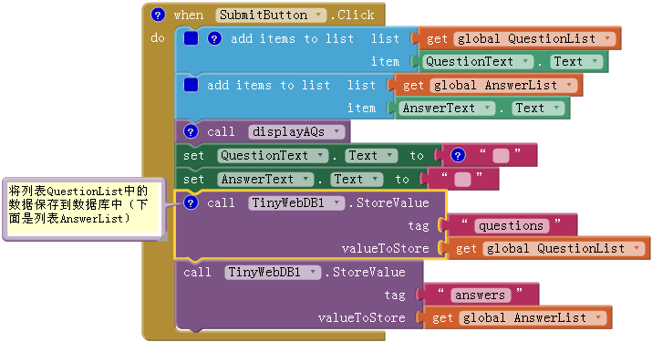
图10-8 将问题和答案保存到数据库中
建议在个人应用中使用更有特点的tag（如DavesQuestions和DavesAnswers）来代替questions和answers，这非常重要，因为你正在使用App Inventor的默认Web数据库，所以你的数据（列表questions和answers）可能会被别人的数据覆盖，也包括那些正在学习本教程的人。

这里要提醒各位，App Inventor默认的Web服务会在各个程序员和各种应用之间共享，因此它仅适用于测试。当你打算正式发布一款应用时，需要建立自己私有的数据库服务。幸运的是，做到这一点很简单，而且不需要编程（见第22章）。

## 从数据库加载数据

本应用需要永久保存数据，一方面因为出题者可以随时关闭应用，并随时启动应用，以便对之前输入问题和答案进行补充、修改或删除。这就需要在每次启动应用时，从数据库中加载那些已存储的数据。（另一方面，答题者可以访问数据库总的问题及答案，稍后会涉及到。）

正如我们之前所学，在应用启动时需要进行的操作，要通过Screen.Initialize事件处理程序来实现。在本应用中，需要用TinyWebDB组件向Web数据库请求questions及answers这两个列表，因此Screen1.Initialize将两次调用TinyWebDB.GetValue。块的设置如下图：
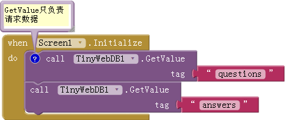

图10-9 在应用启动时从数据库中请求列表数据
### 块的功能

图10-9中使用的TinyWebDB.GetValue块与之前用过的TinyDB.GetValue的运行机制不同，后者会立即返回一个值，而前者只负责向Web数据库发送请求，不会立即收到返回值。当应用收到Web数据库返回的数据时，会触发TinyWebDB.GotValue事件，因此需要另外编写一个GotValue事件的处理程序来接收返回的数据。

当TinyWebDB.GotValue事件发生时，所请求的数据封装在参数valueFromWebDB中，所请求的数据标签（tag）则封装在参数tagFromWebDB中。

如图10-9所示，在Screen1.Initialize事件处理程序中发出了两次GetValue请求，分别请求questions和answers，因此GotValue也将被触发两次。为了避免把questions的数据写入AnswerList中（或反过来），需要对tag进行检查，来判断收到的是哪个请求的返回值，然后再把返回值写到相应的列表中（QuestionList或AnswerList）。现在，你该意识到这些tag的真正用途了吧！

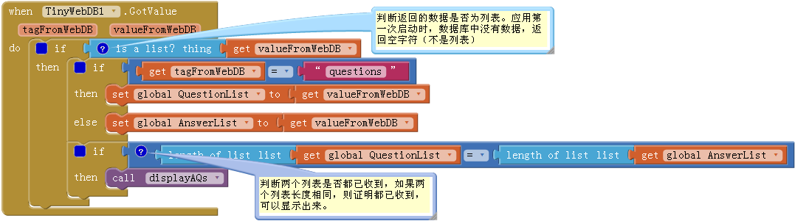

图10-10 当收到来自web的数据时触发GotValue事件

### 块的功能

应用中两次调用TinyWebDB1.GetValue来请求存储过的数据：分别是为QuestionList及AnswerList。当收到Web数据库返回的数据时，触发TinyWebDB1.GotValue事件，如图10-10。

从数据库中返回的数据封装在GotValue事件的valueFromWebDB参数中。在GotValue的事件处理程序中，外层的if块用来判断数据库的返回值valueFromWebDB是否为空。设想用户首次启动应用，数据库中没有任何数据。通过询问参数valueFromWebDB是否“is a list？”，可以得知是否真的有数据返回。如果没有数据返回，则会跳过对GotValue事件的处理。

如果有数据返回（is a list？为真），再继续判断收到的是哪个请求。识别数据的标记tag封装在tagFromWebDB中：即可能是“questions”，也可能是“answers”，如果tag是“questions”，则将valueFromWebDB保存到变量QuestionList，否则（else块），保存到AnswerList。（如果你使用的tag不是“questions”和“answers”，请替换成你自己的tag再做判断。）

我们希望当两个列表都已收到时（GotValue被触发两次）再来显示这些数据。想想看，如何判断从数据库收到了两个列表的数据？是的，用if块来检测两个列表的长度是否相同，因为只有两个列表都收到了，检测结果才能为真。如果为真，你可以轻松调用之前编写的displayQAs过程来显示加载的数据。
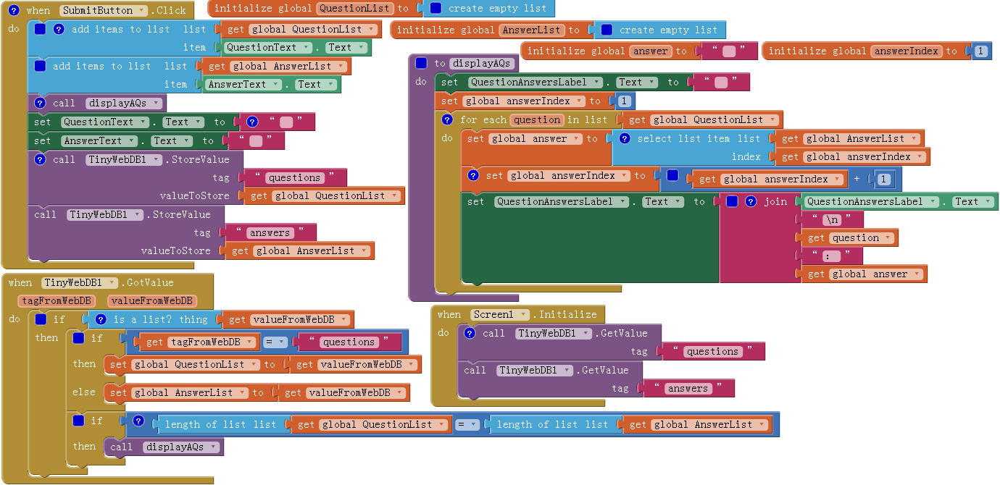

图10-11 “出题”应用中的块

# 答题：从数据库中读取试题的应用

“出题”应用已经就绪，下面来创建“答题”应用，一个可以动态加载测验的应用，相当简单。只是在“总统测验”的基础上稍加修改（如果你还没学过，现在就去学，然后再继续）。

打开“总统测验”，选择“save project as”将应用另存为“TakeQuiz”，这保证在不修改“总统测验”的情况下，以此为基础来构建“答题”应用 。

## 在组件设计器中调整组件

在组件设计器中做如下改变：

1. 这个版本的“出题/答题”应用不需要为问题搭配图片，因此首先删除所有与图片相关的部分：在组件设计中，从Media区域中选择并删除所有图片，然后再删除Image1组件，这将删除块编辑器中对它的所有引用（块编辑器中的global PictureList需手工删除）；
2. 由于“答题”应用中会用到数据库中的数据，因此添加一个TinyWebDB组件；
3. 在试题被加载完成之前，不希望用户来回答问题或点击“下一题”按钮，因此取消勾选“提交”和“下一题”按钮的Enabled属性。

## 在快编辑器中编程：从数据库加载测验

首先，修改列表变量的初始化设置：这里不需要预置问题及答案，因此用create empty list块替代QuestionList和AnswerList初始化时用到的make a list块，结果如图10-12所示。

图10-12 应用开始时，问题及答案列表为空
其次，删除PictureList，这里不需要图片；修改Screen1.Initialize，两次调用TinyWebDB.GetValue来加载列表，与“出题”应用中相同，如图10-13所示。

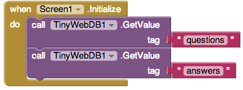

图10-13 从Web数据库中请求问题及答案列表
最后，拖出一个TinyWebDB.GotValue事件处理程序。此事件处理程序与“出题”应用中的程序类似，但这里只显示第一个问题，而且没有答案。先尝试自己做些修改，然后对照图10-14，看看你的方案是否与图中的相符。

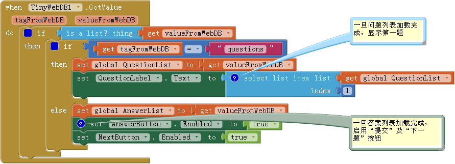
图10-14 用GotValue处理来自Web的数据
### 块的作用

应用启动时触发Screen1.Initialize事件，应用从Web数据库请求数据（questions及answers）。每次（共两次）收到数据都会触发TinyWebDB.GotValue事件。首先使用“is a list?”来判断valueFromWebDB中是否真的含有数据：如果有，则使用tagFromWebDB来判断是哪个请求返回的，并将valueFromWebDB值写入相应的列表中。如果QuestionList已经加载，则从QuestionList选择第一题并显示；如果AnswerList已经加载，则启用“提交”及“下一题”按钮，以便用户可以开始答题。

## 完整的答题应用
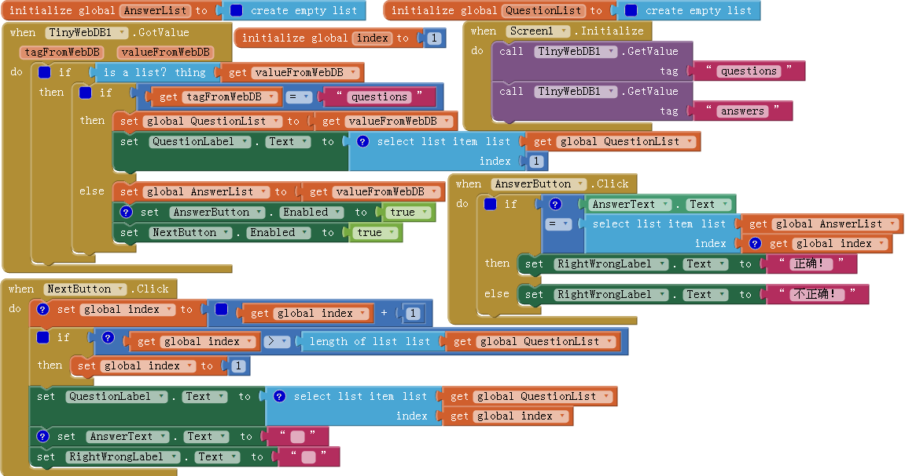

图10-15 “答题”应用中块的最终设置
# 改进

在“出题”与“答题”应用开始运行之后，你也会会尝试做一些改进。例如：

* 允许出题者为每个问题指定一个图片。当然，你（作为开发者）不能预加载这些图像，并且目前应用的用户也无法做到这一点。因此，图片必须是一些Web URL，出题者需要在“出题”应用的表单中输入这些URL，这些URL构成了应用的第三个列表。请注意，你可以将Image组件的Picture属性设置为一个URL。
* 允许出题者从问题和答案列表中删除项。用户可以使用ListPicker组件选择一个问题，并用remove list item块来删除列表项（记住要同时从两个列表中删除，并更新数据库）。想获得ListPicker和列表删除的相关帮助，请参见第19章。
* 让出题者为他的测验设定名称。测验名称也要以一个不同的tag保存到数据库中，并在“答题”应用中，与整个测验一同加载。名称加载完成后，可以将其设置为Screen1的Title属性，这样当用户答题时，测验名称也将显示出来。
* 允许创建多个不同名称的测验。需要建一个测验的列表，并且用测验的名称作为保存问题和答案时的tag（一部分）。

# 小结

以下是本章涵盖的内容：

* 动态数据是指由用户输入的、或从数据库中加载的信息。用动态数据编程会更加抽象。更多信息请参见第19章；
* 可以使用TinyWebDB组件在Web数据库中永久保存数据；
* 要从Web数据库中检索数据，需要用TinyWebDB组件的GetValue方法。当Web数据库返回数据时，会触发TinyWebDB.GotValue事件。用TinyWebDB.GotValue事件处理程序，可以把数据存储在列表中，或以其他方式进行处理；
* TinyWebDB数据可以在多部手机和应用之间共享。关于（Web）数据库的更多信息，请参见第22章。
