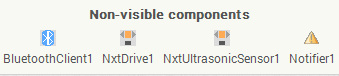
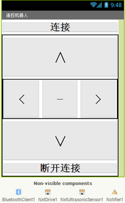
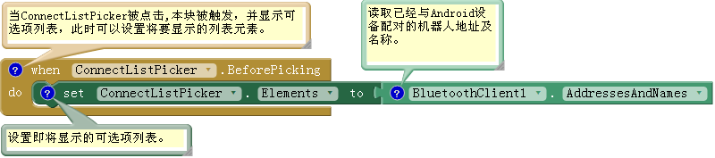
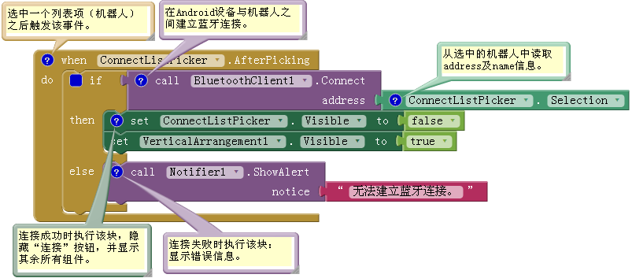
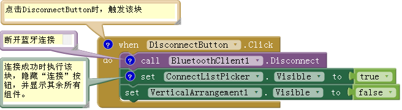
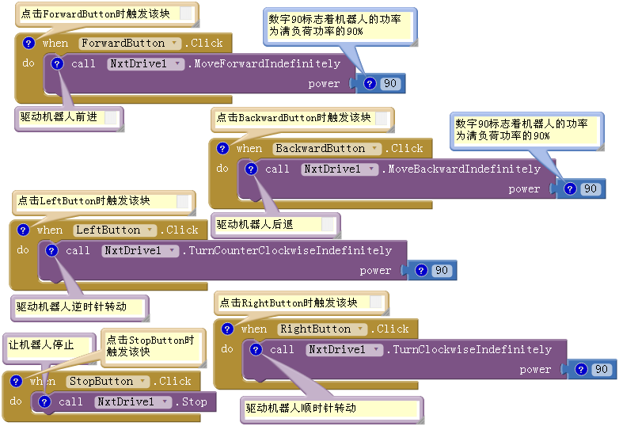
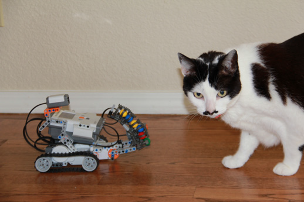
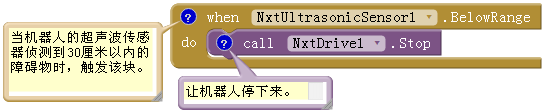

# 第12章 遥控机器人

本章将创建一个应用，将Android手机变成LEGO MINDSTORMS NXT 机器人的遥控器。应用中用按钮来控制机器人前后移动、左右转动和停止，如果机器人遇到障碍物，它还会自动停止。应用中使用具有蓝牙功能的手机与机器人通信。 LEGO MINDSTORMS机器人不只是玩具，更是教具。After-school program 使用机器人来教小学和初中的孩子们掌握解决问题的能力，并引导他们了解工程和计算机编程。NXT机器人也用于FIRST LEGO League 机器人竞赛，这项比赛允许9-14岁的孩子参加。
NXT可编程机器人套件中有一个“NXT智能积木”主单元，它可以控制三个电机及四个输入传感器。你可以用乐高的构造元件、齿轮、车轮、电机和传感器来组装机器人。该套件自带的软件可以对机器人进行编程，但现在我们将用App Inventor来创建Android应用，通过蓝牙连接来控制NXT机器人。 应用中参与协作的机器人具有超声波传感器以及用于移动的车轮，如Shooterbot 机器人。图中所示，这款机器人通常是人们利用LEGO MINDSTORMS NXT 2.0套件建造的第一个机器人。它的左车轮与输出端口C相连，右车轮与输出端口B相连，颜色传感器与输入端口3相连，超声波传感器与输入端口4相连。

## 学习要点

本章用到了以下组件和概念：

* BluetoothClient组件：用于建立Android设备与NXT机器人之间的蓝牙连接；
* ListPicker组件：为用户提供机器人选择列表，选中后开始建立机器人到Android的连接；
* NxtDrive组件：用于驱动机器人的轮子；
* NxtUltrasonicSensor组件：利用机器人的超声波传感器探测障碍物；
* Notifier组件：显示错误消息。

## 准备开始

本章的应用需要Android 2.0或以上版本。此外，出于安全原因，蓝牙设备必须首先配对才能彼此连通。在开始构建应用之前，需要按以下步骤使Android设备与NXT机器人配对：

1. 在NXT上单击向右箭头，直到显示“Bluetooth”，然后按下橙色方块；
2. 点击向右的箭头，直到显示“Visibility”，然后按下橙色方块；
3. 如果“Visibility”值已设定为可见，继续步骤4；如果不可见，请单击向左或向右箭头设置其值为可见；
4. 在Android设备上，进入设置→无线与网络；
5. 确保打开蓝牙功能；
6. 点击“蓝牙”；
7. 在“可用设备”中查找名为“NXT”的设备；
8. 如果机器人名字下显示“已配对但未连接”字样，则配对成功！否则，继续执行步骤9；
9. 如果机器人名字下显示“与此设备配对”，则点击它；
10. 在NXT上，要求输入密码，按下橙色方块接受1234为密码；
11. 在Android上，也会要求输入PIN码，输入1234，然后按确定；
12. 现在应该看到“已配对但未连接。”，说明配对成功！

注意：如果你曾经修改过机器人的名字，则寻找机器人现在的名字，而非“NXT”。
连接到App Inventor网站，创建新项目“NXTRemoteControl”，将设置屏幕的标题为“遥控机器人”，并连接测试手机。

### 设计组件

在这个应用中，我们需要分别创建可见组件及不可见组件，并分别定义它们的行为。

### 不可见组件

在创建用户界面之前，先来创建表12-1中的不可见组件，如图12-1所示，用来控制NXT。

表表12-1 NXT“机器人遥控”应用中的不可见组件

|组件类型	|面板中分组	|命名	|作用|
|:---|:---|:----|:----|
|BluetoothClient	|Connectivity	|BluetoothClient1	|建立Android与NXT的连接|
|NxtDrive	|LEGO® MINDSTORMS®	|NxtDrive1	|驱动机器人的轮子|
|NxtUltrasonicSensor|	LEGO® MINDSTORMS®	|NxtUltrasonicSensor1|	检测障碍物|
|Notifier	|User Interface|	Notifier1|	显示错误信息|

图12-1 在组件设计器底部显示的不可见组件
按以下方式设置组件的属性：

1. 设置NxtDrive1及NxtUltrasonicSensor1的BluetoothClient属性为 BluetoothClient1；（说明轮子的驱动与障碍物的侦测都需要依赖蓝牙通信——译者注）
2. 勾选NxtUltrasonicSensor1的BelowRangeEventEnabled属性(近距离侦测障碍物功能可用)；
3. 设置NxtDrive1的DriveMotors属性
 * 如果机器人的左轮电机与输出端口C连接，右轮电机与输出端口B连接，则保持默认设置“CB”；
 * 如果机器人的配置与上述不同，则将DriveMotors属性设置为两个字母的文本，其中第一个字母是连接左轮电机的输出端口，第二个字母是连接右轮电机的输出端口。
4. 设置NxtUltrasonicSensor1的SensorPort属性
 * 如果机器人的超声波传感器与输入端口4连接，则保持默认值“4”；
 * 如果机器人的配置与上述不同，则将SensorPort设置为与超声波传感器连接的输入端口。

## 可视组件

现在创建用户界面组件，如图12-2所示。

图12-2 组件设计器中的应用
建立蓝牙连接时，Android设备需要访问NXT机器人具有唯一性的蓝牙地址，但蓝牙地址由8个用冒号分隔的2位数的十六进制数（二进制数的另一种表示方式）组成，输入起来异常麻烦，而且每次运行应用都要在手机上输入该地址。为了减少麻烦，使用ListPicker来显示已经与手机配对的机器人列表（列表项的值为机器人的名称及蓝牙地址），并从中选择一个。 使用按键来驱动机器人的前进、后退、左右转动、停止和断开连接，使用VerticalArrangement来放置除ListPicker以外的所有组件，用HorizontalArrangement来放置左右转向及停车按钮。 按照表12-2中列出的组件来创建图12-2所示的用户界面。
表12-2 NXT机器人控制器应用中的可见组件

|组件类型	|面板中分组	|命名	|作用|
|:---|:----|:----|:---|
|ListPicker	|User Interface|	ConnectListPicker	|选择要连接的机器人|
|VerticalArrangement	|layout	|VerticalArrangement1	|布局容器，容纳除ListPicker之外的组件|
|Button	|User Interface	|ForwardButton	|前进|
|HorizonalArrangement	|layout	|HorizonalArrangement1	|布局容器，容纳左转、右转、停止按钮|
|Button	|User Interface	|LeftButton	|左转|
|Button	|User Interface	|StopButton	|停止|
|Button|	User Interface	|RightButton	|右转|
|Button	|User Interface	|BackwardButton	|后退|
|Button	|User Interface	|DisconnectButton	|与NXT断开连接|

按照图12-2所示来设置可视组件布局：将LeftButton、StopButton和RightButton放在HorizontalArrangement1中，将ForwardButton、HorizontalArrangement1、BackwardButton和DisconnectButton放在VerticalArrangement1中。 按下列方式设置组件属性：

1. 取消勾选Screen1的Scrollable属性（滚屏功能）；
2. 设置ConnectListPicker和DisconnectButton的宽度为“Fill parent”；
3. 设置VerticalArrangement1、ForwardButton、HorizontalArrangement1、LeftButton、StopButton、RightButton及BackwardButton的Width与Height为“Fill parent”；
4. 设置ConnectListPicker的Text属性为“连接”；
5. 设置ForwardButton的Text属性为“∧”；
6. 设置LeftButton的Text属性为“<”；
7. 设置StopButton的Text属性为“—”；
8. 设置RightButton的Text属性为“>”；
9. 设置BackwardButton的Text属性为“∨”；
10. 设置DisconnectButton的Text属性为“断开连接”；
11. 设置ConnectListPicker和DisconnectButton的FontSize属性为30；
12. 设置ForwardButton、LeftButton、StopButton、RightButton及BackwardButton的FontSize属性为40。

在这类应用中，当手机与NXT建立蓝牙连接之前，应该隐藏用户的操作界面，为此取消勾选VerticalArrangement1的Visible属性。不要担心，当NXT连通后，将重新显示用户界面。

## 为组件添加行为

本节将编程来设置应用的行为，包括：

* 用户从列表中选择机器人，并与之建立连接；
* 断开机器人与应用的连接；
* 使用控制按钮来操控机器人；
* 在机器人侦测到障碍物时，让它停下来。

## 连接到NXT机器人

添加第一个行为：连接到NXT。点击 ConnectListPicker将显示已配对的机器人列表，选中一个，将在应用与机器人之间建立蓝牙连接。

## 显示机器人列表

使用ConnectListPicker组件来显示机器人列表。ListPicker的外表像按钮，被点击后则显示列表项，并允许进行单选。 使用BluetoothClient1.AddressesAndNames块来提供列表，列表项是已经与Android设备配对的蓝牙设备的名称及地址。由于NXT已经将轮驱动及超声波组件的BluetoothClient属性设定为BluetoothClient1，因此AddressesAndNames属性列表中的设备会自动限定为这类机器人，其他类型的蓝牙设备（如耳机）将不会出现在列表中。表12-3列出了所需要的块。

表12-3 在应用中添加ListPicker列表所需要的块

|块的类型|	所在抽屉|	作用|
|:---|:----|:---|
|ConnectListPicker.BeforePicking	|ConnectListPicker	|当ConnectListPicker被点击时，触发该事件|
|set ConnectListPicker.Elements to	|ConnectListPicker	|为ConnectListPicker设置可供选择的列表项|

## 块的作用

点击ConnectListPicker将触发ConnectListPicker.BeforePicking事件，并显示可选项列表。将ConnectListPicker.Elements属性设置为 BluetoothClient1.AddressesAndNames块，来设定可选项；ConnectListPicker将显示已经与Android设备配对的机器人列表。

图12-3 显示机器人列表

测试：在手机上点击“连接”，看看会发生什么，你会看到所有已经与手机配对的机器人列表。
如果只见黑屏，说明手机尚未与任何机器人配对；如果见到其他蓝牙设备，如蓝牙耳机，说明 NxtDrive1与 NxtUltrasonicSensor1的BluetoothClient属性设置有误。

## 建立蓝牙连接

从列表中选择一个机器人，应用将通过蓝牙与机器人连接。如果连接成功，用户界面将发生变化：隐藏ConnectListPicker，并显示用户界面的其余部分。如果机器人开关没有打开，则连接失败，会弹出错误信息。 使用call BluetoothClient1.Connect块与机器人进行连接。ConnectListPicker.Selection属性提供了选中机器人的地址和名称信息。 使用ifelse块来测试连接是否成功。ifelse块需要连接三个不同的块：“if”、“then”及“else”。“if”与BluetoothClient1.Connect块连接，“then”区域放置连接成功时要执行的块；“else”区域放置连接失败时要执行的块。 如果连接成功，使用Visible属性来隐藏 ConnectListPicker并显示VerticalArrangement1（其中放置了除ConnectListPicker之外的所有组件）。如果连接失败，则使用Notifier1.ShowAlert块来显示错误信息。表12-4列出了设置上述行为所需的块。

表表12-4与机器人建立蓝牙连接所需的块

|块的类型	|所在抽屉	|作用|
|:---|:----|:----|
|ConnectListPicker.AfterPicking	|ConnectListPicker	|当从ConnectListPicker选中一个机器人时触发|
|ifelse	|Control	|检验蓝牙连接是否成功|
|call BluetoothClient1.Connect	|BluetoothClient1	|连接到机器人|
|ConnectListPicker.Selection	|ConnectListPicker	|选中的机器人的地址及名称|
|set ConnectListPicker.Visible to	|ConnectListPicker	|隐藏ConnectListPicker按钮|
|false	|Logic	|插入set ConnectListPicker.Visible to块|
|set VerticalArrangement1.Visible to	|VerticalArrangement1	|显示“连接”按钮之外的所有组件|
|true|	Logic	|插入set VerticalArrangement1.Visible to块|
|Notifier1.ShowAlert	|Notifier1	|用来弹出错误信息|
|“无法建立蓝牙连接。”	|Text	|错误信息。|

## 块的作用

选中机器人后将触发ConnectListPicker.AfterPicking事件，见图12-4，BluetoothClient1.Connect块用于建立与机器人之间的蓝牙连接。如果连接成功，执行“then”块：隐藏ConnectListPicker按钮并显示VerticalArrangement1内的所有组件，即，设置ConnectListPicker.Visible属性为false，设置VerticalArrangement1.Visible属性为true。如果连接失败，执行“else”块：用Notifier1.ShowAlert块弹出错误信息。

图12-4 建立蓝牙连接

## 与NXT断开连接

让Android设备与NXT机器人连接着实让人兴奋，不过“断开连接”是我们下面要添加的行为，这样便于对连接与断开进行连续测试。 当点击DisconnectButton时，应用将关闭蓝牙连接，用户界面将发生变化：ConnectListPicker按钮将重新出现，而用户界面上的其余组件将被隐藏。 表12-5列出了构建BluetoothClient1.Disconnect（断开蓝牙连接）所需的块。设置Visible属性来显示 ConnectListPicker按钮并隐藏VerticalArrangement1中包含的所有组件。

表12-5 与机器人断开连接所需的块

|块的类型	|所在抽屉	|作用|
|:---|:----|:----|
|DisconnectButton.Click	|DisconnectButton	|当点击DisconnectButton时触发该事件|
|BluetoothClient1.Disconnect	|BluetoothClient1	|断开与机器人的蓝牙连接|
|set ConnectListPicker.Visible to	|ConnectListPicker	|显示ConnectListPicker（“连接”按钮）|
|true	|Logic	|插入set ConnectListPicker.Visible to块|
|set VerticalArrangement1.Visible to	|VerticalArrangement1|	隐藏用户界面上的其余组件|
|false|	Logic	|插入set VerticalArrangement1.Visible to块|

### 块的作用

点击DisconnectButton将触发DisconnectButton.Clicked事件，如图12-5所示，断开蓝牙连接要用BluetoothClient1.Disconnect块，之后设置ConnectListPicker.Visible属性为true来显示 ConnectListPicker，设置VerticalArrangement1.Visible属性为false来隐藏VerticalArrangement1。

图12-5 与机器人断开连接

测试：请确保机器人已经打开，点击手机上的“连接”按钮，并选择要连接的机器人。建立蓝牙连接需要一点时间。一旦连接成功，用户界面将显示机器人的控制按钮，以及“断开连接”按钮。
单击“断开连接”按钮：控制机器人的按钮会消失，“连接”按钮则重新出现。

## 操控机器人

下面是真正有趣的部分：添加前进、后退、左右转动及停止行为。不要忘记“停止”，否则你手中的机器人会失去控制！ NxtDrive组件提供了五个块，用来驱动机器人的电机：

* MoveForwardIndefinitely块：驱动两个电机前进；
* MoveBackwardIndefinitely块：驱动两个电机后退；
* TurnCounterClockwiseIndefinitely块：驱动机器人左转：让右侧电机向前而左侧电机后退；
* TurnClockwiseIndefinitely块：驱动机器人右转：让左侧电机向前而右侧电机后退；
* Stop将停止电机。

 每个移动及转向块都有一个Power参数，需要与数字块配合使用，来设定机器人电机的输出功率，取值范围可以从 0到100。但如果设置的功率太小，电机会发出吱吱声而不运转。在本例中建议使用90（百分比）。表12-6中列出了所需的块。

表12-6 用于控制机器人的块

|块的类型|	所在抽屉| 作用|
|:----|:----|:-----|
|ForwardButton.Click	|ForwardButton	|点击ForwardButton时触发|
|NxtDrive1.MoveForwardIndefinitely	|NxtDrive1	|驱动机器人前进|
|数字90	|Math	|功率值|
|BackwardButton.Click	|BackwardButton	|点击BackwardButton时触发|
|NxtDrive1.MoveBackwardIndefinitely	|NxtDrive1	|驱动机器人后退|
|数字90	|Math	|功率值|
|LeftButton.Click	|LeftButton	|点击LeftButton时触发|
|NxtDrive1.TurnCounterClockwiseIndefinitely	|NxtDrive1	|驱动机器人逆时针转动|
|数字90|	Math	|功率值|
|RightButton.Click	|RightButton	|点击RightButton时触发|
|NxtDrive1.TurnClockwiseIndefinitely	|NxtDrive1	|驱动机器人顺时针转动|
|数字90	|Math	|功率值|
|StopButton.Click	|StopButton	|点击StopButton时触发|
|NxtDrive1.Stop|	NxtDrive1	|让机器人停止|

## 块的作用

如图12-6所示，点击ForwardButton按钮时触发ForwardButton.Clicked事件，此时调用NxtDrive1.MoveForwardIndefinitely块，让机器人以90％的功率前进，其余按钮的事件处理程序与此类似，并以相同的功率驱动机器人后退及左右转动。点击StopButton时触发StopButton.Clicked事件，调用NxtDrive1.Stop块让机器人停止运动。

图12-6 操控机器人

测试：按照此前的“测试”说明，先连接NXT机器人。不要将机器人放在桌子上，以免跌落，然后测试以下行为：
1. 点击前进按钮，机器人应该向前移动；
2. 点击后退按钮，机器人应该向后移动；
3. 点击左转按钮，机器人应逆时针转动；
4. 点击右转按钮，机器人应顺时针转动；
5. 点击停止按钮，机器人应停止。

如果机器人不动并发出吱吱声，可能需要加大电机的功率，可以用最大功率100。

## 用超声波传感器探测障碍物

使用超声波传感器的机器人可以侦测到30厘米范围内的障碍物，遇到障碍物时机器人会像罪犯一样停下来，如图12-7所示。

图12-7 为NXT机器人设置障碍
NxtUltrasonicSensor组件用于侦测障碍物，两个属性BottomOfRange和TopOfRange用来定义侦测范围（以厘米为单位）。默认设定BottomOfRange为30厘米，TopOfRange为90厘米。 NxtUltrasonicSensor组件具有三个事件BelowRange、WithinRange及boveRange，当侦测到障碍物在BottomOfRange（下限）距离以内时，会触发BelowRange事件；当障碍物的距离在BottomOfRange与TopOfRange （上下限）之间时，会触发WithinRange事件；当障碍物的距离超过TopOfRange（上限）时，将触发AboveRange事件。 这里使用NxtUltrasonicSensor1.BelowRange事件块，用来侦测30厘米以内的障碍物，如果你想尝试侦测不同距离的障碍物，可以调整BottomOfRange属性。当BelowRange时间发生时，使用NxtDrive1.Stop块让机器人停下来。表12-7中列出了所需的块

表12-7 使用NxtUltrasonicSensor需要的块

|块的类型	|所在抽屉|	作用|
|:---|:---|:---|
|NxtUltrasonicSensor1.BelowRange	|NxtUltrasonicSensor1|	超声波传感器在30厘米内遇到障碍物时触发|
|NxtDrive1.Stop	|NxtDrive1	|让机器人停下来|

### 块的功能

当机器人的超声波传感器侦测到30厘米以内的障碍物时，NxtUltrasonicSensor1.BelowRange事件被触发，如图12-8所示，此时NxtDrive1.Stop块让机器人停下来。

图12-8 侦测障碍物

测试：按照此前的“测试”说明，先连接NXT机器人。引导机器人朝着障碍物（如猫）的方向前进，机器人将在距离猫30厘米时停下来。如果机器人没停下来，可能是猫已经远离了机器人，它们之间的距离一直大于30厘米。可以换一个静止的障碍物来进行测试。

## 改进

应用运行起来，想必你已经花了大量时间来操控这个机器人，不过还是想继续其他的尝试：

* 调节驱动电机的输出功率：
 * 可以修改插入到前进(MoveForwardIndefinitely)、后退(MoveBackwardIndefinitely)、左转(TurnCounterclockwiseIndefinitely)及右转(TurnClockwiseIndefinitely) 块中的数字块的值。
* 当侦测到障碍物时，使用NxtColorSensor让红灯闪烁：
 * 可以使用NxtColorSensor组件及其GenerateColor属性；
 * 需要将DetectColor属性设置为false（或在组件设计器取消勾选该属性），因为颜色传感器无法同时检测和产生颜色。
* 使用Android的方向传感器OrientationSensor来控制机器人。
* 使用乐高的构造元件建立手机与机器人之间的物理连接，创建应用实现机器人的自主性。
小结

以下是本章涵盖的内容：

* ListPicker组件：让用户可以从已配对的机器人列表中进行选择；
* BluetoothClient组件：使Android设备与机器人建立连接；
* Notifier组件：用来显示错误消息；
* Visible属性：用于隐藏或显示用户界面中的组件；
* NxtDrive组件：可以控制机器人的移动、转向及停止；
* NxtUltrasonicSensor组件：用于侦测障碍物。

## 附录

### 外部链接

LEGO MINDSTORMS EV3控制程序 Android应用控制LEGO EV3(Video)
