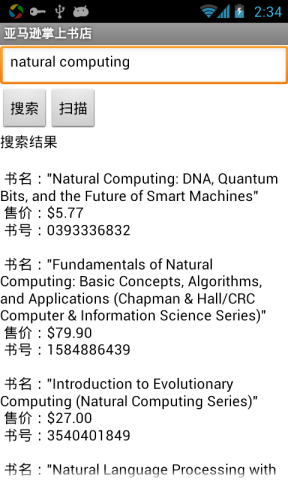
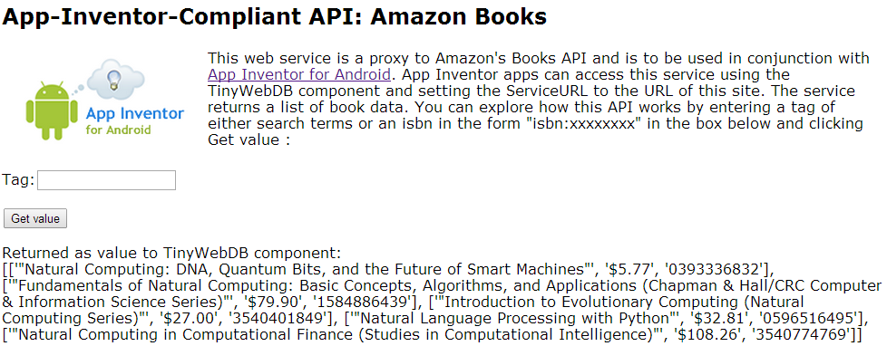
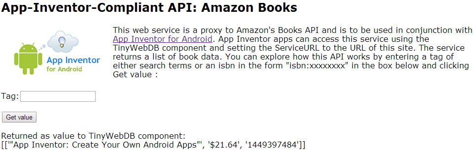
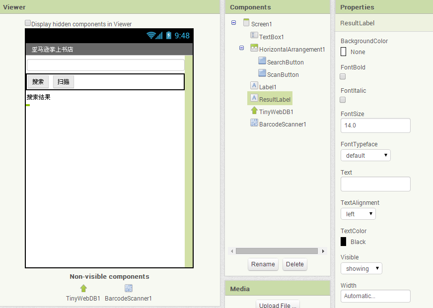
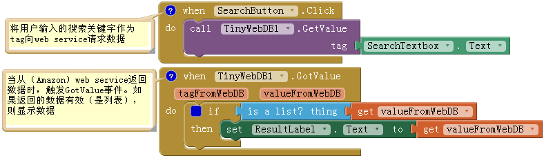
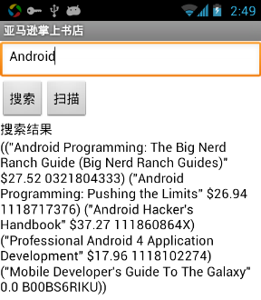
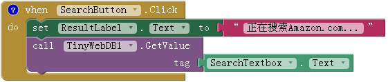
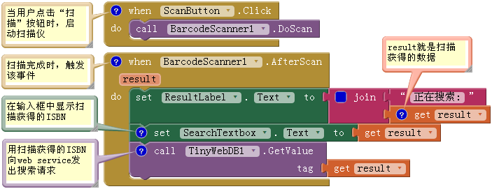
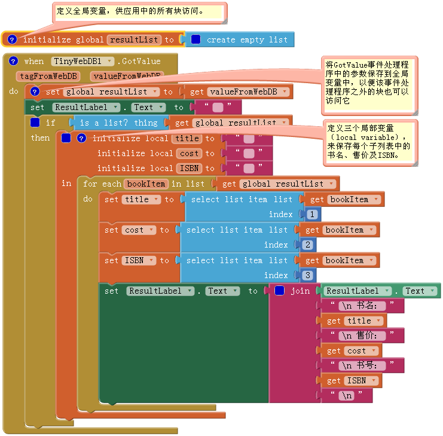
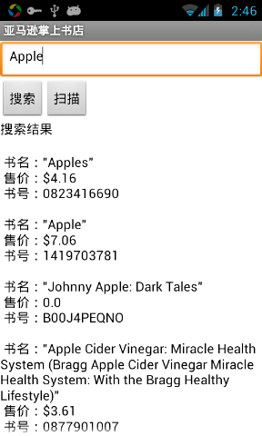

第13章 亚马逊掌上书店  
十一月 20, 2015 ADMIN	一条评论
假设你正在一家你很喜欢的书店里翻书，你想了解某一本书在Amazon.com（网上书店）的售价，那么这款“亚马逊掌上书店”应用就可以帮你实现这一愿望。通过扫描书上的条码，或输入书上的ISBN，应用将告诉你这本书当前在Amazon.com的最低售价。你也可以按照主题进行书籍的搜索。

 
“亚马逊掌上书店”演示了如何使用App Inventor来创建与web service进行交互的应用（web service又称作API 或应用程序接口）。本应用将从一个web services上获取数据，该web services是由本书的作者之一创建的。由本章结束时，你将为自己创建一款定制的应用，来访问亚马逊网上书店。

该应用界面非常简单，用户可以输入关键字或书的ISBN 码，应用将列出书名、ISBN以及新书在亚马逊上的最低售价。也可以使用条码扫描组件，让户可不必输入文本，而是通过扫描来进行搜索（从技术上讲，是扫描仪替你输入了书的ISBN！）。

Contents [hide]
1 学习要点
2 什么是API?
3 设计组件
4 设计行为
4.1 按关键字或ISBN搜索
4.1.1 块的作用
4.2 消除用户的困惑
4.3 扫描一本书
4.3.1 块的作用
4.4 改进信息的显示
4.4.1 块的作用
4.5 定制化API
5 改进
6 小结
# 学习要点

本章将学习以下内容：

在应用中使用条形码扫描仪功能；
用TinyWebDB组件访问Web信息源（Amazon API）；
学会处理从web信息源返回的复杂数据。所谓复杂数据，具体来说，就是图书列表中的每本书都是一个列表，其中包含三个列表项：书名、价格及ISBN。
此外我们将介绍用Python语言及谷歌的App引擎编写的源代码，并用它来创建自己的web service API。

# 什么是API?

在开始设计组件和编写应用之前，我们来解释一下什么是API（应用程序接口），以及它如何工作。可以把API想象为一个网站，只是它不与人类交互，而是与其他计算机程序交互。

图13-1 模拟器中的“亚马逊掌上书店”
API通常被称作“服务器端”程序，因为它们的特点就是为“客户端”程序提供信息。“客户端”程序负责实现与人类的接口——如App Inventor应用。如果你曾经在手机上使用Facebook 应用，你实际上是通过Facebook的客户端程序与Facebook的服务器端程序（API）进行通信。

本章将创建一个Android客户端应用，与Amazon API进行通信。应用将向Amazon API请求书的信息（书名、书号及价格等），而API将向应用返回最新的信息列表，用户将在应用中浏览到书的相关信息。

我们即将使用的Amazon API是App Inventor专用的API。这里我们不想过多地解释细节，但有关配置的知识是非常有用的，正是由于有了这些配置，我们才能用TinyWebDB组件与Amazon进行沟通。好在你已经学会了使用TinyWebDB！调用TinyWebDB.GetValue来请求信息，然后在TinyWebDB.GotValue事件处理程序中处理返回的信息，就像在用Web数据库一样。（如果忘记了，去复习一下第10章的“出题”应用。）

在创建应用之前，需要先了解一下Amazon API协议，协议规定了请求数据的方式以及返回数据的格式。就像不同的族群有不同的礼仪（两人相遇时，是握手、鞠躬还是点头？），计算机之间的互相则需要有协议 。

Amazon API为调用者提供了一个Web页面，来说明API的使用方法。虽然设计API的目的是为了与其它计算机交互，但在这个页面上，你可以看到这种交互的过程。 按照下列步骤，你可以尝试调用一个指定tag参数的GetValue，并在页面上看到返回的数据，这与你在App Inventor中使用TinyWebDB组件请求数据的结果完全一致：

1. 在浏览器中访问网站http://aiamazonapi.appspot.com/，你会看到如图13-2所示的页面（页面中的中文为译者添加）。

图13-2 App Inventor专用的Amazon API的说明及测试页面  
2. 本页面允许你对与此API的GetValue功能进行测试：在tag输入框中输入搜索词（如“natural computing”），然后单击“Get value”按钮。页面将显示从Amazon API返回的排在前五位的书籍列表，如图13-3所示。

图13-3 调用Amazon API来搜索与tag（或关键字）“natural computing”有关的书籍
返回值是一个书的列表，每本书的信息由一对方括号包围[像这样]，提供了书名、售价及ISBN。如果仔细观察，你会发现每本书其实是另一主列表的子列表。主列表（natural computing）由外层的方括号包围，每个子列表（或书）被封闭在单独的一对方括号内。所以此API的返回值实际上是一个列表的列表，每个子列表提供一本书的信息。我们来细致地观察一下。

数据中的每个左括号（[）标志列表的开头。第一左括号标志外层列表（书籍列表）的开始，紧挨着它的左括号是第一个子列表，即第一本书的开头：

[[‘”Natural Computing: DNA, Quantum Bits, and the Future of Smart Machines”‘, ‘$5.77’, ‘0393336832’],
子列表包含三个部分：书名、该书在亚马逊书店的最低售价及这本书的ISBN。当你的App Inventor应用取得这些信息时，就可以使用select list item块来访问其中的每个部分，用索引值1访问书名，索引值2访问价格，索引值3访问ISBN。（如果淡忘了有关列表及索引的使用方法，请复习第十章的“出题”应用。）

3. 除了搜索关键字，你还可以通过ISBN来精确地搜索一本书，只要在tag后面直接输入书号即可，试试输入“1449397484”，如图13-4所示。返回结果如下：

[[‘”App Inventor: Create Your Own Android Apps”‘, ‘$21.64’, ‘1449397484’]]
返回结果中的双括号（[[）表示返回的仍然是一个列表的列表，虽然列表中只有一本书。这似乎有点奇怪，但这一点对需要访问这类信息的应用来说非常重要。

图13-4 用ISBN替代关键字在Amazon API中查询书籍
# 设计组件

“掌上书店”应用的用户界面比较简单：一个用于输入搜索词或ISBN的文本框，一个用于启动搜索（关键字或ISBN）的按钮，另一个启动扫描书的条码的按钮（稍后会用到），一个搜索结果标题的label，另一个显示搜索结果的label，还有两个非可视组件：TinyWebDB和条码扫描仪。表13-1列出了图13-5中所示的所有组件，对照检查你的结果。

图13-5 组件设计器中“亚马逊掌上书店”的用户界面
表13-1 “亚马逊掌上书店”应用的组件列表

|组件类型|	面板中分组|	命名|	作用|
|:--|--:|--:|:--:|
|Textbox|	User Interface|	SearchTextBox|	用户在此输入关键字或ISBN|
|HorizontalArrangement|	Layout|	HorizontalArrangement1|	将按钮放置在同一行内|
|Button|	User| Interface|	SearchButton|	点击启动关键字或ISBN搜索|
|Button|	User| Interface|	ScanButton|	点击开始扫描书的ISBN条码|
|Label|	User| Interface|	Label1|	搜索结果的标题|
|Label|	User| Interface|	ResultLabel|	显示搜索结果|
|TinyWebDB|	Storage|	TinyWebDB1|	与Amazon.com交互|
|BarcodeScanner|	Sensors|	BarcodeScanner1|	扫描条码|
组件的属性设置如下：

设置SearchTextBox的Hint属性为“输入关键字或ISBN”；
设置Button及Label的Text属性：如图13-5所示；
设置TinyWebDB组件的serviceURL属性为http://aiamazonapi.appspot.com/ 。
# 设计行为

在块编辑器中设定下列行为：

## 按关键字搜索：用户输入关键字并点击SearchButton来调用Amazon搜索。通过调用TinyWebDB.GetValue来实现这一点；
按ISBN搜索：用户输入一个ISBN并点击SearchButton；
条码扫描：用户点击ScanButton启动扫描仪，扫描ISBN完成后将启动Amazon搜索；
处理图书列表：首先采用默认方式显示Amazon返回的数据。稍后再加以修改，采用有组织的方式来显示每本书的书名、售价及ISBN。
按关键字或ISBN搜索

用户点击SearchButton时，从SearchTextbox中获取搜索内容，并以此为tag，使用TinyWebDB.GetValue块向Amazon API请求搜索数据。

当Amazon返回结果时，将触发TinyWebDB.GotValue事件。现在用ResultsLabel直接显示返回结果，如图13-6所示，当见到这些真实的数据后，可以采取更为复杂的方式来显示数据。

图13-6 向API发送搜索请求，并将结果显示在ResultsLabel中
### 块的作用

当点击SearchButton时，TinyWebDB1.GetValue开始向API发出请求。随请求一同发送的tag正是用户在 SearchTextBox中输入的内容。

从第十章“出题”应用中得知，TinyWebDB.GetValue发出的请求并不能立即获得结果，而是在收到从API返回的数据时，触发TinyWebDB1.GotValue事件。在GotValue块中，首先检查返回值是否为列表，如果是，则数据被写入ResultsLabel。（如果Amazon API离线或搜索的关键字不存在，将没有数据返回。）再输入ISBN“1118717376”试试看。

图13-7 搜索“Android”返回的结果

测试：在输入框中输入搜索词，如“Android”，然后点击“搜索”按钮。你将得到类似于图13-7的结果。注意：手机上返回的结果与网页上的结果略有不同：方括号变成了圆括号。（这个界面看起来很糟糕，稍后我们会处理。）

## 消除用户的困惑

在前几章中了解到，使用TinyWebDB请求数据的过程需要一点时间，在收到返回的数据之前，用户界面上悄无声息，这时用户会感到困惑，因此从用户友好的角度考虑，添加一点提示是非常必要的。这里我们用ResultLabel来显示提示信息。如图13-8所示。但如果网络速度很快，数据很快返回并触发GotValue事件，则几乎看不到提示，数据就显示出来了。

图13-8 添加提示信息消除用户的困惑
## 扫描一本书

现实情况是：在手机上输入字符通常不那么容易，而且总会出一些小错。如果能够在应用中使用条码扫描，那么问题会变得简单（并且几乎不会出错）。这是Android手机内置的另一项强大的功能，你可以用App Inventor轻而易举地实现它。

函数BarcodeScanner.DoScan用于启动扫描仪，可以在ScanButton被点击时调用它。一旦扫描操作完成，将触发BarcodeScanner.AfterScan事件。该事件带有一个参数result，其中保存了扫描所获得的信息。在本例中，result即是用于搜索的ISBN，如图13-9所示。

图13-9 用户扫描书上的条码获得ISBN并启动搜索
### 块的作用

点击ScanButton将启动扫描仪，即执行BarcodeScanner1.DoScan。扫描完成时触发AfterScan事件。该事件带有result参数，在本例中为书的ISBN。用ResultLabel告诉用户正在进行搜索，并在SearchTextBox中显示result（扫描获得的ISBN），最后调用TinyWebDB.GetValue来启动搜索。仍然使用之前定义的TinyWebDB.GotValue事件处理程序来处理返回的书籍信息。

测试：点击ScanButton并扫描一本书的条码。应用中是否显示了该图书的信息？

## 改进信息的显示

我们所创建的这类客户端应用，可以按需要来处理收到的数据，可以与其他网上商店进行价格比较，也可以用书名信息来搜索其他图书馆中的同类书籍。

通常是将加载自API的信息保存到变量中再做处理，而目前只是在TinyWebDB.GotValue事件处理程序中，将Amazon API返回的所有信息直接写入到ResultsLabel中。

下面我们来处理（或这说安排）这些数据，方法是（1）将返回数据中的每本书的书名、售价以及ISBN分别保存到单独的变量中；（2）以一种有序的方式显示这些项目。

到目前为止，你已熟知了全局变量（global variable），与之对应的是局部变量（local variable），这是本章引入的一个新的概念。一个变量有它的有效范围：全局变量直接在块编辑器中定义，单独占一行，不属于任何一组块，而所有的块都可以调用全局变量；局部变量则定义在某个程序块内部，它将包含其它块，而且只对其包含的块有效，其余的所有块都无法访问到它。

下面将使用这些变量，并将它们显示出来，试试看按需要创建这些变量，并组织一些块来分行显示每一项搜索结果，完成之后与图13-10进行比较。

### 块的作用

这里定义了四个变量：resultList、title、cost及ISBN，用来保存Amazon API返回数据中的每一条数据。从API返回的数据保存在参数valueFromWebDB中，这里将它另存为resultList。其实程序可以直接使用valueFromWebDB，但通常会将它另存为一个变量，以便在该事件处理程序之外也可以使用这一数据。（像valueFromWebDB这样的参数仅在事件处理程序内有效，事件处理程序之外无法访问该参数值。）

foreach循环用来遍历返回结果中的每个数据项。回想一下，从Amazon返回的数据是一个列表的列表，每个子列表代表一本书的信息，因此foreach块中的项变量被命名为bookItem，它保存了当前正在被遍历的书的信息。

现在我们要清醒地面对项变量bookitem，它是一个列表，其中第一项是书名，第二项是售价，第三项是ISBN，因此，select list item块利用索引值（index）将这些数据逐项提取出来，并保存在事先定义的变量中（title、cost及ISBN）。

图13-10 在遍历过程中提取每本书的书名、售价及ISBN，并逐行显示它们
一旦数据被拆解成这种方式，就可以随意地摆布它们。程序中的局部变量只是作为join块的组成部分，来逐行显示书名、售价及ISBN。

测试：尝试搜索其他书，看看返回的信息是如何显示的。应该类似于图13-11。

## 定制化API

我们所连接的API(http://aiamazonapi.appspot.com)是由Python(编程语言)和谷歌应用引擎(App Engine)创建的。开发者可以将应用引擎上创建并发布网站或服务(API)。只有当你的网站或服务非常受欢迎时(这意味着你使用了大量的谷歌服务)，才需要向App Engine付费。

这里使用的API只能访问全部Amazon API中的有限的部分：最多只能查询到五本书。如果想提供更多灵活的访问，例如，不仅是找书。你可以从http://appinventorapi.com/amazon/下载源代码，并按照自己的需要来修改它。

这种修改确实需要有Python编程的知识，所以要小心！但是加入你已经通过本书完成了App Inventor的学习，那么是该考虑迎接新的挑战了。想要学习Python，可以查看网上的文章《如何像计算机科学一样思考：学会使用Python》(http://openbookproject.net//thinkCSpy/)，并查看本书第24章的“创建App Inventor API”部分。

图13-11 用更有条理的方式显示搜索结果
改进

一旦应用运行起来，你可能会探索做一些改进。如：

如果用户的搜索没有任何返回值（比如当用户输入了一个无效的ISBN），程序没有任何反馈，修改或添加块，当没有返回值时通知用户；
修改程序，只查找低于10美元的书籍；
修改程序，当扫描一本书后，用声音来报告Amazon的最低售价（使用第七章“Android，我的车在哪儿”中用过的TextToSpeech组件）；
从http://examples.oreilly.com/0636920016632/下载http://aiamazonapi.appspot.com API，修改它，使之能返回更详细的信息。例如，返回每本书在Amazon上的网址（URL），并随每本书的信息一同显示；用户点击URL可以打开相应的页面。正如前面提到的，修改API需要Python编程和谷歌App Engine的一些知识。更多信息请参见第24章。
小结

以下是本章涵盖的内容：

使用TinyWebDB组件以及指定的API，在应用中访问互联网API。将TinyWebDB组件的serviceURL属性设置为API的地址（URL），并调用TinyWebDB.GetValue来发出请求。请求的数据不会立即返回，可以在TinyWebDB.GotValue事件处理程序中访问到该数据；
BarcodeScanner.DoScan可以启动扫描仪。当用户完成条码扫描时，将触发BarcodeScanner.AfterScan事件，并将扫描获得的数据保存在参数result中；
在App Inventor中，复杂数据可以表示为列表以及列表的列表。如果知道从API返回的数据的格式，就可以使用foreach及select list item来分别提取没条信息，并将其保存到变量，这样就能以你需要的方式，对变量进行处理或显示。
