第14章 理解应用的结构  
十一月 20, 2015 ADMIN	留下评论
本章将从程序员的视角来探讨应用的结构问题。先从一个经典的比喻开始，将应用理解为一份菜谱，然后再从组件的角度，理解其对事件的响应，从而对应用产生新的认识。本章还将探讨应用如何提问、重复、记忆以及与Web交互，所有这些在后面章节均有更详细的叙述。

大多数人是从用户的角度来描述一个应用，但是在程序员看来，应用要复杂得多。我们必须充分理解应用的内部结构，才能更加有效地创建应用。

 
通常从两个方面来描述应用的内部结构：组件及行为，这大致与App Inventor的两个主要窗口相对应：组件设计器及块编辑器。前者用来设定应用中的对象（组件），而后者用来编写程序，实现对用户及外部事件的响应（应用程序的行为）。

在图14-1中，对应用的架构给出了总体描述，本章将对这种架构进行深入细致的探讨。

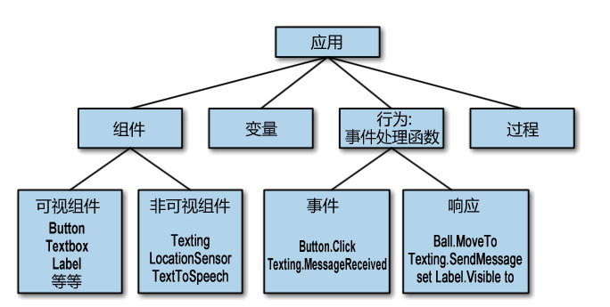

图14-1 App Inventor应用的内部结构
Contents [hide]
1 组件
2 行为
2.1 应用如菜谱
2.2 应用就是一系列的事件处理程序
2.3 事件类型
2.3.1 用户引发的事件
2.3.2 初始化事件
2.3.3 计时器事件
2.3.4 动画事件
2.3.5 外部事件
2.4 事件处理程序可以提问
2.5 事件处理程序可以重复执行某些块
2.6 事件处理程序可以实现存储功能
2.7 事件处理程序可以与Web对话
3 小结
# 组件

应用中的组件分为两大类：可视组件及非可视组件。可视组件是在应用启动后能够看到的组件，如Button、Textbox及Label等，这些通常被视为应用的用户界面。

非可视组件是不可见的，因此它们不是用户界面的组成部分，通常用于访问设备的内置功能，如，Texting组件用于收发短信，LocationSensor组件用于确定设备的位置，而TextToSpeech组件用于朗读文字。非可视组件是设备的技术核心，是服务于应用程序的小精灵。

两类组件都是由一组属性来定义，属性相当于组件信息的存储空间。如可视组件的Width、Height及Alignment属性，它们共同定义了组件的外观。因此，最终用户所看到的如图14-2所示的“Submit”按钮，实际上是在组件设计器中由一组属性所定义的，如表14-1所示。

表14-1 按钮属性

|WIDTH|	HEIGHT|	ALIGNMENT|	TEXT|
|:--|--:|--:|:--:|
|50|	30|	center|	Submit|

图14-2 提交按钮
可以将属性理解为上面表格中的内容，在组件设计器中，用它们来定义组件的初始外观。如果将Width属性从50改为70，那么无论是在设计器中，还是在实际应用中，按钮看起来都会变宽。注意，最终用户不会看到70这个数字，他们只能看到按钮变宽。

# 行为

一般来说，人们很容易了解组件的用途：文本框（Textbox）用于输入信息，按钮（Button）用来点击等等。但是对于应用中的行为，则往往是抽象的和复杂的。行为定义了应用对事件的响应，无论是用户发起的事件（如点击按钮），还是外部事件（如手机收到短信）。定义这些交互行为的难度恰恰是编程的挑战性所在。

幸运的是，App Inventor提供了一种非常适合于定义行为的可视化“块”语言，本节为理解块语言提供了一种模型。

## 应用如菜谱

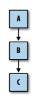

图14-3 传统的软件由一系列顺序执行的指令构成
人们习惯于把软件与菜谱相对比。像菜谱一样，传统的应用由一系列的顺序排列的指令构成，如图14_3所示，而计算机（厨师）则按顺序执行这些指令。

一项典型的银行业务可能按如下顺序执行：

启动某项业务；
执行某些计算并修改客户账目；
在屏幕上显示新的余额信息。
## 应用就是一系列的事件处理程序

然而，如今的绝大多数应用，无论是手机的，还是Web或桌面电脑的，都不再适合采用这种菜谱模式了。应用不再是顺序地执行一系列的指令，相反，更为普遍的是对事件的响应，事件的触发者是最终用户。例如，当用户点击按钮时，程序会做出响应，执行某些操作（如发送短信）。对于使用触屏的手机或设备，当你的手指在屏幕上拖动时，将触发另一类事件，在应用中可以利用这类事件，在手指最初的接触点与最终的抬起点之间画一条线，作为对该事件的响应。

这种类型的应用更适合于概括为“对事件做出响应的组件的集合”。这类应用中依然包含了“菜谱”——一些顺序执行的指令，但每个菜谱只限于对某些特定事件做出响应，如图14-4所示的“菜谱”。

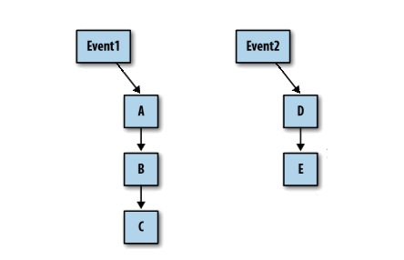

图14-4 拥有多个“事件菜谱”的应用
因此，当事件发生时，应用通过调用一系列的函数进行回应。这里的函数是指①利用某些组件来完成某些操作，如发送短信；②对某些组件属性进行操作，如在用户界面上修改label的text属性。调用函数意味着让函数运行，让它产生作用。我们把事件，连同对事件进行响应的一系列函数统称为事件处理程序（Event Handler）。

许多事件由最终用户触发，但还有些不是。应用可以对手机内部的事件进行响应，如方向传感器的变化以及时钟的行走（即时间的流逝），也可以对手机以外的事件做出响应，如来自于其他手机的事件，或收到来自web的数据，等等。如图14-5所示。

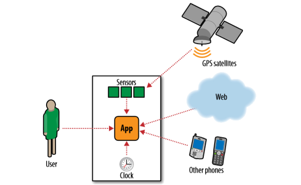

图14-5 应用可以兼顾对内部及外部事件的响应
之所以称App Inventor编程为“直观”编程，是因为这种编程完全基于一种事件响应模式，而“事件处理程序”则是该语言中最重要的词汇（在其他语言中情况未必如此）。想要定义某个行为，首先要拖出一个事件块，事件块在形式上是这样的：“When do”。假设有这样一个“朗读”应用，当用户点击按钮时，应用大声读出用户输入的文字，这个应用只需要一个事件处理程序，如图14-6所示。

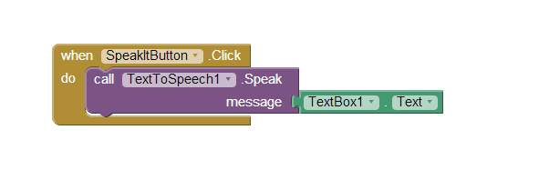

图14-6 “朗读”应用中的事件处理程序
这些块的作用是，当用户点击“SpeakItButton”按钮时，TextToSpeech组件将朗读用户在输入框TextBox1中输入的文字。在这里，事件是SpeakItButton.Click，对事件的响应是调用TextToSpeech1.Speak函数，事件处理程序中包括了图14-6中的所有块。

在App Inventor中，所有活动都发生在对事件的响应之中，应用中不可能存在事件块“when-do”之外的块，如图14-7这样的单摆浮搁的块是毫无意义的。

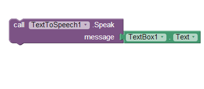

图14-7 事件处理程序之外的散在的块毫无用处
## 事件类型

可以引发活动的事件被分类列在表14-2中。

表14-2 能够引发活动的事件

|事件类型|	举例|
|:--|:--:|
|用户发起的事件|	当用户点击Button1时,执行…|
|初始化事件|	当应用启动时，执行…|
|计时器事件|	当20毫秒过去时,执行…|
|动画事件|	当两个物体碰撞时，执行…|
|外部事件|	当电话收到短信时，执行…|
### 用户引发的事件

用户引发的事件是一种最常见的事件类型，在输入表单中，通常点击按钮事件会引发应用的响应。图形化的应用更多的是对触摸及拖拽事件做出响应。

### 初始化事件

有时需要在应用启动时实现某些功能，这既不同于响应最终用户引发的事件，也不是对其他类型事件的响应，那么如何让这种情况也适合于事件处理模式呢？

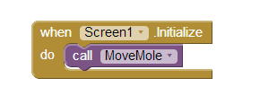

图14-8 应用启动时，使用Screen1.Initialize事件块来放置地鼠
在App Inventor这种基于事件处理的语言中，应用的启动也被视为一种事件。如果你想在应用打开的同时实现某些功能，可以拖出Screen1.Initialize事件块，并将某些函数调用块放在其中。

例如，在第三章打地鼠游戏中，在应用启动的同时，通过调用MoveMole过程，将地鼠放在一个随机的位置，如图14-8所示。

### 计时器事件

应用中的某些活动是由时间的流逝而触发的，比如动画，可以理解为计时器事件触发了角色的移动。App Inventor有一个Clock组件，用于触发计时器事件。例如，如果想让一个球在一定时间间隔内，在屏幕上水平移动10个像素，就可以像图14-9那样来设置块。

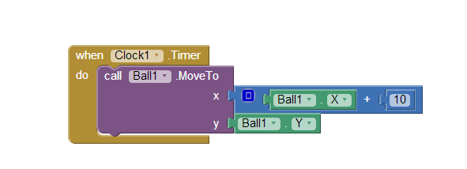

图14-9 一旦Clock1.Timer开始运行（计时），使用计时器事件块来移动球
### 动画事件

在canvas范围内的图形对象（sprites精灵），它们的活动将触发动画事件，具体地说，当两个sprites发生碰撞，或一个sprites到达canvas的边界时，将触发动画事件。因此可以编写游戏或其他交互式动画程序，利用动画事件来定义游戏或动画的情节。更多信息请参见第17章。

### 外部事件

当手机从接收到来自GPS卫星的位置信息时，将触发一个外部事件；同样，当手机收到短信时，也会触发此类事件（图14-10）。

这类向设备输入外来信息的行为都被视为外部事件，用户点击按钮也属于此类事件。

因此你所创建的应用，从本质上讲是一系列的事件处理程序：一个是对应用的初始化，有些是响应最终用户的输入，有些由事件触发，有些则有外部事件触发。你的任务是以事件处理的方式构思应用，然后设计对每个事件的响应方式。

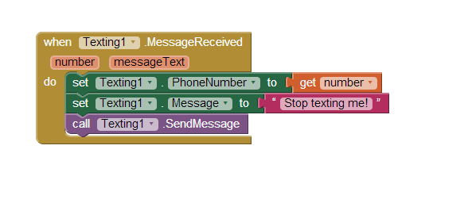

图14-10 当手机收到短信时，触发Texting1.MessageReceived事件
## 事件处理程序可以提问

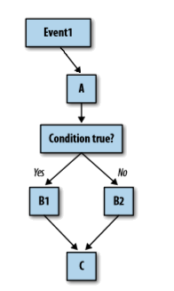

图14-11 事件处理程序可以根据 对条件问句的回答来执行不同的分支
对事件的响应不总是单线条的菜谱，程序可以提问，也可以重复某些操作。“提问”意味着就应用中的数据进行提问，并根据答案决定下一步的行进方向（分支）。我们把应用中的提问称为“条件分支”，如图14-11所示。

测试条件会如此设计：“分数到达100了吗？”或者“我刚收到的短信来自小明吗？”

测试也可以是的更为复杂的规则，包含多种关系操作符（小于、大于、等于）及逻辑运算符（and、or、not）。

在App Inventor中可以使用if块、ifelse块来设定条件行为，例如，在图14-12中，当玩家的分数为100点时，程序将显示“你赢了！”。

本书第18章中将详细讨论条件块。

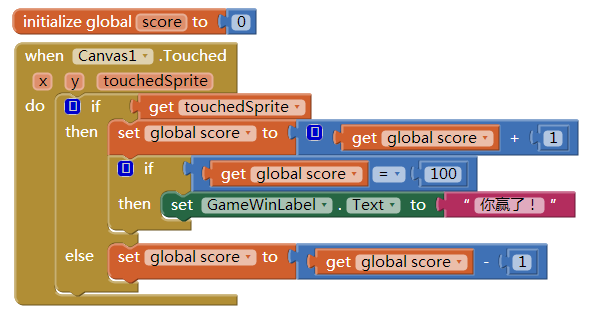

图14-12 一旦玩家成绩达到100点，用if块来报告获胜
## 事件处理程序可以重复执行某些块

应用不但可以提问并依据答案执行不同分支，还可以多次重复执行某些操作。App Inventor提供了两种用于重复执行的块：foreach及while do。两种块中都会包含其它块。对于列表中的每一项，都会执行一次foreach块中的所有块，例如，如果你想给电话号码列表中的每个人都发送同一条短信，你可以利用图14-13中的块来实现。

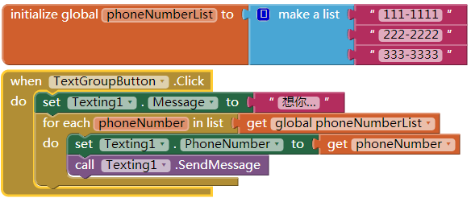

图14-13 foreach块中的块将对列表中的每一项都执行一次操作
foreach块中的块会重复多次，例如，3次，因为PhoneNumbers列表中只有三项。因此“想你…”这样的短信将发往这三个号码。本书第20章将详细讨论重复块。

## 事件处理程序可以实现存储功能

在事件处理程序运行过程中，通常会记录某些信息，有些信息可以保存在内存中，被称作变量。变量在块编辑器中定义，与组件的属性类似，但与任何组件无关。例如，在游戏类应用中，可以定义一个叫做“score（分数）”的变量，当用户执行了某些操作时，事件处理程序会相应地修改score的值。变量用于在应用运行过程中临时保存数据，一旦退出应用，数据将不复存在。

有时不仅需要在运行中保存某些数据，而且要求当退出又重新打开应用时，数据依然存在。例如，你想保存一个游戏的历史最高得分，就需要长期保存数据，以便下次有人再玩游戏时，可以看到这个分数。在应用关闭后依然保存下来的数据成为永久性数据，这些数据被保存在某种类型的数据库中。

在本书的第15章及第22章，我们将分别讨论临时存储（变量）及永久存储（数据库）的使用问题。

## 事件处理程序可以与Web对话

有些应用只能使用电话或设备的内部信息，但有些则能通过向web service API发送请求的方式与网络进行通信，这类应用被称为“网络应用”。

Twitter是一个很好的例子，它提供web service供App Inventor的应用访问。你可以编写一个应用，来请求并显示朋友们刚刚发布的“推文”，也可以随时更新自己的Twitter状态。能够与多个web service进行对话的应用被称为聚合类应用，我们将在第24章进行探讨。

# 小结

应用开发者必须以两种视角来观察一个应用，一个是最终用户的视角，另一个则是自内向外的程序员的视角。利用App Inventor来开发应用，首先要设计应用的外观，然后设计应用的行为——一套事件处理程序，让应用按照你的意图去运行。首先，通过在事件处理程序中拼装配置某些块，来实现对事件的响应，这些块可能是函数、条件分支、循环操作、web调用、数据库操作，等等；然后在手机中运行应用，来测试你的程序。当你编写了若干个程序之后，应用的内部结构与它的物理外观之间的关系将逐渐清晰，此时，你将成了一名真正的程序员。
