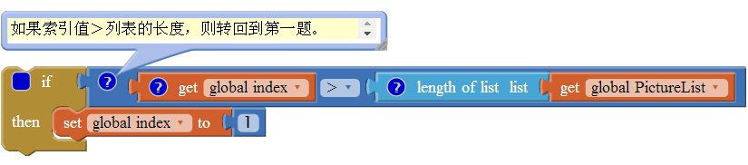
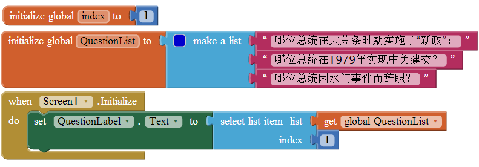
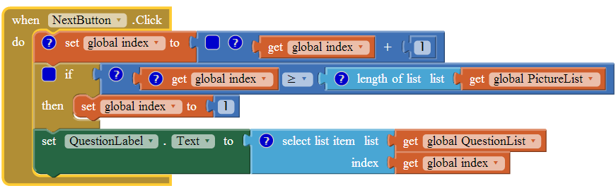
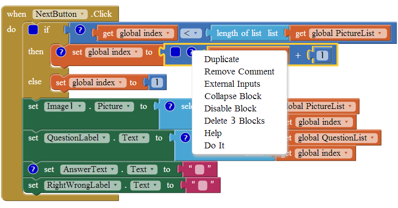
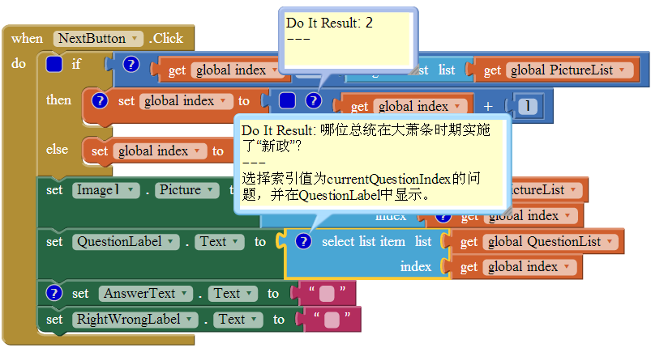
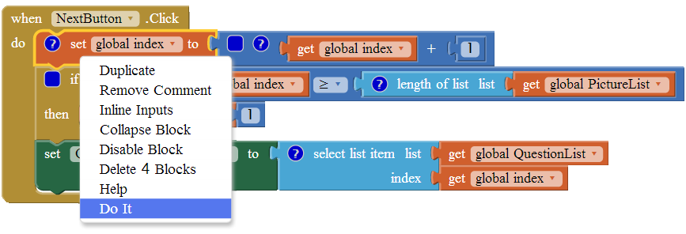

第15章 软件工程与应用调试  
十一月 20, 2015 ADMIN	留下评论
前面几章中讲过的Hello猫咪、打地鼠以及其他应用都是些非常小的软件项目，并不需要用引入软件工程的概念。工程的概念借用自其他行业，意为设计并建造，教程中的应用就像是用预制件拼装起来的房屋模型，而软件工程才是设计并建造真正用来居住的房子。这个例子虽然稍显夸张，但一般来讲，某些极其复杂的建造过程，的确需要大量的前期构思、规划以及技术分析，这些过程都可以归结为工程。

 
但凡接手过一个相对复杂的项目，你就会理解，只要在功能上稍稍增加一点复杂度，软件工程的复杂程度就会急剧增加，两者之间绝对不是线性的关系。对于我们大多数人来说，在真正开始面对这样残酷的现实之前，我们很少能够意识到将要面临的困顿。从这个意义上讲，你要准备学习更多的软件工程的原则及调试技巧。如果你已经认可这一点，或者，你是为数不多的、希望通过掌握一些技术来克服成长障碍的人，那么本章就是为你准备的。

Contents [hide]
1 软件工程原则
1.1 设计要面对真实的人、现实的问题
1.2 快速地创建软件原型，并展示给未来的使用者看
1.3 迭代式开发
1.4 先设计，后编码
1.5 对代码进行注释
1.6 切割、分层、各个击破
1.7 理解编程语言：用纸和笔跟踪记录
2 应用的调试
2.1 监视变量
2.2 单独测试块
2.3 使用“Do It”渐进式开发
2.4 启用与禁用块
3 小结
# 软件工程原则

以下是本章所涵盖的一些基本原则：

未来的软件使用者应该尽早，并尽可能多地参与到软件的设计及开发过程中来；
建立一个初始的、简单的原型，并逐步完善；
编码与测试同步进行，不要一次测试太多的代码（App inventor中的块）；
开始编码前进行逻辑设计：对功能做纵向切割，对技术或实施的复杂度做分层切割，并各个击破；
对代码块进行注释，以便其他人（和你自己）能理解这些程序；
学会用纸笔来跟踪记录块的执行过程，以便于理解它们的工作机制。
如果能够遵循上述原则，你就可以节省时间，避免挫折，从而制作出优秀的软件。但你很有可能做不到每次都依原则行事！有些原则看似违背常理。一种自然的倾向是，首先有了一个想法，并假设你了解用户的需求，然后开始把若干个块拼在一起，直到完成了想象中的任务。现在，让我们回到软件工程的第一个原则，在正式开始动手之前，看看如何了解用户的需求。

## 设计要面对真实的人、现实的问题

电影《梦幻成真》（Field of Dreams）中的男主角Ray听到了一个声音向他低语：“如果你建好了，他们就会来。”Ray听从了这个声音，在爱荷华州的农场中间建了一个棒球场，果然，在1919年，芝加哥白袜队（White Sox）和成千上万个球迷出现在这里。

不过你现在必须明白，那个低语的建议绝对不可以用于软件开发。事实上，必须正相反。在软件开发的历史中，充斥着各类“没问题”的伟大方案（如：“让我们写个软件，告诉人们开车到月球需要多长时间！”）。一个优秀的（同时也是极有可能获利的）软件的真正目的是解决现实中的问题。想知道问题出在哪里，就要找到有问题的人，并与他们交谈，这就是通常被称作“以用户为中心”的设计方法，这个方法同样也可以帮助你做出更好的应用。

如果遇到程序员，你可以问他们，在他们所写的软件中，有多少被真正交付到了最终用户的手中。结果会让你感到惊讶：即使是对那些伟大的程序员来说，这个比例也还是太小了！许多软件项目驶入了问题的泥沼而终无见天之日。

以用户为中心的设计理念意味着尽早并尽可能多地替未来的使用者着想，并与他们交流，这种思考与交流甚至应该在尚未确定目标之前就开始。大多数成功的软件都是针对某个具体的人，试图解决他的特定问题，也只有这样，最终才能发展成一个伟大的产品。

## 快速地创建软件原型，并展示给未来的使用者看

如果让最终用户阅读软件功能的说明文档，他们多半不会给出任何有效的回应，他们不会对文档做出反馈。真正有效的方法是，让他们体验未来软件的交互模式，即软件的原型。原型是一个不完整的、未经重构的软件版本，创建原型的目的在于充分体现软件所具有的核心价值，而不必注重细节、完整性或漂亮的用户界面。拿出原型让未来的使用者看，然后安静地倾听他们的反馈。

## 迭代式开发

在首次明确了软件的具体规格之后，采用迭代式开发。你可能很自然地倾向于将所有组件和块一股脑地添加到应用中，然后下载到手机上看看它是否好用。举例来说，“答题”应用，在缺乏指导的情况下，多数初学者会一次性添加所有的块：带有一长串问题及答案的块、浏览问题的块、检查用户答案的块，以及与每个逻辑细节有关的块，所有的块未经测试就全部罗列在应用中，这种开发方式在软件工程中被称为“大爆炸”方式。

几乎所有的初学者都会采用这种方式。在旧金山大学（USF）的课堂上，当学生忙于创建应用时，我经常会问他一个问题：“进展如何？”

“我想我做完了，”他说。

“好极了，能让我看看吗？”

“哦，还不行，我没带手机来。”

“那么你还从来没有运行过这个程序，对吗？”我问。

“嗯…”

我透过他的肩膀看到了30个左右色彩缤纷的块，但他居然连一个功能都没有测试过。

程序员们很容易着迷，他们沉湎于创建UI(用户界面)并在块编辑器中创建所需的行为。那些块天衣无缝地结合在一起，优雅地排布在屏幕上，这些让他们感到倾心，却忘记了创建一个让其他人也能使用的、完整的、通过测试的应用。这听起来像是洗发水的广告，但对于我的学生和那些有志成为程序员的人，这是我能给出的最好的建议：代码要随写随测，周而复始。

每次只写少量代码，并随时测试，这个过程本身会变成一种习惯，如此这般，在不久的将来，你会收获令人惊异且满意的成果（而且几乎杜绝了大而难缠的程序漏洞——bug）。

## 先设计，后编码

编程要分两步走：①理解应用的逻辑，②将这些逻辑翻译成某种形式的编程语言。在开始翻译之前，要在逻辑上花一些功夫：首先要明确应用中将会发生哪些事情，无论是用户引发的，还是应用内部的；其次在正式开始将逻辑翻译成代码块之前，要明确每个事件处理程序中的逻辑。

有许多专门讨论各种程序设计方法的书籍。有些人喜欢用流程图或结构图来做设计，有些则更愿意将设计或草图写在纸上，更有人认为所有的“设计”最终应该体现为代码的注释，而不是一个与代码分离的文档。对于初学者来说，关键是要理解所有的程序在本质上都是一套逻辑，而这种逻辑与具体的编程语言无关。当然，思考应用的逻辑和翻译为编程语言这两件事有时难免会同步进行，无论这种编程语言是否直观。因此，在整个逻辑思考阶段，应该远离电脑，想清楚应用最终要实现哪些功能，并以某种方式随时记录下你的想法，然后让设计文档与应用保持关联，以便其他人也可以从中获益。下面我们就来实践这一过程。

## 对代码进行注释

你已经学过了本书中的教程部分，应该见过块所附带的黄色方框（见图15-1），这就是“注释”。在App Inventor中，任何的块都可以添加注释，方法是在块上单击鼠标右键，并在快捷菜单中选择Add Comment。注释丝毫不影响程序的运行。

图15-1 为测试条件块添加注释——用简洁的语言描述块的作用
那么为什么要做注释呢？想想看，如果你的应用很成功，它的生命周期会很长，即便只是搁下一周的时间，你都有可能忘记当时的想法，想不起来这些块有什么用处。因此，尽管没有别人会看到你的代码块，你也应给添加这些注释。

假如你的应用很成功，毫无疑问它会传到很多人手里，人们想了解它、按自己的需要修改它，或者扩展它的功能，等等。在开源的世界里，很多项目会以现有项目为基础，做进一步的修改和完善，只要你亲身体验过那些没有代码注释的项目，你就会彻底明白为什么注释是必需的。

为程序添加注释并不是一种自觉地行为，我也从未见到过初学者重视它，然而，我也从未见到过一个经验丰富的程序员不重视它。

## 切割、分层、各个击破

当问题的规模大到难以应对时，解决之道在于将问题分解，分解的方法有两种：第一种方法我们非常熟悉，即，将问题分解为若干个部分（如A、B、C），然后各个击破；第二种则不太常见：将问题按照从简单到复杂的顺序逐层分解。对应到App Inventor的编程方法上，就是先添加少量的块来实现简单的功能，并测试其效果，再逐渐过渡到复杂的功能，以此类推。

让我们以第10章的“出题”应用为例来具体阐述这两种方法。在应用中，用户可以点击“下一题”按钮对问题进行浏览，也可以检查用户的答案是否正确。从设计角度，可以将应用分解为两个部分：问题浏览及答案核对，并针对两个部分单独编程。

但在每个部分中，还可以对整个过程按照从简单到复杂的顺序进行分解。例如，问题浏览环节，先创建代码来显示问题列表中的第一题，并测试其是否有效；然后编写代码来浏览到下一题，暂时不考虑到达最后一题时可能引起的错误；当测试结果证明可以从头至尾浏览所有问题时，再添加块来处理用户浏览到最后一题的“特殊情况”。

究竟是将问题分解为几部分，还是按照复杂性分解为若干层，这不是一个非此即彼的问题，但却是一个值得思考的问题，关键在于哪种方法更适合于你所创建的应用。

## 理解编程语言：用纸和笔跟踪记录

应用在运行过程中，仅有部分可见。最终用户只能看到它的外观——用户界面上显示的图形及数据，而软件的内部运作机制对外部世界来说是不可见的，就像人类大脑的内部机制一样（谢天谢地！）。应用在运行时，我们既看不到这些指令（块），也看不到跟踪当前正在执行的指令的程序计数器，更无法看到软件的内部存储单元（应用中的属性及变量）。不过说到底，这正是我们想要的：最终用户只能看到程序需要被显示的部分，但对于开发者来说，在开发及测试过程中，你需要了解所有正在发生的事情。

作为一个开发者，在开发过程中所看到的代码，都只是些静态视图，因此必须靠想象力来驱动软件的运行：事件发生了，程序计数器移动到下一个块，并执行这个块，内存单元中的值发生了变化，等等。

编程过程中需要在两种不同的场景之间切换：先从静态模式——代码块开始，并试着想象程序的实际运行效果；一切就绪后，切换到测试模式——以最终用户的身份测试软件，看它的运行结果是否与预期的结果相一致。如果不是，必须再切换回静态模式，调整程序，然后再试。如此循环反复，最终获得一个满意的结果。

初学者对于计算机程序的运作方式知之甚少，整个过程看起来就像魔术。依照本教程的指导，学习应该从简单的应用开始（如，点击按钮导致猫叫），再逐渐过渡到较为复杂的应用，而且随着学习的不断深入，或许还可以根据自己的需要，对教程中的例子做出修改。从初学者到入门者，对程序的内部运作机制有了一些了解，但依然感到对整个过程无法控制。他们经常会说：“这个不起作用，”或者“它不应该是这样的。”关键是要理解程序如何实现那些你主管想象出来的功能，而且要说：“我的程序正在做这件事”，以及“我的逻辑导致了程序的…”。

了解程序运行机制的方法就是剖析一个简单应用的执行过程，在纸上精确地描绘出每个块在执行时，设备的内部发生了什么。想象用户触发了某个事件处理程序，然后逐步跟踪并记录块的执行效果：应用中的变量及属性如何改变，用户界面上的组件如何改变。就像文学课上的“精读”环节，这样一步一步的跟踪可以促使你检查语言中的各个要素（即App Inventor中的块）。

对复杂性的描述几乎是完全抽象的，重要的是你要放慢思路，理清各个块之间的因果关系。最终你会明白，这些过程控制的规则，并不像最初想象的那样难以理解。

以第8章总统测验为例，如图15-2所示，思考图中的这些块（对原教程做了一点修改）。

图15-2 应用启动时，将QuestionLabel的Text属性设置为QuestionList列表的第一项
你能理解这些代码吗？你能跟踪这些代码，并说明每一步都发生了什么吗？

首先跟踪所有相关的变量及属性。画出存储单元的表格，这个例子中，表头分别为currentQuestionIndex和QuestionLabel.Text，如表15-1.

15-1 记录text属性及index值变化的表格

|QUESTIONLABEL.TEXT|	CURRENTQUESTIONINDEX|
|:--|:--:|
| | |

接下来，思考当应用启动时，发生了哪些事——不要以用户的视角来看，而是从应用的内部来分析它的初始化过程。如果你学过这些教程，你可能知道这个过程，但你可能没有从机制方面去思考过。当应用启动时：

完成了所有组件的属性设定，它们的值等于在组件设计器中设定的初始值；
完成了所有变量的定义及初始化；
执行了Screen.Initialize事件处理程序中的所有块。
对程序进行跟踪有助于理解程序的运行机制，那么在完成了应用的初始化之后，表格中应该填写什么内容呢？

如表15-2所示，currentQuestionIndex的值为1，因为应用启动时完成了变量的定义，并将其初始值设为1；而QuestionLabel.Text的值为第一题，因为在Screen.Initialize中选择了QuestionList列表中的第一项，并放入了QuestionLabel中。

表15-2 总统测验应用初始化后，QuestionLabel.Text与currentQuestionIndex的值

|QUESTIONLABEL.TEXT|	CURRENTQUESTIONINDEX|
|:--|:--:|
|哪位总统在大萧条时期实施了“新政”？|	1|

下面再来跟踪用户点击“下一题”按钮时发生的事情。

图15-3 用户点击“下一题”按钮时执行的块
逐个检查每个块。首先是变量currentQuestionIndex的递增，说得更具体一些，变量当前值是1，经过+1的运算后，将结果2再赋给变量currentQuestionIndex。接下来看if语句，列表QuestionList的长度为3，显然currentQuestionIndex的值2小于3，因此if语句的结果是false（假），于是列表中的第2项（第二题）被写入QuestionLabel.Text中，如表15-3所示。

表15-3 点击“下一题”按钮后的变量及属性值

|QUESTIONLABEL.TEXT|	CURRENTQUESTIONINDEX|
|:--|:--:|
|哪位总统在1979年实现中美建交？|	2|

跟踪“下一题”按钮的第二次点击。现在currentQuestionIndex已经递增到3，会发生什么呢？继续阅读之前，细心地检查一下，看你能否跟踪正确。

在if测试中，currentQuestionIndex的值（3）的确≥列表QuestionList的长度（3），于是currentQuestionIndex的值被设为1，第一题被写入label，如表15-4所示。

表15-4 “下一题”按钮被第二次点击时的值

|QUESTIONLABEL.TEXT|	CURRENTQUESTIONINDEX|
|:--|:--:|
|哪位总统在大萧条时期实施了“新政”？|	2|

我们的跟踪揭露了一个错误：最后一题永远也无法显示！

通过类似的跟踪，最终使你成为一名程序员、工程师。你开始从机制上去理解编程语言，掌握代码中的语句和词汇，而不是对一些片段的模糊理解。诚然，编程语言是复杂的，但机器对每个“词”都有明确而且简单的解释，如果理解了块与变量或属性变化之间的对应关系，也就理解了如何编写或修复你的应用，当然也就实现了对应用的完全控制。

现在如果你告诉朋友们，“我正在学习如何让用户点击‘下一题’按钮来看到下一道题，这实在是太难了！”他们会以为你疯了。但这个过程的确很困难，困难不在于概念的复杂性，而在于你不得不有意让自己的脑子慢下来，来搞清楚计算机的每一步处理过程，包括那些你的大脑下意识完成的过程。

# 应用的调试

逐步跟踪不仅是理解编程的方法，同样在调试有问题的应用时，也是一个屡试不爽的方法。

像App Inventor这样的开发工具（通常被成为交互式开发环境，或IDEs-Interactive Development Environments）一般会提供了一种调试工具，相当于纸笔跟踪记录的高科技版本，能够自动完成某些跟踪过程，这极大地改善了应用开发的进程。这些工具提供了一个描述正在运行的应用的视图，程序员可以在其中：

在任何一点暂停应用来检查其中的各个变量及属性；
单独执行某些指令（块）来检查它们的执行效果。
## 监视变量

说明：监视变量是AI1（App Inventor version1.0）中的功能，目前尚未在AI2中实现。

## 单独测试块

除了可以用监视功能来检查应用运行过程中变量及属性的变化，还有另一个工具“Do It”，可以让你脱离开程序通常的运行顺序，单独测试某些块的运行。右键点击一个块，在快捷菜单中选择“Do It”，这个块就会开始执行，如果这个块是一个有返回值的表达式，App Inventor将在块的上方的方框内（在注释块中插入两行）显示返回值。如图15-4及15-5。

图15-4 右键点击事件处理程序中的任何一个块，会弹出快捷菜单

图15-5 在快捷菜单中选择“Do It”，可以执行该块，并查看返回值（如果有）
“Do It”在调试块的逻辑错误时非常有用。还是回到“总统测试”例子中的NextButton.Click事件处理程序，并假设程序中存在逻辑错误，无法浏览所有的问题。调试过程需要在开发环境及测试设备上同时进行。在用户界面上点击“下一题”按钮，然后回到块编辑器查看是否每次点击都显示了适当的问题。也可以监视变量index在每次点击时的变化。

但是这类测试只允许检查整个事件处理程序的执行效果，在运行完所有的块之前，你无法检查你要监视的变量或用户界面。（抓不到逐句的中间状态）

“Do It”允许你减缓测试过程，并检查任何一个块执行完成后的整个应用的状态。一般是从用户界面上的事件开始跟踪，直到发现问题所在。在发现无法显示最后一题之后，你可能在用户界面上点击“下一题”一次转到第二题，然后不再继续点击“下一题”，而是在块编辑器中让整个事件处理程序一步一步地运行。在NextButton.Click事件处理程序中，每次对一个块使用“Do It”让块执行，如图15-6中，先右键点击第一行的块（让变量index递增），并选择“Do It”。

此时index的值变为3，应用停止执行——“Do It”只能使被选中的块以及它所包含的子块运行，这可以让测试者检查被监视变量以及用户界面的变化。接下来，选择下一行要测试的块（if测试）并选择“Do It”来执行该行，其中的每一步都能看到每个块的执行效果。

图15-6 使用“Do It”工具，每次只执行一个块
## 使用“Do It”渐进式开发

有一点需要强调，这种逐行执行指令的方式不仅仅适用于程序的调试，它同样适用于开发过程中的随时测试。例如，如果你写了一个很长的公式来计算两个GPS坐标之间的距离，你可能要分步测试这个公式，来验证这些块的使用是否正确。

## 启用与禁用块

另一个有助于渐进式调试应用的方法是启用或禁用某些块，它允许应用中保留有问题的或未经测试的块，并让系统在运行过程中暂时忽略它们，然后充分调试那些启用状态的块，而不必担心那些有问题的部分。禁用块很简单，在块上点右键，在快捷菜单中选择Disable Block即可，被禁用的块呈现为灰色，在应用运行时，这些块被忽略；需要时，还可以重新启用这些块，方法是在块上点击右键并选择Enable Block。

# 小结

App Inventor的伟大之处在于它的易用性——可视化的特点让你可以直接开始一个应用，而不必担心那些低层的细节。但现实的问题是，App Inventor不可能知道你的应用要做什么，更不知道如何来做。尽管直接进入组件设计器与块编辑器创建应用是件让人着迷的事情，但这里要强调的是，花一些时间来思考并详细、准确地设计应用的功能，是非常重要的。这听起来有些烦，但如果你能听取用户的想法、创建原型、测试并跟踪应用的逻辑，那么创建出精彩应用的目标指日可待。
