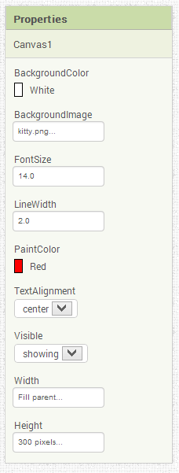
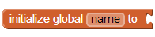
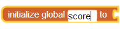
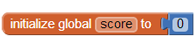
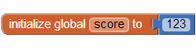
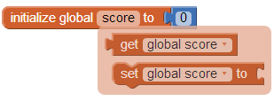
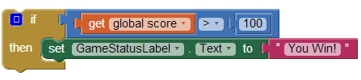
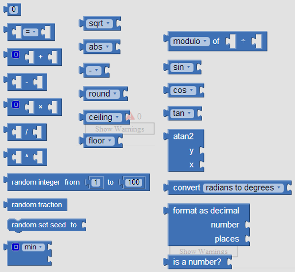
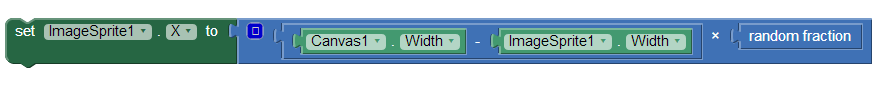

第16章 应用中的存储  
十一月 20, 2015 ADMIN	留下评论
就像人类需要记忆一样，应用需要存储。本章将探究如何在应用中实现信息的存储。

如果刚刚有人在电话里告诉你一家披萨店的电话号码，你的大脑中会留下一段记忆；这时，如果有人大声告诉你一串数字，并要你记住，你也会将它们保存到记忆中。在这种情况下，你未必能清楚地意识到，你的大脑是在保存或调用信息。

应用同样具备记忆功能，但它的内在机制并不像大脑那样神秘。本章你将学习如何设置应用的存储功能，如何利用它来保存信息，以及之后如何提取这些信息。

Contents [hide]
1 有名称的存储槽
1.1 属性
1.2 定义变量
2 设置及读取变量
2.1 用表达式为变量赋值
2.2 变量的递增
2.3 构造复杂的表达式
3 显示变量
4 小结
# 有名称的存储槽

 
应用的存储功能由一组有名称的存储槽（memory slots）组成。一旦组件被拖到应用中，就会自动创建了一组被称为“属性”的存储槽；也可以定义与特定组件无关的、有名称的存储槽，即变量。如果说属性通常与应用的外观呈现有关，那么变量则被认为是应用中不可见的“暂时”记忆。

## 属性

图16-1 在属性栏中修改存储槽来改变应用的外观
在应用中，组件,或者说像Button、TextBox以及Canvas这类可视组件，构成了完整的用户界面。而组件本身的外观则是又一组属性来确定，属性值就保存在存储槽中。

在组件设计器中，可以直接对属性的存储槽进行修改，如图16-1所示。

图16-1中的Canvas组件具有六个属性：BackgroundColor及PaintColor是保存颜色的存储槽，BackgroundImage保存了文件名（kitty.png），Visible属性保存了一个布尔值（true或false，依赖于是否勾选了方框），而Width及Height属性保存了一个数字或某个特定的设置（如，“Fill parent”）。

在组件设计器中设置组件的属性，相当于设置应用启动时的外观。应用的最终用户从未见过应用中有一个名字为Height、值为300的存储槽，他们只能看见用户界面上有一个300像素高的组件。

## 定义变量

像属性一样，变量也是被命名的存储槽，只是与特定的组件无关。在应用中，需要记住某个状态，如果无法用组件的属性来保存它，就需要定义一个变量来保存它。例如，一个游戏类的应用可能需要记住玩家到达的等级。如果等级数用Label组件来显示，就不需要定义变量，因为Label组件的Text属性可以用来保存这个等级。但是，如果等级数不需要显示给用户，就应该定义一个变量来保存它。

另一个使用变量的例子是第8章总统测验。在这个应用中，用户界面上一次只能显示一道测验题，而其他问题用户是看不见的，因此，就需要定义一个问题列表的变量来保存它们。

在组件设计器中拖入一个组件，它的属性就自动创建完成了，相比之下，变量的定义需要在块编辑器中直接拖出一个变量初始化块（initialize global name to），点击块中的“name”为变量命名，并为变量设置初始值，方法是拖出一个块放入变量初始化块中，可以是number块、text块、color块或者是make a list块。跟随下面的步骤就可以创建一个叫做score的初始值为0的变量。

1. 从块编辑器的Built-in分组中找到Variables，点击打开抽屉并拖出“initialize global name to”块，如图16-2所示。

图16-2 拖出变量初始化块

图16-3 为变量命名
2. 为变量命名：点击变量初始化块中的“name”，并输入“score”，如图16-3所示。

3. 为变量设置初始值：从Math抽屉中拖出数字块，将其插入变量初始化块的插槽中，如图16-4所示。

图16-4 为变量设初始值

图16-5 修改变量的初始值
4. 将变量初始值由默认值（0）改为123，如图16-5

定义一个变量，就是通知应用建立一个有名称的存储槽，来保存某个值。像属性一样，这些存储槽用户是看不见的。

变量的初始值在应用启动时就已经被放入存储槽中。可以用数字或文本对变量进行初始化，除此之外，也可以插入一个“make a list”块，它告诉应用这个变量是一个存储槽的列表，而不是一个单独的值。关于list的更多内容请参考第19章。

# 设置及读取变量

变量定义之后，App Inventor会生成两个属于这个变量的块：set块及get块，只要将鼠标悬停在变量初始化块中的变量名称之上，就可以呼出到这两个块。如图16-6所示。

图16-6 变量初始化块包含访问该变量的set块及get块
其中的“set global score to”块可以用来修改（设置）变量的值，例如图16-7中，将数字块5放在变量score的set块中。变量初始化块中的“global”一词意为“全局的”，指的是变量的适用范围，一个全局变量可以被程序中所有事件处理程序及过程所引用。新版的App Inventor中还可以定义一种“local”变量，这种变量可以在一个事件处理程序或某个过程的内部进行定义（这里暂不涉及）。

图16-7 将数字5赋给变量score
另一个“get global score”块用于从变量中读取变量值。例如，如果你想检查score的值是否大于或等于100，就可以将“get global score”块插入if块进行测试，如图16-8所示。

图16-8 使用get global score块来获取变量值
## 用表达式为变量赋值

可以用单一的数字5来为变量赋值，不过通常会用一个更为复杂的表达式来为变量赋值（“表达式”是一个计算机科学的术语，即公式）。例如，在总统测试的应用中，用户点击“下一题”按钮时，要让变量currentQuestionIndex的值增加1，来显示下一道题；又如在游戏类应用中，如果玩家失败，还有可能将他的成绩减10分；还有像第3章打地鼠的游戏中，通过改变变量x的值，实现地鼠在Canvas中水平位置的随机移动。因此可以用若干个块组成的表达式插入“set global score”块为变量score赋值。

## 变量的递增

一种最常见的表达式可能是变量的递增，或根据变量的当前值进行设定。例如，游戏中当玩家获胜一次，变量score就将增加5，如16-9显示了实现这一行为需要的块。

图16-9 分数变量递增5
如果能够理解这些块的含义，你就离程序员又近了一步。这些块可以理解为“让成绩在现有的值上加1”，这是变量递增的另一种说法。要理解这些块的工作机制，需要按照从内向外、而不是从左到右的顺序，最里面的块是“get global score”及数字“5”，它们是最基础的块，然后“+”块执行加法运算，并将结果设定为变量score的值。

假设存储槽中score的当前值为5，经过这些块的运算，程序执行了以下步骤：

从score的存储槽中读取当前值5；
加上5得到结果10；
3. 将10放回到score的存储槽中（来替代5）。
关于变量递增的更多内容请参见第19章。

## 构造复杂的表达式

在Math抽屉中（图16-10），App Inventor提供了许多数学函数，就像在电子表格或计算器中见到的一样。

图16-10 Math抽屉中的运算符及函数
你可以使用这些块来构造复杂的表达式，并将它们作为赋值表达式插入到“set global to”块中。例如，要想实现一个图片精灵（image sprite）在canvas范围内的随机水平移动，就需要使用一个乘法块（*）、一个减法块（-）一个Canvas.Width属性以及一个随机小数函数来组织表达式，如图16-11所示。

图16-11 使用数学（Math）块来构造上面的复杂表达式
正如在前面变量递增的例子中所说，程序对这些块的解释是遵循从内而外的顺序。假设Canvas的Width属性值为300，ImageSprite的Width为50，程序将执行以下步骤：

分别从Canvas1.Width及ImageSprite.Width的存储槽中读取300及50；
减法运算：300 – 50 = 250；
调用随机小数函数获得一个1-1之间的随机数（比如说0.5）；
乘法运算：250 * 0.5 = 125；
将125放在ImageSprite.x属性的存储槽中。
# 显示变量

在前面的例子中，修改一个组件的属性，将直接影响到用户界面的外观，而变量则不然，改变一个变量并不会直接影响到应用的外观。如果你只是将变量score的值递增，而不设法修改用户界面的话，用户永远都不知道变化的存在，就像俗话说的“树木落入森林”一般：如果没有人知道它，怎么证明它的存在呢？

有时，当变量变化时，不希望在用户界面上立即显示出来，例如，在游戏中，可能会记录某些统计结果（如失败次数），只有游戏结束时才会显示其结果。

与组件的属性相比，这是使用变量来存储数据的优势：可以在需要的时间显示必要的数据，也可以使应用中的计算与用户界面分离，这样做的结果是更易于稍后对用户界面的修改。

例如，在游戏中，可以将成绩直接保存在Label的Text属性中，也可以保存在变量中。如果保存在Label中，得分时可以让Label的Text属性值递增，用户可以直接看到成绩的变化；如果成绩被保存到变量中，并用变量的递增记录得分，则需要另外设置块，将变量值显示到Label中。

尽管使用变量保存并显示数据要多出一些步骤，但当你决定要修改应用，以不同的方式在用户界面上显示成绩时，变量的方法让改变很容易实现。你不必对每个显示组件上的成绩进行修改，它们不需要修改，你只需要修改那些与显示有关的块。

使用Label而非变量的方法，会让应用变得难于修改，因为，比如说要用一个递增的值来控制label的宽度（Width），每一次递增都要执行一次对Width属性的修改。

# 小结

应用启动之后，开始执行一系列的操作，并对发生的事件进行响应。在事件响应过程中，应用有时需要记住一些东西，如，游戏中每个选手的成绩，或者某个对象的移动方向等。

应用可以用组件的属性来实现存储，但当你需要与组件无关的存储槽时，就需要定义变量。可以将值保存到变量中，也可以从变量中读取当前值，就像使用组件的属性一样。

无论是属性值，还是变量值，对用户来说都是不可见的。如果你想让用户看到保存在变量中的信息，只要添加块，就可以用Label或其他用户界面组件来显示这些信息。
