本章将讨论创建另一类应用的方法，应用中使用了简单的可移动的动画对象。你将学习使用App Inventor创建二维游戏的基本知识，并熟练使用图片精灵（image sprite）及处理两个物体碰撞一类的事件。

 
当你在电脑屏幕上看到一个平滑移动的物体时，你实际上看到的是一连串快速移动的图片，每次只移动一个极小的距离，它利用了人的视觉暂留，从这一点上，它无异于“手翻书”——一种通过快速翻页来看到动画效果的书（这也是那些精美绝伦的动画电影的制作方法）。

在App Inventor中，通过在Canvas组件上放置物体，并让这些物体随时间在Canvas内移动，从而产生出动画效果。本章将学习使用Canvas的坐标系统，学习利用Clock.Timer事件来触发运动，以及如何控制运动速度、如何响应两个物体的碰撞事件等等。

# 在应用中添加Canvas组件

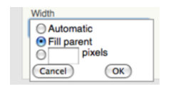
图17-1 设置Canvas组件的Width属性
从组件面板的Drawing and Animation组中拖出Canvas组件，然后定义它的Width及Height属性。通常我们希望Canvas与屏幕等宽，为此将宽度设为“Fill parent”，如图17-1所示。

可以用同样的方式设定Height属性，但一般会将其设为一个数字（如300像素），以便为Canvas上面或下面的其他组件留出空间。

## Canvas的坐标系统

Canvas上的图画实际上是一个许多像素构成的表格，像素是手机（或其他设备）屏幕上能够显示的最小的色块，每个像素都在Canvas上有它的位置（或者说单元格），位置由X-Y坐标系定义，如图17-2所示，X定义了水平方向上的位置（方向是从左到右），Y定义了垂直方向的位置（从上到下）。

图17-2 Canvas的坐标系统
坐标轴的方向定义可能与你的经验不一致，不过位于Canvas左上角的单元格的x、y坐标都为零，因此这个位置表示为（x=0，y=0）。（这与App Inventor列表中使用的索引值有所不同，索引值从1开始，看起来更容易理解。）向右移动时，x坐标增大；向下移动时，y值变大。位于左上角单元格右侧的单元格坐标为（x=1，y=0）。右上角单元格的x坐标等于canvas的宽度减1，多数手机屏幕的宽度都在300左右，但这里例子中显示的宽度是20，因此右上角的单元格坐标为（x=19，y=0）。

要改变canvas的外观有两种方法：①在上面绘画，或者②在上面放置移动的物体，本章所涉及的是后者，但我们首先要讨论如何绘画，以及如何通过绘画来创建动画（这也是本书第二章油漆桶中的主要内容）。

Canvas中的每一个单元格都对应显示为一个有颜色的像素。Canvas组件提供的Canvas.DrawLine及Canvas.Circle块可以用来在canvas上以绘制像素组成的图画。首先需要将Canvas.PaintColor属性设置为你需要的颜色，然后调用某个具体的绘画块来画出颜色。其中的DrawCircle块可以绘制直径为任意大小的圆，但如果你将半径设为1，如图17-3所示，那么只能画出一个单独的像素。

图17-3 用1个像素画圆，每次只能画1个单独的像素
在块编辑器Built-in组的Colors抽屉中，App Inventor提供了13种常用的颜色，可以用来绘制像素图（或设置组件背景色）。也可以使用颜色编码方案来获得更为丰富的颜色，颜色编码方案的解释请参见相关App Inventor文档：http://appinventor.googlelabs.com/learn/reference/blocks/colors.html。

改变canvas外观的第二种方法是在canvas上放置Ball和ImageSprite组件。sprite是一个被放置在场景中的图形对象，所谓的场景这里指的就是canvas。Ball和ImageSprite组件都属于sprites类型，只是外观不同而已。Ball为圆形，只能通过改变颜色和半径来改变它的外观，而ImageSprite可以是任何形状；ImageSprite和Ball都只能添加到Canvas中，不可能将它们拖入用户界面中Canvas以外的区域。

# 用计时事件制造动画

在App Inventor中，为应用添加动画的方法之一就是让物体对计时器事件做出响应，最常用的方法就是让sprite按照设定的时间间隔，在canvas上进行位置的移动。设定的时间间隔的方法是使用计时器事件最通用的方法。稍后我们还将讨论另一种方法，即，利用ImageSprite及Ball组件的Speed（速度）及Heading(方向)属性，通过编程来实现动画效果。

点击按钮以及其他用户触发的事件理解起来非常简单：用户做动作，应用通过执行某些操作来进行响应；但计时器事件则不然：这类事件不是由最终用户发起，而是由时间的流动来触发。你需要将应用中的这类手机时钟触发的事件与用户的行为区分开来。

定义计时器事件的第一步是在组件设计器中为应用拖入一个Clock组件。Clock组件有一个关联的TimerInterval（计时间隔）属性，用来以毫秒为单位定义计时器的计时间隔（1秒=1000毫秒）。如果将TimerInterval设为500，就意味着每隔半秒钟触发一次计时器事件。计时间隔越小，物体的移动也就越快。

在设计器中完成Clock的添加以及TimerInterval的设定后，就可以在块编辑器中拖出“when Clock.Timer”事件块，并在其中加入任何你需要的块，这些块将每个一个计时间隔执行一次。

## 产生运动
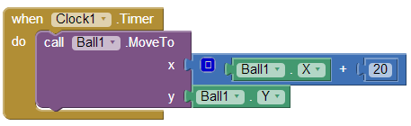

图17-4 让球在水平方向穿越屏幕
要让sprite随时间移动，就需要用MoveTo函数。在块编辑器的ImageSprite及Ball组件抽屉中可以找到这个函数。例如，要使一个球在水平方向上穿越屏幕，需要使用图17-4中的块。

MoveTo的作用是在canvas上将物体移动到一个绝对位置，而不是相对位置。因此，为了移动到这个绝对位置，需要将MoveTo函数的参数设定为当前位置与增量之和。这里我们要实现球的水平移动，只需要将参数x设定为当前的x值与增量20之和，而y值保持不变（Ball1.Y）。

如果想让球沿着对角线的方向移动，就需要同时设定x、y坐标的增量，如图17-5所示。
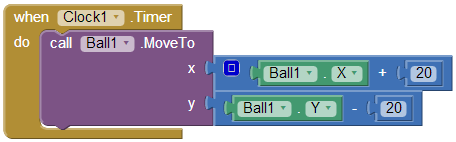

图17-5 设置x、y坐标的增量，实现球在对角线方向的移动
## 控制速度

在前面的例子中，球的移动有多快呢？速度取决于两个因素：Clock组件的TimerInterval属性值，以及MoveTo函数中的参数值。如果计时间隔设为1000毫秒，就意味着每秒钟触发一次计时事件，这样会让运动变得不流畅。为了得到更为平滑的运动，就需要缩短计时间隔。如果将TimerInterval设为100毫秒，则球每隔1/10秒移动20像素，或者每秒移动200像素，对于应用的使用者来说，这个速度看起来会平滑得多。除了改变计时间隔之外，还有一种方法也可以改变速度，你能想到是什么方法吗？（提示：速度与球移动的频次以及每次的移动量相关。）在保持计时间隔100毫秒不变的情况下，改变MoveTo中的算式也可以改变移动的速度：让球每次只移动2个像素，即2像素/100毫秒，这相当于20像素/秒。

## 高级动画功能

这种让物体在屏幕上移动的能力，适合于那些飘来飘去的动画类广告，但要制作游戏或其他的动画应用，就需要更为复杂的功能。幸运的是，App Inventor提供了几个的高级块，用于处理动画类事件，如物体到达屏幕边缘及两个物体的碰撞。

在这种情况下，用高级块来侦测两个sprite之间的碰撞这类事件，表明App Inventor已经深入到了程序的底层细节。其实你自己也可以利用Clock.Timer事件，通过检查每个sprite的xy坐标及Width、Height属性来检测到这类事件的发生，但这样的程序涉及到非常复杂的逻辑。由于这类事件在许多游戏及其他应用中很常见，因此App Inventor为你提供了这些功能。

## 抵达边界
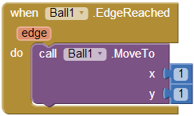

图17-6 当球到达边缘时让它重回左上角
重新考虑前面的动画，物体在canvas上沿着对角线方向从左上角向右下角移动。依照前面的程序，物体沿对角线方向移动并将停在canvas的右下角（因为系统不允许sprite对象超出canvas的边界）。

如果想让物体在到达右下角后再重新出现在左上角，可以定义一个事件处理程序Ball.EdgeReached来响应到达边缘事件。

当Ball碰到canvas的任何一个边时，将触发EdgeReached事件(到达边缘事件，该事件只适用于Sprite及Ball组件)。这个事件，再加上前面提到的让球沿斜线移动的定时器事件，两个事件共同作用的结果就是，球从左上角向右下角移动，在到达彼岸猿猴再跳回到左上角，然后继续移动，并再次跳回，循环往复，永不停止（或者直到接到其他指令）。

注意到在EdgeReached事件中有一个参数，edge1，它代表球碰到的那个边，这里用数字来代表不同的方向：

North = 1
Northeast = 2
East = 3
Southeast = 4
South = -1
Southwest = -2
West = -3
Northwest = -4
## CollidingWith事件与NoLongerCollidingWith事件

射击类、运动类游戏以及其他类型的动画应用通常都会涉及到两个或多个物体之间的碰撞（如，子弹击中靶子）。

例如，考虑这样一个游戏，当其中的物体与其他物体发生碰撞时，会改变颜色，并发出爆炸声，图17-7中显示了这样一个事件处理程序。

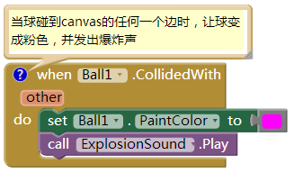
图17-7 当球与其他物体发生碰撞时，变色并发出爆炸声
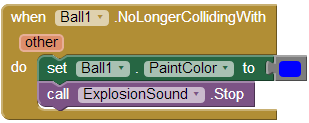
图17-8 当碰撞的物体离开时，球变黑色并停止爆炸声
NoLongerCollidingWith事件是与CollidedWith相反的事件，当两个碰到一起的物体分开时，触发该事件。而在游戏中，可能用到图17-8中的块。

注意到CollidedWith及NoLongerCollidingWith事件都有一个参数other，它代表了被撞到的那个物体。这可以用来处理一个物体（如Ball1）与另一个指定物体之间的相互作用。如图17-9所示。
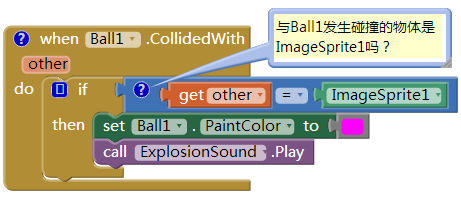

图17-9 只有当Ball1碰撞到ImageSprite1时才做相应
之前我们没有提到过这个“ImageSprite组件”块。如果需要对两个组件进行比较（得知究竟是哪一个与之碰撞），如本例中的情形，就必须指定被比较的具体对象。为此，每个组件都有一个指向它自己的块，而这个块就在ImageSprite1的抽屉里，排在最后一个的就是。

## 交互动画

到目前为止，我们所讨论的动画行为都没有最终用户的参与。毫无疑问，游戏都是交互的，最终用户扮演着核心的角色，通常他们使用按钮或其他界面对象来控制物体的速度及方向。

作为例子，我们来改变对角线移动的动画，用户可以让移动停止然后再启动。可以通过对Button.Click事件编程来实现这一点，具体方法是控制clock组件的启用与禁用属性。

在默认情况下，Clock组件的timerEnabled属性是被选中的，可以在事件处理程序中动态地设置它，如设为false。例如，在图17-10的事件处理程序中，在用户第一次点击按钮时，可以让Clock的计时作用停止运行。
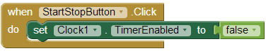

图17-10 当按钮被第一次点击时，停止计时
在Clock1.TimerEnabled属性被设为false之后，Clock1.Timer事件不再被触发，因此球停止移动。

当然，只是在第一次点击时让运动停止，这样的操作并不能为游戏带来乐趣，需要在事件处理程序中添加一个ifelse块来控制计时功能的启用与禁用，从而实现对运动的双向控制（运动及停止）。如图17-11所示。

在点击按钮的事件处理程序中，第一次点击按钮，计时器停止计时，按钮上的文字由“停止”变为“开始”；第二次点击按钮，此时TimerEnabled的值为false，因此执行“else”分支，于是计时器被置于启用状态，使得物体重新开始移动，按钮上的文字改回“停止”。关于ifelse快的详细信息请参见第18章，另外，关于用方向传感器创建交互动画的例子，请参见第5章及第23章。
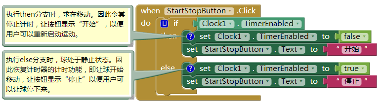

图17-11 添加ifelse块，通过点击按钮来控制运动的开始与停止
# 关于没有计时器的sprite动画

目前为止我们讲述的动画案例都是利用Clock组件的计时功能，计时器事件每触发一次，物体就移动一次。采用Clock.Timer事件的方案是设定动画最普遍的方案，除了可以移动物体，还可以随时间改变物体的颜色，改变某些文字（好像应用自己在输入文字一样），或者让应用以某个速度说话，等等。

App Inventor提供了另外一种不需要Clock组件而让物体的移动的方法。你可能已经注意到，ImageSprite及Ball组件都具有Heading（方向）、Speed（速度）及Interval（间隔）属性。与Clock.Timer方案中定义事件处理程序相比，这里可以在组件设计器及块编辑器中设置这些属性，来实现对sprite运动的控制。

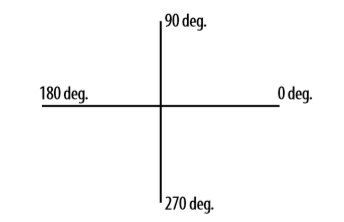

图17-12 Heading属性的取值范围
为了便于描述，我们来重新考虑沿对角线移动的例子。Sprite或ball的Heading属性的取值范围为0-360度，如图17-2所示。

如果Heading属性设置为0，则球从左向右移动；如果设为90，则从底向上移动；如果设为180，则从右向左移动；如果设为270，则从上向下移动。

当然，可以将Heading设定为0-360之间的任何值。要想让球沿对角线从左上角向右下角移动，就需要将Heading设为315。

此外，还需要设置Speed属性，它可以是0以外的任何值。此处Speed属性对物体的移动作用与MoveTo函数的作用相同：定义了每个时间间隔（interval）物体移动的像素数，而时间间隔由物体的Interval属性来定义。

尝试设置这些属性，用Canvas及Ball创建一个测试应用，并点击“Connect AICompanion”，在手机（或设备）上查看应用。修改Heading、Speed以及Interval属性，看看球是如何运动的。

如果你想通过编程来实现球在左上角与右下角之间做连续往复运动，可以在组件设计器中将球的Heading属性初始值设为315，然后在块编辑器中添加Ball1.EdgeReached事件处理程序，当球到达边缘时，改变它的方向。如图17-13所示。
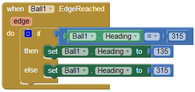

图17-13 当球到达边缘时改变它的方向
# 小结

动画是物体随时间的位置移动或某些属性的变化，App Inventor为提供了几个高级的组件及功能，让动画的实现变得简单易行。通过对Clock组件的Timer事件进行编程，可以创建任何类型的动画，包括物体的移动——这是任何类型游戏中最基本的活动。

Canvas组件在设备的屏幕上定义了一个区域，物体可以在其中移动，并产生交互。Canvas内部只接受两种类型的组件，即ImageSprite组件及Ball组件。这些组件为处理碰撞及到达边界这样的事件提供了高级功能。此外，这些组件的Heading、Speed及Interval属性也为运动的实现提供了替代方法。

文章导航
