第18章 程序中的决策：条件块
十一月 20, 2015 ADMIN	留下评论
即使是像口袋里的手机这样小型的电脑，也可以在短短几秒钟内完成超过数千次的操作。更令人惊奇的是，它们可以基于内存中的数据以及程序员编写的逻辑进行决策。这种决策能力在人们所思考的人工智能问题中是极为关键的要素，当然也是创建有趣的智能应用的重要组成部分。本章将探索如何在应用中编写判断选择逻辑。

 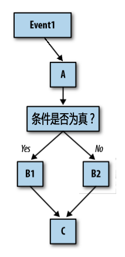
 
正如我们在第14章所讨论的，应用的行为由一系列的事件处理程序所定义。每个事件处理程序针对某个特定事件进行响应，并实现特定的功能。然而，这种响应的过程未必是按线性顺序来实现各项功能，有些功能只能在一定条件下才能执行。像游戏类的应用可能就会判断分数是否已经达到了100，而位置感知类的应用可能会问“某个手机是否在某个建筑物的范围之内”。你的应用也可以询问类似的问题，然后根据答案，继续执行不同的程序分支。

如图18-1，当事件（Event1）发生时，无论如何A功能都会被执行；然后进行一个检测判断：如果检测结果为真，则执行B1分支；如果结果为假，则执行B2分支；无论执行哪个分支，该事件处理程序的其余部分（C）都将被执行。

由于像图18-1这样的决策图看起来像一棵树，因此通常会将这种根据判断结果而选择执行的一段程序称为“分支”。在这种情况下，你会说， “如果测试结果为真，则执行包含B1的分支。 ”

图18-1 事件处理程序中，根据条件测试的结果执行不同分支

# 用if及ifelse进行条件测试

App Inventor提供了两类条件块（如图18-2）：if块和ifelse块。可以从Control抽屉里拖出一个if块，然后点击上面的蓝色图标，弹出可扩充的块，可以根据需要添加任意多个“else”分支。

可以将任何逻辑表达式（Boolean）插入到if右侧的测试插槽中。逻辑表达式是一个用数学等式，它的返回值要么是真（true），要么是假（false）。如图18-3，逻辑表达式使用关系运算符（蓝色）以及逻辑运算符（绿色），对属性值或变量值进行检测。

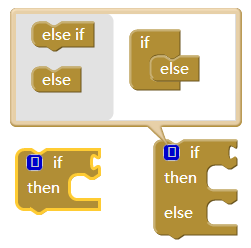

图18-2 条件块if及ifelse

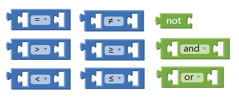
图18-3 用于条件判断的关系及逻辑运算符
无论是if块还是ifelse块，只有“if”后面的测试结果为真时，将执行“then”右侧插槽中的块。对于if块，如果测试结果为假，程序将跳出if块，继续执行if后面的块；而对于ifelse块，如果测试结果为假，将执行“else”右侧插槽中的块。

因此，对于一个游戏来说，可能会插入一个与成绩有关的逻辑表达式，如图18-4所示。

在本例中，如果成绩到达100，则播放一个声音文件。注意，如果测试结果为假，不执行任何块。如果需要在测试结果为假时执行某些操作，可以使用ifelse块。

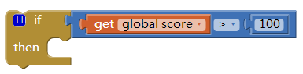

图18-4 用于测试成绩值的逻辑表达式
# 编写一段二选一的决策程序

考虑这样一个应用，无聊的时候也许会用到它：在手机上点击一个按钮，就可以随机地拨打一个朋友的电话。如图18-5，使用一个random integer（随机整数）块来生成一个数字，然后用ifelse对生成的数字进行判断，来决定即将拨打的电话号码。
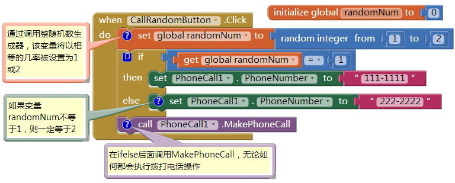

图18-5 用ifelse块判断随机生成的整数来选择要拨打的号码
在这个例子中，random integer的参数为1和2，意味着将以相等的几率产生1或2，所产生的随机数保存在变量randomNum中。

一旦取得了变量randomNum的值，在ifelse块中将变量值与1进行比较：如果randomNum的值为1，程序将执行第一个分支（then），将电话号码设置为“111-1111”；如果变量值不为1，测试结果为假，程序执行第二个分支（else），电话号码被设置为“222-2222”。无论测试结果如何，程序都将拔打电话，因为是在整个ifelse块的下面调用了MakePhoneCall过程。

# 多重条件判断

许多情况下不只是双重选择，即，可选择的结果不仅仅是两个。例如，也许你希望可以给更多的朋友随机拨打电话，因此就需要在原来的else分支中，再加入一个ifelse，如图18-6所示。
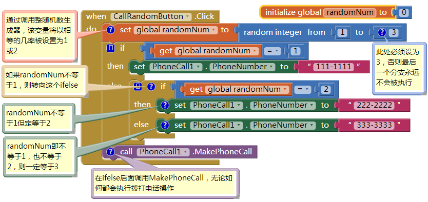

图18-6 外层条件判断的else分支中加入另一个ifelse条件判断
在这些块中，如果第一个检测条件结果为真，程序将执行第一个“then”分支并拨打号码“111-1111”；如果第一个测试结果为假，则执行外层的else分支，此时将立即进行另一个测试。因此，如果第一个测试结果（randomNum=1）为假，而第二个测试结果（randomNum=2）为真，则执行第二个（内层的）“then”分支，并拨打号码“222-2222”；如果前面两个测试的结果都为假，则执行最下面的内层的else分支，并拨打第三个号码333-3333。

注意，在修改过的程序中，随机整数生成器（random integer）中的参数2变成了3，因此，将以相等的几率生成结果1、2或3。

这种在一个条件判断中加入另一个判断的方式称为“嵌套”，在本例中，可以称为“嵌套的if-else块”，使用这种嵌套的逻辑，可以为随机拨打电话的程序提供更多的选择。一般来说，任何程序中都可以使用任意多层的嵌套。

# 复杂条件判断

除了嵌套，还可以设定更为复杂的检测条件，即，多于一个等式的检测条件。例如这样一个应用，当你（或你的手机）离开某栋建筑或某个边界时，手机会发出震动。这样的应用适用于那些受控人员，警告他们不要远离法定的边界；也可以用于家长监视孩子们的行踪；教师可以用它来做自动点名（条件是学生们都配有Android手机！）。

例如，我们提出这样的问题：手机是否在“旧金山大学哈尼科学中心”范围内？这样的应用要对4个不同的问题进行一个复杂的检测：

手机所在的纬度低于边界纬度的最大值（37.78034）吗？
手机所在的经度低于边界经度的最大值（-122.45027）吗？
手机所在的纬度高于边界纬度的最小值（37.78016）吗？
手机所在的经度高于边界经度的最小值（-133.45059）吗？
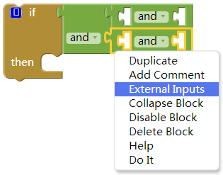
图18-7 放在if块测试插槽中的“and”块（选择“External Input/外展式输入”以免块的排列过宽）
本例中使用了位置传感器（LocatinSensor）组件，即便你没用过这个组件，也能够理解这些程序，在第23章中将有更多讲解。

使用逻辑运算符and、or及not可以构造出更为复杂的测试条件，可以从Logic抽屉中找到它们。在本例中，先拖出一个if块以及三个and块，并将and块放在if块的测试插槽中，如图18-7所示。
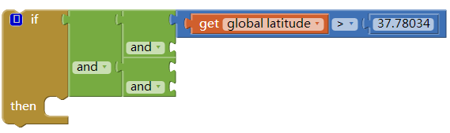
然后拖出几个块来组成第一个测试问题，并将其放在and块的第一个测试插槽中，如图18-8所示。

图18-8 and块中放入了第一个测试问题块
如法炮制出其他几个测试条件，填入其他几个and的测试插槽中，并将整个if块放入事件处理程序LocationSensor.LocationChanged中，这样就写成了一个检测边界的程序，如图18-9所示。
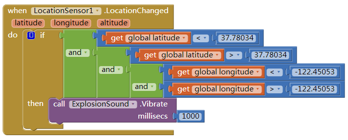

每次位置更新时，触发该事件处理程序，来检测是否在边界之内
这些块的功能是，在每次位置传感器读数更新时做出判断，如果手机的位置在边界之内，则发出震动。

OK,到目前为止，应用已经相当酷了，但现在我们来尝试更为复杂的功能，以便你能充分地了解程序中决策的威力。如何才能让手机仅在越出边界时才发出震动呢？继续学习之前，自己先想想如何来写这样的程序。

我们的方法是定义一个变量withinBoundary，目的是记住传感器上一次的读数是否在边界内，并根据每一次后续读数的测试结果对变量值进行修改。withinBoundary是一个布尔（Boolean）类型的变量，与保存数字或文本的变量相比，它保存的值为true（真）或false（假）。举例来说，如果将变量初始值设为false，如图18-10所示，这意味着设备不在旧金山大学的哈尼科学中心范围内。

图18-10 变量withinBoundary为初始化为false
对块做出修改，以便在每次位置信息变化时，对变量withinBoundary进行设置，并且只有当手机越出边界时，才会发出震动。说的更明确一些，手机产生震动的必备条件是（1）变量withinBoundary的值为真，即意味着上一次读数还在边界内；（2）新的传感器读数超出了边界。图18-11中是修改后的块。
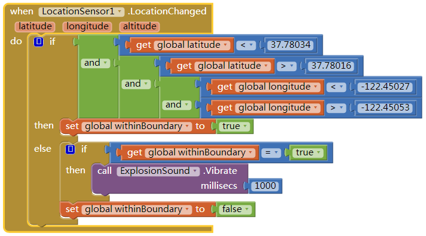

图18-11 这些块的功能是：只有当手机从界内移动到界外时，手机才会震动
我们来仔细地分析一下。当位置传感器（LocationSensor）获得读数时，首先判断读数是否在边界内，如果是，将withinBoundary设置为true。由于我们希望只有在手机越出边界时才震动，因此在第一个分支中不发生震动。

如果执行的是else分支，我们知道新的读数已经超出了边界。此时，我们需要检查上一次的读数：尽管这次读数超出了边界，但我们希望仅当上次读数在边界内时，才让手机发出震动。withinBoundary变量会告诉我们上一次的读数，因此我们会检查这个变量，如果检查结果为真，则让手机震动。

一旦确认手机从界内移动到了界外，还有一件事必须要做，你能猜到是什么吗？对，需要重新设置withinBoundary为false，这样，在下一次收到传感器读数时，手机才不会再次震动。

关于布尔型变量，还有一点需要提示：检查一下这两个if测试，如图18-12，它们的效果一样吗？
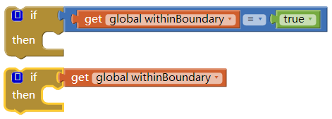

图18-12 你能说出这两个if测试的结果一样吗？
答案是“一样”！唯一的差别在于下边的提问方式实际上更加老练，而上边的测试还要将一个布尔型的变量（其值只能是true或false）与true进行比较。如果withinBoundary的值为true，将true与true比较，结果一定是true；如果变量值为false，将false与true比较，结果为false。因此，只需要对withinBoundary的值进行检测，像右边那样，其结果相同，而且编码更加简洁。

# 小结

头晕了吗？尤其是最后的部分相当复杂！但这类决策方法是高级应用中必须具备的。如果你能一步一步（或者说一个分支一个分支）地实现这些行为，并做到边做边测试，我们敢断言，你会发现，即便是人工智能也不是不可能的。它让你头疼，也让你的大脑获得了些许逻辑思维的锻炼，但无疑也是充满乐趣的。
