第19章 数据列表编程
十一月 20, 2015 ADMIN	留下评论
如你所见，应用就是处理事件以及作出决策，这一过程是计算机程序的基础，而同样构成程序基础的就是数据——程序所要处理的信息。程序中很少只用到像游戏中的成绩这样的单个数据，更普遍的是使用复杂数据——一些相互关联的数据项，必须像设计应用的功能一样，非常细心地组织这些数据。

 
本章将探讨App Inventor中处理数据的方式，并学习两种数据类型的基本编程方法，两种数据类型为静态数据（数据的值保持不变）及动态数据（数据由用户生成），然后将学习如何处理更为复杂的包含数据的数据，即数据项本身也是一组数据。

许多应用中都存在这样复杂的数据，如facebook中的好友列表，测试应用中的问题及答案列表等等，游戏中也会有角色的列表以及当前最高成绩的列表。

列表变量的使用如同普通的文本及数字变量一样，只是它们不仅仅代表单一的有名称的存储单元，而是表示一组相互关联的存储单元，例如，考虑表19-1中的电话号码列表。

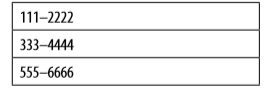

表19-1 列表变量表示一系列的存储单元
使用索引值（index）来访问列表元素，因此在列表19-1中，index为1时表示第一项111-2222，index为2时表示第二项333-4444，而index为3时表示555-6666。

App Inventor提供了操作这些数据的块，包括数据的创建、为数据添加元素、从列表中选择指定的项以及对整个列表的操作，让我们从创建列表开始。

# 创建列表变量

在块编辑器中，使用“initialize global (name) to”块以及“make a list”块来创建列表变量。例如，假设你正在写一个“一键发送短信”的应用，通过点击一个按键向电话号码列表中的所有成员发送短信。用如下方式创建一个电话号码列表：

1. 从块编辑器的Variables抽屉中拖出一个“initialize global (name)to”块到应用中，如图19-1。

图19-1 初始化变量的块
2. 点击文本“name”，将其改为phoneNumbers，如图19-2所示。

图19-2 将变量重命名为phoneNumber
3. 从Lists抽屉中拖出“make a list”块插入初始化变量块，如图19-3所示。这是告诉应用，要存储的变量是一个列表，而非单个值。通过点击“make a list”块上的蓝色增项图标来指定所需存储槽的数量，来增加数据项，如图19-3所示。

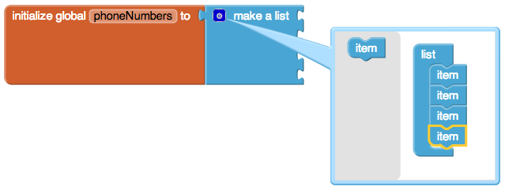

图19-3 使用“make a list”块来定义列表变量phoneNumber
4. 最后，从Text抽屉中拖出文本块，输入需要的电话号码，插入到“make a list”块的数据项插槽中。

图19-4 当列表中添加了全部数据项，相当于开辟了一个新的存储空间
数据项的存储中可以插入任何类型的数据，但在本例中，这些数据项是文本类型的对象，而不是数字，因为电话号码中含有一个破折号“-”，这种非数字类型的符号无法输入到数字块中，也无法与数字进行任何运算（而数字运算必须用到数字块）。

图19-4中所示的块定义了一个名为phoneNumber的变量，在应用启动时，你定义的任何变量就在此时被创建，而像表19-1中的存储槽也被同时创建并被填写上初始值。一旦有了这个列表变量，就可以使用列表中的数据开始编程了。

# 选择列表项

应用中可以使用“select list item”块，并指定索引值（index）来访问列表中指定的数据项。index代表了该数据项在列表中的位置。因此，如果列表中有三个数据项，就可以用索引值1、2、3来访问这些项。图19-5中显示了选中列表第二项的块。

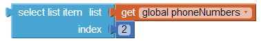

图19-5 选择列表中的第二项
使用选择块“select list item”需要提供两项参数，首先是要查询的列表，将其插入选择块的第一个插槽中，其次是索引值index，将其插入选择块的第二个插槽中。图19-5中的块是告诉应用从列表phoneNumber中选出第二个元素。如果列表的定义如表19-1的话，俺么选择的结果就是“333-4444”。

从列表中选择数据项，这仅仅是第一步，通过选择可以实现各种操作，下面将举例说明。

## 使用Index遍历列表

许多应用中，定义列表的目的是让用户可以遍历（逐个查看）它。第8章总统测验就是一个很好的例子：用户点击“下一题”按钮，程序从问题劣币哦啊中选择下一道题并显示出来。

但如何实现对下一项的选择呢？图19-5中选择的是列表phoneNumber中的第二项，而遍历列表时，每次选择的项目序号是不同的，会根据当前选中项在列表中的位置来确定。因此就需要定义一个变量来表示这个位置，通常用index来作为变量名，初始值通常设为1（列表中的第一个位置），如图19-6所示。

图19-6 变量index的初始值为1
当用户设法移动到下一项时，可以在当前的index值上加1来实现变量的递增，并使用递增后的值在列表中做选择。图19-7中显示了实现这一点使用的块。

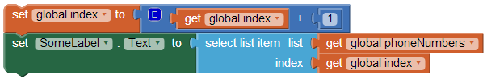

图19-7 使index值递增，并用递增后的值选择列表项
## 举例：遍历画笔颜色列表

来看一个例子，用户可以通过点击按钮来为他的房子选择一种可能的粉刷颜色，每次点击，按钮的颜色都会变化。当用户查阅完全部颜色时，再重新回到第一种颜色。

例子中，可以使用基本色，也可以替换成任何一组颜色，关于颜色的更多信息，可以参见App Inventor文档（http://appinventor.googlelabs.com/learn/reference/ blocks/colors.html）。

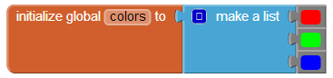

图19-8 用一组颜色为colors列表做初始化
第一步是定义一个颜色列表变量，并以颜色为列表项来初始化列表，如图19-8中所示。

接下来，定义变量index来跟踪列表的当前项位置，初始值为1。可以给变量一个更有意义的名字，如currentColorIndex，但如果你的应用中不需要处理其他更多的列表，用index就好。如图19-9所示。

图19-9 使用index变量来跟踪列表当前项的位置，初始值为1
用户通过点击ColorButton从列表中浏览到下一项（颜色），此时，index值递增，而按钮的BackgroundColor变为当前选中的颜色，如图19-10所示。

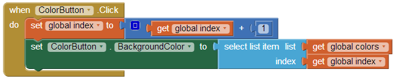

图19-10 用户通过点击按钮浏览颜色列表——每次点击都会改变按钮颜色
先假设我们已经在组件设计器中将按钮的背景颜色设为红色（Red），第一次点击按钮时，index值从初始的1变为2，按钮颜色变为列表中的第二项——绿色；第二次点击按钮时，索引值从2变为3，按钮变为蓝色。

想象一下，下一次的点击会出现什么情况？

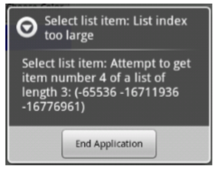

图19-11 当试图从一个只有三项的列表中选择第四项时，程序将提示错误信息
如果你说会出错，那么你对了！index值将变成4，程序将试图在列表中选择第4项，但列表中只有3项，因此程序强行关闭，或退出，用户将看到一条如图19-11中所示的错误信息。

显然，你不想让用户看到这样的信息，为了避免出现这样的问题，需要添加一个if块来检查是否到达了列表中的最后一项。如果是，将index值设回1，来显示第一种颜色，如图19-12所示。

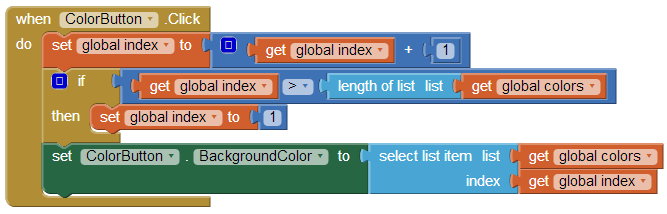

图19-12 使用if块检查索引值index是否大于列表的长度，如果是，将index值重新设为1
用户点击按钮时，index值递增，然后检查它的值是否过大。与index值进行比较的是“length of list”，而不是3，因此，即便是列表中添加了更多的项，程序也能正常运行。通过检查index是否大于列表长度（而不是与固定的数字3进行比较），可以消除程序中的代码相关性。所谓“代码相关性”是一个编程术语，举例来说，如果你的应用中某些方面的程序写得过于具体，那么当你想对某处做出修改时（如，列表的数据项），你不得不找到应用中所有使用过这个list的地方，并对程序块进行逐一修改。

正如你所想象得，这种相关性会让程序在短时间内变得混乱不堪，也会产生更多的错误等待你去排查。事实上，在“粉刷彩色房屋”应用的设计中，就在我们刚刚完成的程序中，还存在另一个代码相关性问题，你能找出是什么吗？

如果将颜色列表中的第一项由红色改为其他颜色，应用的运行结果就不再正确，除非你能记得在组件设计器中修改ColorButton.BackgroundColor属性的初始设定。消除这种代码相关性的方法是，将ColorButton.BackgroundColor初始值设定为颜色列表中的第一项，而不是某个特定的颜色。由于这一修改涉及到程序启动时的行为，因此需要在应用启动时调用的Screen.Initialize事件处理程序中进行这一设定。如图19-13所示。

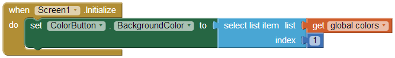

图19-13 应用启动时，将按钮的背景色设置为颜色列表中的第一项
# 创建输入表单及动态数据

前面的“粉刷彩色房屋”应用涉及到一个静态列表：程序员（也就是你）定义了列表中的元素，除非你亲自动手，没有人能修改这些列表项。不过，多数情况下，应用中要处理动态列表：最终用户输入新的数据项而导致数据的变化，或者从数据库或web信息源加载新数据。本节将讨论一个“随手记”应用：用户在应用中，通过表单输入笔记，并可预览之前所有输入过的内容。

## 定义动态列表

如果希望创建一个空列表，可以使用“create empty list”块来定义，例如，在“随手记”应用中，允许用户输入笔记，但在定义列表时，不应该有预定义的数据项，具体的定义方法见图19-14。

图19-14 动态列表的定义中不应该含有任何预定义数据项
## 添加数据项

图19-15 用输入表单想笔记列表中添加新项
当第一次启动应用时，notes列表是空的，当用户在表单中输入数据并点击“保存”按钮时，新的笔记内容将被添加到列表中。表单的设置非常简单，如图19-15所示。

当用户输入一段笔记并点击“保存”按钮，应用将调用“add items to list”函数将新输入的内容添加到列表中，如图19-16所示。

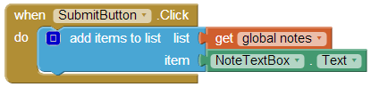

图19-16 用户点击“保存”按钮时，调用“add items to list”向列表中添加新内容
“add items to list”块将新的数据追加到列表的结尾，用户每次点击“保存”，就添加一条新笔记，在Lists抽屉中可以找到这个块。特别注意：还有另一个块“append to list”，它的功能是向一个列表中追加另一个列表，很少会用到这个块。

## 显示列表

对用户来说，列表变量notes的内容是不可见的，还记得之前讲过，应用中的变量是用来保存那些不需要被用户看到的信息。图19-16中的块实现了一点击按钮就添加新项的功能，但用户看不到任何反馈，除非你在程序中添加显示列表内容的功能。

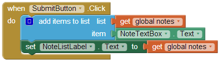

图19-17 用NotesListLabel的Text属性显示笔记列表
在应用的用户界面中显示列表内容最简单的方法就是现实数字和文本的方法：将列表内写入Label组件的Text属性，如图19-17所示。

可惜这种简单的显示方法看起来不够美观，列表中所有的项被放置在一对小括号内，没有分行，项之间用空格分隔。如图19-18所示，用户输入了第一条笔记“忘记了让笔记显示出来”，然后又输入第二条“显示结果被一对括号包围着！”。

如果学习过第13章的“亚马逊掌上书店”，你对这个问题应该熟悉。在第20章中，将学习如何用更加复杂的方式来显示列表内容。

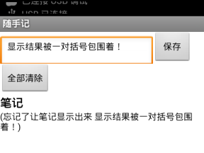

图19-18 列表内容的简单显示方法
## 删除列表项

图19-19 删除列表项
使用“remove list item”块可以从列表中删除某一项。如图19-19所示。

图19-19从列表notes中删除了第2项，但通常我们不希望只删除某个固定的项（如第2项），而是让用户来选择需要删除的项。

ListPicker是一个可以用于删除列表项的用户界面组件，它与一个按钮关联，当点击按钮时，ListPicker会显示列表项，并允许用户选择其中的一项。当用户选中后，应用就可以将其删除。

ListPicker有两个关键事件BeforePicking及AfterPicking，而且每个事件都有两个重要属性：Elements及Selection，如表19-2所示，只要理解了这两个事件及其属性，ListPicker组件的编程就很容易了。

表19-2 ListPicker组件的两个关键事件及其属性
事件	属性
BeforePicking：点击按钮时触发	Elements：选中的列表
AfterPicking：用户做出选择时触发	Selection：用户所选项
当用户点击ListPicker的关联按钮时，触发ListPicker.BeforePicking事件，此时用户尚未选择列表项；在ListPicker.BeforePicking事件处理程序中，可以将ListPicker.Elements属性设置为一个列表变量，例如，在“随手记”应用中，将Elements属性设置为列表notes，如图19-20。

这些块将列表notes的内容显示在ListPicker中，如果列表中有两条笔记，其显示如图19-21所示。

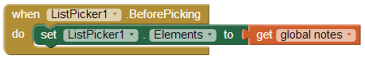

图19-20 ListPicker的Elements属性被设置为列表变量notes

图19-21 列表notes显示在ListPicker组件中
当用户从列表中选择一项时，将触发ListPicker.AfterPicking事件，在该事件的处理程序中，可以利用ListPicker.Selection属性来访问用户的所选项。

但是想到“remove item from list”块需要的是索引值（列表中的位置），不是具体的项，而Selection属性却是实际数据（一条笔记），不是索引值，ListPicker组件不直接提供对列表索引值的访问（在App Inventor的后续版本中将添加此功能）。

变通的方法是利用Lists抽屉中的另一个块：“index in list”。对于给定的文本，该块将返回列表中最先与该文本匹配的项的位置，使用“index in list”，ListPicker1.AfterPicking事件处理程序将删除用户选中的项。如图19-22所示。

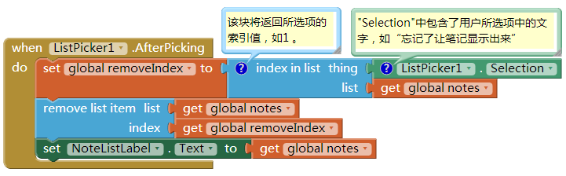

图19-22 使用“index in list”块找出要删除项的索引值
AfterPicking事件被触发后，ListPicker1.Selection中包含了用户选中的文本（如“忘记了让笔记显示出来”）。我们的目标是找到选中项在列表中的索引值，以便将其删除。如果用户选择的是“忘记了让笔记显示出来”，则“index in list”块将返回1，因为这段文本是列表中的第1项。将索引值保存到变量removeIndex中，并将它用作“remove list item”块中的index值。

再继续阅读之前，先思考一个问题：这种方法是否总是有效呢？

回答是肯定的，但条件是列表中没有重复的项。比如说，用户输入的第2条和第10条笔记都是“今天过得太好了！”。如果此时用户点击“删除列表项”按钮（其实是ListPicker），并选中了第10项，那么被删除的将是第2项，而非第10项。“index in list”块只能返回第一个匹配项，然后就停在那里，因此也就找不出应该被删掉的内容相同的第10项。需要对列表进行遍历，并使用适当的条件判断（见第18章）来查看是否还有其他匹配项，并将其删除。

# 列表中的列表

列表项可以使数字、文本、颜色、布尔值（true/false），也可以是数据（维基：在计算及数据处理中，数据往往表示一种结构，如表格[由行和列组成]、树[一组有父子关系的节点]或者图形[一组连接起来的节点]。数据通常是测量的结果，可以被可视化成图形。），这是一种常见的数据结构。例如，一个数据的列表可以将第8章总统测试转变为一个多选题测验。我们来重温一下总统测试中数据的基本结构：一个问题列表和一个答案列表，如图19-23所示。

图19-23 一个问题列表和一个答案列表
每当用户回答完一个问题，程序通过与AnswerList中的当前项进行对比来判断回答是否正确。

为了实现多选测验，需要为每个问题提供一个可供选择答案的列表。多选列表可以表示为一个数据列表变量，将三个“make a list”块放在一个外层“make a list”块中，来定义这个变量，如图19-24所示。

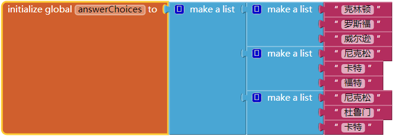

图19-24 通过在外层“make a list”块中插入若干个“make a list”块来构造出一个数据列表
变量answerChoices中的每个数据项本身也是一个由三个数据项组成的列表，如果从answerChoices列表中选择一项，选择的结果将是一个列表。现在填好多选答案的双重列表，那么如何向用户显示这些数据呢？

在“随手记”应用中，使用了一个ListPicker来向用户显示选项。假如索引值为currentQuestionIndex，则事件处理程序ListPicker.BeforePicking将写成图19-25中显示的样子。

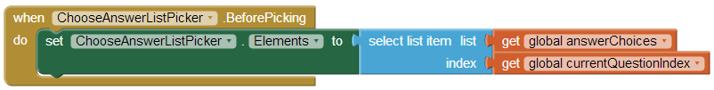

图19-25 使用ListPicker向用户展示多选列表

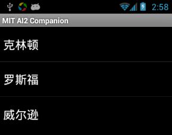

图19-26 向用户展示第1题的多选答案
这些块将选取并显示answerChoices中的当前项对应的子列表，供用户选择。如果currentQuestionIndex为1，ListPicker将显示图19-26中的列表。

用户选择之后，用图19-27中的块对答案进行检查。

这些块中，用户从ListPicker中选择的答案将与正确答案进行比较，而正确答案保存在另一个列表AnswerList中（注意answerChoices只提供选项而不代表答案）。

图19-27 检查用户选择的答案是否正确
# 小结

你能想到的几乎每个应用中都会用到数据，理解它们的运行机制是编程的基础，本章探索了一种最常用的编程模式：使用索引变量，从列表的第一项开始，通过变量的递增实现对每个列表项的处理。如果能理解并在自己的程序中加以运用，那么你的确是一名程序员了。

然后我们讲到了列表处理的其他方式，包括一个典型的让用户添加并删除列表项的表单。如此的编程还需要另一个层次的抽象能力，你必须假想数据的存在，因为直到用户输入某些数据之前，这些数据都是空的。如果你能理解这一点，你甚至可以考虑辞掉现在的日常工作了。

最后我们介绍了复杂的数据结构——数据列表。这显然是一个不太容易理解的概念，但我们利用一些固定的数据对问题进行了探索：多选测验中的可选择答案列表。如果你对此以及本章的其余部分都有所掌握，那么你的期末考试题是：使用数据列表创建一个应用，但要求使用动态数据！一个例子就是允许用户在应用中创建他们自己的多选测验，这个功能甚至比第10章的出题应用还要强大。祝你好运！

在你思考如何处理这些列表时，要知道我们的探索还没有结束。在下一章中，我们将继续讨论并重点讲解略有不同的列表循环：对列表中的每一项实施一些列的操作。
