第2章 油漆桶

# 学习内容

本章涵盖了以下内容：

* 使用Canvas组件来绘制图画；
* 处理屏幕上的触摸及拖拽事件；
* 使用arrangement组件来控制屏幕的外观；
* 定义变量，来保存某些状态，如用户绘制的圆点的大小。

# 准备开始

首先检查测试用的Android设备是否已经为使用App Inventor做好了准备：

* Android设备中已经安装了“AI伴侣”；
* 手机的WiFi连接已经打开；

再访问App Inventor网站。新建项目“PaintPot”，点击“Connect->AICompanion”，并按照提示操作，连接测试设备。 在正式开始之前，在组件设计器右侧的“属性”面板中，将“Screen1”的“Title”属性修改为“油漆桶”。在测试设备上可以立即看到这一改变：应用的标题栏将显示“油漆桶”。 这样做是否会混淆了项目名称与屏幕标题呢(在英文版书中，将Title改为“PaintPot”，与项目同名，因此才有此疑问，对中文读者来说不存在这个疑问。——译者注)？别担心！在App Inventor中有三个非常重要名称：

* 项目名称：同时也是应用发布时所使用的名称。提示：想修改项目名称，可以点击Project->Save project as，可以将原有项目赋予新的名称，同时原有项目依然得以保留；
* 组件名称：一般的组件名称都可以修改，但Screen1例外，在当前版本中不能修改它的名称；
* 屏幕标题：出现在设备的标题栏中，是Screen组件的Title属性，默认值是Screen1，如第一章HelloPurr中所见，可以随意修改它，如我们刚才将其改为“油漆桶”。

# 设计组件

创建“油漆桶”应用需要以下组件：

* 三个Button组件：用来选择画笔颜色：红、蓝或绿，放在HorizontalArrangement组件中；
* 一个Button组件用来充当橡皮；
* 另外两个Button组件用来改变画笔的大小；
* 一个Canvas组件，充当画布。Canvas具有BackgroundImage属性，我们将其设置为第一章HelloPurr中的kitty.png，稍后还可以将背景图片设置为用户拍摄的照片。

# 创建颜色按钮

首先按照以下提示创建三个颜色按钮：

1. 拖一个Button组件到预览窗口，设置其Text属性为“红”，BackgroundColor属性设为红色；  
2. 在组件列表中选中Button1（可能已经被选中），点击Rename按钮将组件名称改为RedButton。注意组件名称中不允许有空格，因此通常将组件名称中每个单词的首字母大写。 
3. 同样，创建另外两个按钮，分别命名为BlueButton和GreenButton，将它们垂直地放在RedButton下方。对照图2-2，检查一下你的操作结果。

图2-2 创建了3个按钮的预览窗口

 
注意：在项目中，建议为组建起一个有意义的名称，而不是像第一章那样采用默认名称。有意义的名称增加了程序的可读性，尤其是在切换到块编辑器时，将有助于区分不同的组件。本书中，采用惯用的骆驼命名法（如RedButton），即多单词无空格的首字母大写命名方式。

测试：如果你还没有点击“Connect”来连接测试设备，那么做好连接，然后检查一下应用在设备（如果已经连接）上的表现。
# 使用Arrangement组件改善布局

现在三个按钮排成一列纵队，我们希望它们能排成一行，如图2-3所示，使用HorizontalArrangement组件来实现组件的水平排列：

1. 在组件面板的Layout类中拖出HorizontalArrangement组件，放在按钮下方；
2. 在属性面板中，设置HorizontalArrangement的width属性为“Fill Parent”（充满父容器），以便在水平方向上占满整个屏幕；
3. 将三个按钮移动到HorizontalArrangement中。注意，当你拖拽按钮时，会看到一条蓝色竖线，提示按钮将会被放置在什么地方。

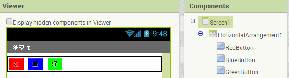

图2-3 在水平布局组件内的三个按钮
此时查看组件列表，你会发现三个按钮缩进排列在HorizontalArrangement项下，以显示它们现在是次一级的组件。同时注意到所有组件都缩进排在Screen1项下。

测试：在测试设备的屏幕上，你会看到三个按钮排列成一行，尽管看起来与预览窗口中略有不同。如，在预览窗口中可见的HorizontalArrangement周围的轮廓线，在测试设备上则不可见。
通常采用布局组件来创建简单的垂直、水平或表格布局，也可以通过逐级插入（或嵌套）布局组件来创建更加复杂的布局。

# 添加Canvas（画布）

Canvas像一块画布，用户可以在上面绘画（画圆、画等）。添加一个Canvas，并用第一章中的kitty.png作它的背景图片（设置BackgroundImage属性），具体步骤如下：

1. 打开组件面板中的Drawing and Amination（绘画与动画）类，将Canvas组件拖到预览窗口中，改名为DrawingCanvas，Width设为“Fill parent”，Height设为300pixels；
2. 如果你已经完成了第一章的课程，那么文件kitty.png已经下载；如果没有，请在这里下载kitty.png。
3. 将DrawingCanvas的BackgroundImage设置为kitty.png：在设计器的属性面板中，BackgroundImage的默认值为None，点击None及Upload File来添加kitty.png文件；
4. 将DrawingCanvas的PaintColor属性设置为red，以便当用户刚启动应用但尚未点击颜色按钮时，画笔为红色。对照图2-4检查一下你的操作。

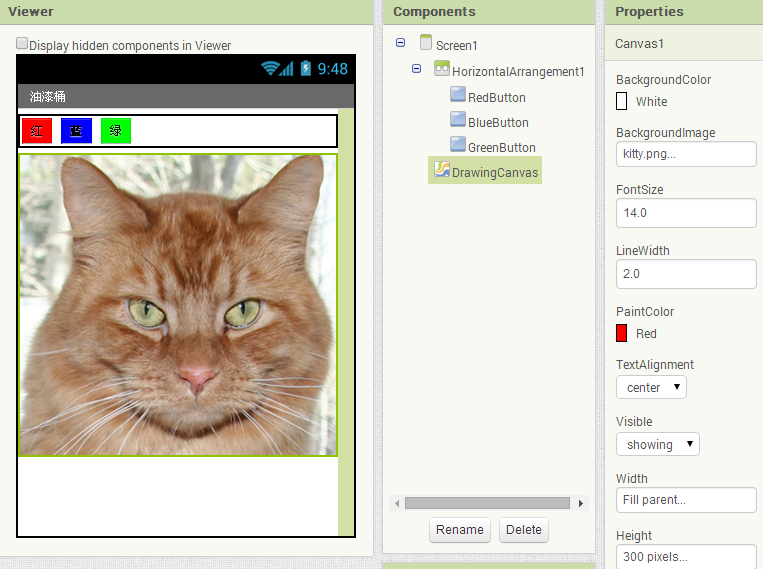

图2-4 背景图片设为kitty.png的DrawingCanvas组件
# 设置底部按钮及照相机组件

1. 从组件面板中拖出第二个HorizontalArrangement，放在canvas下方，再拖两个Button并置于屏幕底部的HorizontalArrangement中；将第一个按钮改名为TakePictureButton，Text属性设为“拍照”；第二个按钮改名为WipeButton，Text属性设为“清除”；
2. 再拖两个Button组件到HorizontalArrangement中，放在“清除”按钮后面；
3. 两个Button分别命名为BigButton、SmallButton，Text属性分别设为“大圆”、“小圆”；
4. 从组件的Media类中拖出一个Camera组件放在预览窗口中，它将落在非可视组件区。

到此为止，应用外观已经设置完成，如图2-5所示。

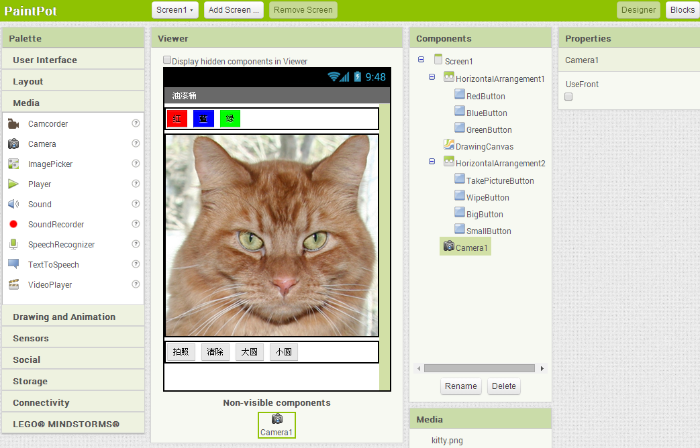

图2-5 油漆桶应用的完整用户界面

测试：在设备上检查一下应用，猫的图片是否在顶部的一行按钮的下方？底部的按钮是否正常显示？
为组建添加行为

下一步将定义组件的行为。编写一个绘画程序的难度似乎是难以想象的，但无疑App Inventor已经承担了大部分繁重的工作：这里有易于使用的块语言，不但可以处理用户的触摸及拖拽事件，也可以实现绘画及拍照功能。 Canvas组件具有Touched及Dragged事件，你可以针对DrawingCanvas.Touched（触碰）事件编程，并调用DrawingCanvas.DrawCircle（画圆）程序；也可以对DrawingCanvas.Dragged（拖拽）事件编程来调用DrawingCanvas.DrawLine（画线）程序。然后对按钮编程，来设置DrawingCanvas.PaintColor（画笔颜色）属性、清除DrawingCanvas，以及将DrawingCanvas的背景图片修改为照相机拍摄的图片。

# 添加触摸事件，绘制一个圆点

首先设置触碰行为：当用户触碰DrawingCanvas时，在接触点绘制一个圆点：

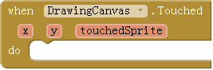

图2-6 带有接触点位置信息的Toughed事件 
1. 在块编辑器中，打开DrawingCanvas抽屉拖出DrawingCanvas.Touched块，该块有三个参数x、y及touchedSprite，如图2-6所示。这些参数提供了接触点的位置信息；

提示：在第一章HelloPurr应用中已经熟悉了Button.Click事件，但对Canvas事件还很陌生。Button.Click事件的发生很简单，不附带任何其他信息；但有些事件则不然，它们附带了与事件有关的“参数”信息。DrawingCanvas.Touched事件中的x、y代表接触点在DrawingCanvas中的坐标，而touchedSprite代表接触点所碰到的DrawingCanvas中的对象（在App Inventor中称作sprite—精灵），但在第三章之前我们不会用到它。我们将利用接触点的xy坐标来绘制圆点。
从DrawingCanvas抽屉中拖出DrawingCanvas.DrawCircle命令块，放在DrawingCanvas.Touched事件处理程序中，如图2-7所示；

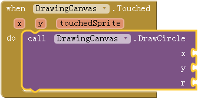

图2-7 用户触摸画布时，应用绘制一个圆点
2. 在DrawingCanvas.DrawCircle块的右侧有三个插槽，需要填入三个参数：x、y、r。其中x、y用于指定绘制圆形的位置，r用于指定圆的半径。在屏幕左下角带感叹号的黄色警告显示数字“1”，表示需要填满这些插槽。从图中看到，有两组xy，这里要区分清楚：DrawingCanvas.Touched事件中的xy表示接触点位置（已知）；而DrawingCanvas.DrawCircle命令块的xy插槽，用于设定绘制圆形的位置（待定）。我们恰好要在用户的接触点绘制圆形，因此DrawingCanvas.Touched事件中的xy值，可以作为DrawingCanvas.DrawCircle的x、y参数，插入到插槽中。

提示：可以从“when”块中提取事件的参数值，将鼠标悬停在参数上，将呼出“get”及“set”块。可以将“get x”块拖出并插到x插槽中，作为DrawCircle命令的x值。如图2-8所示。

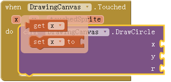

图2-8 读取事件参数：从DrawingCanvas.Touched事件中拖出“get x”块
3. 将鼠标悬停在x、y参数上可以唤出“get”块，将“get”块插入到DrawingCanvas.DrawCircle的插槽中，如图2-8、2-9所示；

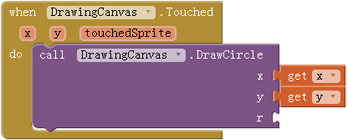

图2-9 已经设定了圆的位置（x,y），尚未指定圆的大小

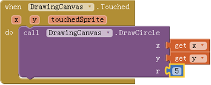

图2-10 当用户触碰DrawingCanvas时，将在(x,y)点绘制一个半径为5的圆形
4. 下面来设定圆的半径r。长度的单位是pixel（像素），是屏幕上能够绘制的最小的点。设r = 5：点击屏幕的空白区域，输入5然后回车（自动创建数字块“5”）并将其插入插槽r中。再看屏幕左下角的黄色三角形，数字由1变为0，因为所有插槽都被填满了。图2-10显示了DrawingCanvas.Touched事件处理程序最终的样子。

提示：在块编辑器中输入5然后回车，这种操作叫做输入块（typeblocking）。块编辑器会根据你输入的字符，显示与该字符相匹配的一系列块；如果输入的是数字，那么将创建一个数字块。

测试：看看测试设备上都有什么。触碰 DrawingCanvas，手指碰过的地方会留下一个圆点。如果在设计器中将DrawingCanvas.PaintColor属性设置为红色，那么圆点也是红色（否则应该是默认的黑色）。
# 添加画线的拖拽事件

下面添加拖拽事件处理程序，先看一下触碰（Toughed）事件与拖拽（Dragged）事件的区别：

* 触碰事件：手指在DrawingCanvas（画布）上放下再抬起，其间手指没有移动。
* 拖拽事件：手指在DrawingCanvas（画布）上放下，手指与屏幕保持接触并移动。

在绘图程序中，手指在屏幕上拖动，沿着手指移动的路径，将绘制出一条巨大的曲线，因为这条曲线实际上由数百个微小的线段构成：手指每次微小的移动，都将绘制一个微小的线段。 1. 从DrawingCanvas抽屉中拖出DrawingCanvas.Dragged事件处理程序块，如图2-11所示；DrawingCanvas.Dragged事件携带了以下参数：

* StartX、StartY：手指开始拖动时所在的位置（整个曲线的起点）；
* currentX、currentY：手指的当前位置（微小线段的终点）；
* prevX、prevY：手指的上一个位置（微小线段的起点）；
* draggedSprite：布尔值，如果用户直接拖动一个图片，则其值为真。本章不会用到这个参数。

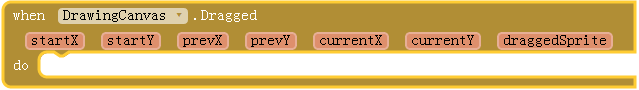

图2-11 比起Toughed事件，Dragged事件携带了更多参数
2. 从DrawingCanvas抽屉中拖出DrawingCanvas.DrawLine块，插入DrawingCanvas.Dragged块中，如图2-12所示。

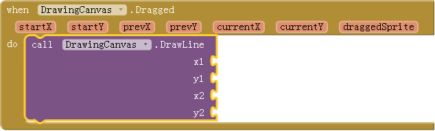

图2-12 添加画线功能
DrawingCanvas.DrawLine块有四个参数，两点确定一线：设（X1，Y1）为起点，（X2，Y2）为终点。你能确定每个参数中需要插入什么值吗？记住，当手指在DrawingCanvas上拖动时，拖动事件将被调用很多次：在应用中，手指的每次移动都会绘制出一个微小线段，从（Prevx, prevy）到（currentX, currentY）。现在把它们填入DrawingCanvas.DrawLine块。 3. 拖出“get”块来充当画线的参数。将get prevX与get prevY分别插入到x1和y1插槽；而get currentX与get currentY插入到x2和y2插槽，如图2-13所示。

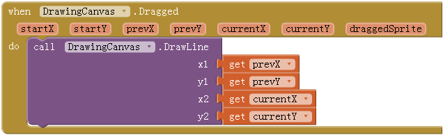

图2-13 用户在屏幕上拖动手指，应用就在前一位置与当前位置之间画一条微小线段

测试：在设备上测试一下刚刚设定的行为：在屏幕上随意拖动手指，画出线段及曲线；触碰屏幕画出一个圆点。
# 添加按钮事件处理程序

应用已经实现了画线功能，但现在只能画红线。下面添加颜色按钮的事件处理程序，用户可以改变画笔的颜色；同样设置清除按钮WipeButton，以便用户可以清除画面并重新开始。 在块编辑器中：

1. 展开左侧块的（Blocks）列表；
2. 打开RedButton抽屉，拖出RedButton.Click块；
3. 打开DrawingCanvas抽屉。拖出set DrawingCanvas.PaintColor块（可能需要滚动块的列表以便在抽屉里找到它），并把它放在RedButton.Click块“do”的位置；
4. 打开Colors抽屉，拖出红色块，将其插入set DrawingCanvas.PaintColor块的插槽；
5. 重复步骤2-4，设置蓝色和绿色按钮；
6. 最后设置WipeButton按钮。从WipeButton抽屉中拖出WipeButton.Click块。再从DrawingCanvas抽屉里拖出DrawingCanvas.Clear块，并将其放在WipeButton.Click块中。确认所有块显示如图2-14所示。

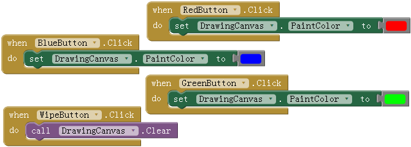

图2-14 单击颜色按钮改变DrawingCanvas的画笔颜色；单击清除按钮清空屏幕
# 让用户拍照片

App Inventor应用可以与Android设备的强大功能进行交互，包括相机功能。为了增加应用的趣味性，用户可以将绘图背景设置为他们用相机拍摄的照片。

1. Camera组件有两个关键的块：Camera.TakePicture块用来启动设备上的拍照程序；拍照完成将触发Camera.AfterPicture事件。在Camera.AfterPicture事件处理程序中，可以将刚刚拍摄的照片设置为DrawingCanvas.BackgroundImage。打开TakePictureButton抽屉并拖出TakePictureButton.Click事件处理程序；
2. 从Camera1抽屉拖出Camera1.TakePicture放在TakePictureButton.Click事件处理程序中；
3. 从Camera1的抽屉中拖出Camera1.AfterPicture事件处理程序；
4. 从DrawingCanvas抽屉拖出set DrawingCanvas.BackgroundImage块放在Camera1.AfterPicture事件处理程序中；
5. Camera1.AfterPicture事件有一个名为image的参数，代表刚刚拍摄的照片，将从Camera1.AfterPicture块中得到的get image块插入DrawingCanvas.BackgroundImage块。
所有的块如图2-15所示 。

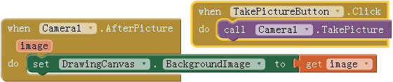

图2-15 拍完的照片被设置为DrawingCanvas的背景图片

测试：在设备上点击“拍照”按钮并拍摄照片，猫的图片变成了你拍的照片。你可以在自己的照片上进行绘画。（用Wolber教授的照片绘画是学生们的一大乐事，如图2-16。）（Wolber教授是本书的作者之一。）
# 改变画笔大小

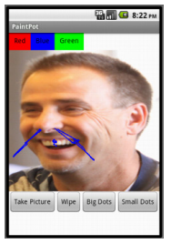

图2-16 带有Wolber教授涂鸦照片的PaintPot应用
在DrawingCanvas上画圆点，其大小由DrawingCanvas.DrawCircle块中参数r决定。改变r值可以改变圆点的大小。试试看将5改为10，然后在测试设备上查看结果。 另一个问题是，无论开发者如何设置参数r，用户都只能用这个固定的尺寸。如何让用户来改变圆点的大小呢？为此我们来修改程序：当用户点击“大圆”按钮时，圆点半径设为8，当点击“小圆”时半径设为2。 我们要用不同的半径画圆，但应用怎么知道我们要用哪个值呢？必须通知应用我们选定的值，而应用必须以某种方式记住（或保存）这个值，这样才能在需要的时候使用它。之前我们所使用的值，要么设定为属性（如画笔颜色），要么用固定的数字块（如画笔大小），现在应用需要记住一些属性之外的、不是固定不变的东西，这就需要定义一个变量。变量是一个存储单元，可以把它想象成一个容器，里面存储着可变的数据，如画笔的大小（有关变量的详细信息，请参见App Inventor指南第16章）。
让我们先来定义一个变量dotSize：

1. 在块编辑器中，从Variables（变量）抽屉中拖出一个initialize global name to块。将“name”改为“dotSize”；
2. 请注意，initialize global dotSize to块有一个开放的插槽，可以在这里设定变量的初始值，或者说是应用启动时的默认值（编程术语称为“初始化变量”）。在本应用中，用数字块2来初始化变量dotSize，（创建块“2”的方法有两种：在空白区直接输入“2”然后回车；或从Math抽屉中拖出“0”块，将0改为2。）将其插到initialize global dotSize to块的插槽中，如图2-17所示。

图2-17 将dotSize变量的初始值设为2
# 使用变量

下一步，我们要修改DrawingCanvas.Touched事件处理程序，将其中DrawingCanvas.DrawCircle块的参数r的固定值用变量dotSize来代替。（我们先将dotSize的初始值设定为“固定”的2，但稍后我们将改变dotSize的值，并同时改变画笔的大小。）

从initialize global dotSize to块中拖出一个get global dotSize块，用它来提供变量的值；
转到DrawingCanvas.Touched事件处理程序，将数字块“5”拖出插槽并扔进垃圾桶，用get global dotSize块来替换（见图2-18）。当用户触摸到DrawingCanvas时，应用将根据dotSize的大小来确定圆点的半径。

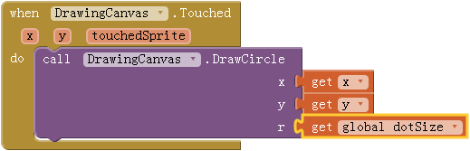

图2-18 画笔的大小取决于变量dotSize中保存的值
# 修改变量值

现在变量魔法登场，变量dotSize允许用户选择画笔的大小，而事件处理程序也将以dotSize为半径来画圆。通过设计SmallButton.Click和BigButton.Click的事件处理程序来实现此功能：

1. 从SmallButton抽屉中拖出SmallButton.Click事件处理程序；再从Variables抽屉中拖出一个“set”块，下拉选择global dotSize，并将其插入SmallButton.Click块；最后，创建一个数字块“2”，并将其插入set global dotSize块。
2. 创建另一个类似的BigButton.Click事件处理程序，设置画笔大小为8。这两个事件处理程序显示在块编辑器中，如图2-19所示。

提示： get/set global dotSize 之中的“global”（全局）指的是该变量适用于程序中所有的事件处理程序（全局）。与global相对的是“local”（局部）变量，适用于程序的特定部分；App Inventor 2中添加了此项功能，第12章首次使用。

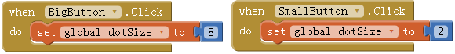

图2-19 点击SmallButton及BigButton按钮改变画笔大小，之后将以该尺寸绘制图形

测试：尝试单击“大圆”、“小圆”按钮，然后在DrawingCanvas上触碰，所绘圆点的大小是否不同？画线呢？线没有变化，因为只有DrawingCanvas.DrawCircle块使用了变量dotSize。在此基础上，考虑修改块的设置，以使画笔的大小，对画线也同样有效。注意：DrawingCanvas有一个“LineWidth（线宽）”的属性。
# 油漆桶的完整应用

图2-20中显示了完整的油漆桶应用。

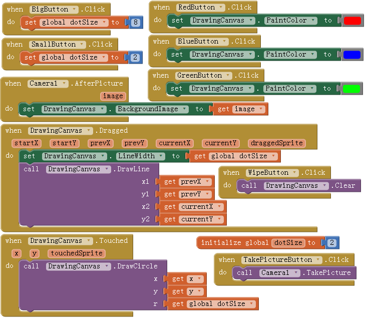

图2-20 油漆桶应用中块的最终设置
# 改进

可以考虑做以下改进：

1. 用户界面中没有显示当前的状态信息（如画笔大小或颜色），只能通过画图来得知这些信息。修改应用，向用户显示当前的状态信息；
2. 让用户在TextBox组件内输入画笔的尺寸，这样一来，除了2和8之外，他还可以将其更改为其他数值。有关TextBox组件的详细信息，请参阅第4章。

# 小结

本章涵盖了如下内容：

* DrawingCanvas组件：用于在其中绘画，也可以感知触摸及拖动事件，可以利用这些事件来实现绘图功能；
* 使用布局组件（HorizontalAarrangement），使多个组件的布局条理化，而不是摞在一起；
* 有些事件处理程序附带了与事件有关的信息，例如Toughed事件中附带了触摸点的坐标，这些信息用参数来表示。在使用带参数的事件处理程序时，App Inventor以块的方式生成“get”及“set”项，来获取这些参数的引用；
* 创建变量可以使用Variables抽屉中的initialize global name to块，变量可以让应用记住那些没有被存储成组件属性的信息，如画笔的大小；
* 对于定义的每一个变量，App Inventor提供了变量的读写方法：get global variable用来获取变量的值（读），而set global variable用来设置/修改变量的值（写）。可以从变量初始化块的变量名中拖出“get”或“set”块。

本章介绍了DrawingCanvas组件如何应用于绘画程序。也可以用它来编写某些2D游戏中的动画，更多信息请参见第5章“瓢虫快跑”游戏，以及第17章中关于动画的讨论。

# 附录

# 画笔应用

在译者用过的最早的windows3.0中就有画笔的应用，直到现在这个应用都是windows不可缺少的组成部分，虽然我们不常用它。

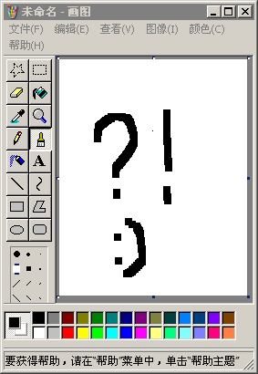

图2.1 windows中的画笔应用
# 开发及测试

如果无法访问App inventor网站，可以尝试译者提供的替代版本，或点击页面右上角的“开发体验”按钮。

图2.2 用手机扫描下载并安装”AI伴侣”
# 骆驼命名法

这是一个编程术语，指的是变量的命名规则：由于变量名中不允许出现空格，因此当需要用多个英文单词为变量命名时，通过每个单词的首字母大写来区分不同的单词，如本例中的红色按钮命名为RedButton，其中第一个单词的首字母也可以小写，即redButton。

# 中英文对照

* canvas:画布
* paint:油漆
* pot:罐,容器
* horizontal:水平的
* arrangement:布置
* background:背景
* image:图像
* touch:触摸
* drag:拖拽
* draw:绘画
* circle:圆
* line:线
* color:颜色
* sprite:精灵
* get:取得
* set:设置
* type:打字
* block:块
* start:开始
* current:现在
* prev:前一个
* button:按钮
* wipe:擦去
* camera:相机
* after:在…之后
* take picture:照相
* dot:点
* size:尺寸
* initialize:初始化
* global:全局的
* click:点击
* small:小的
* big:大的
* width:宽度
