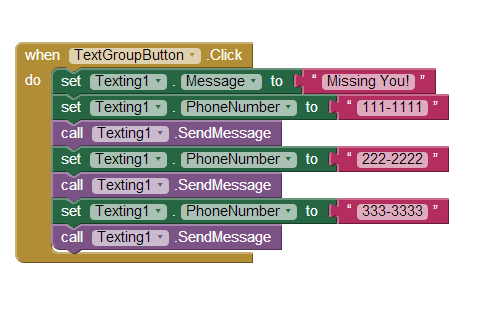
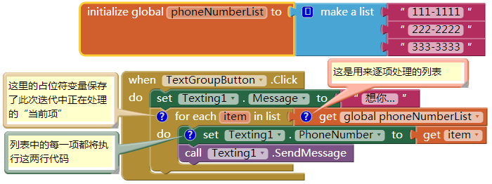
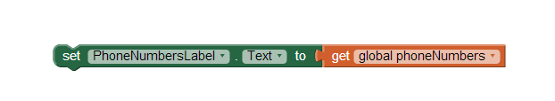
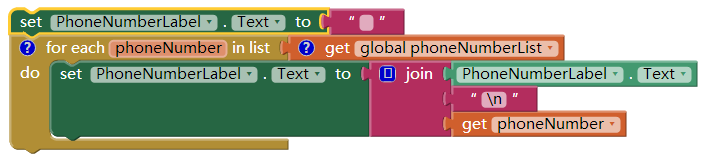
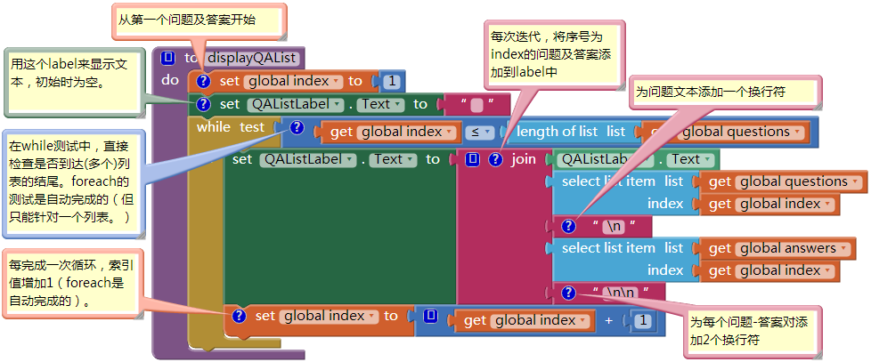
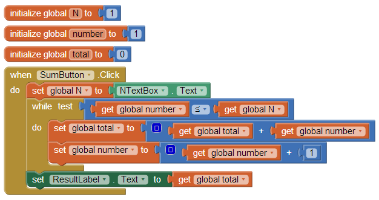

第20章 循环
十一月 20, 2015 ADMIN	留下评论
计算机最擅长做的事情就是“重复”——像儿童一样不厌其烦地重复做一件事，而且重复的速度很快，可以在1毫秒内列出你的全部Facebook好友。

本章将学习如何用有限的几个块来编写可以重复执行的程序，而不必反复拷贝粘贴同一段代码；还将学习与列表有关的操作，如给电话号码列表中的每个号码发送一条短信，以及为列表项排序。通过学习，你将了解到如何用循环块来有效地简化程序。

# 控制程序的执行：分支及循环

图20-1 让程序循环执行的重复块
在前几章中，我们学习了用一组事件处理程序来定义应用中的行为：事件以及对事件做出响应的函数。在这些响应函数中，程序通常不是按照线性的顺序执行，有些程序块只能在满足某些条件时才能执行。

 
重复块是程序的另一种非线性运行方式。就像if及ifelse块让程序产生分支一样，重复块让程序循环执行，换句话说，在执行完一组指令后，重新跳回到这组指令的起点并再次运行，如图20-1所示。在应用的运行过程中，内部的计数器会跟踪即将执行的下一步操作，因此，对于整个事件处理程序来说，从头至尾的每一步操作都在程序计数器的监控之下（有条件地）完成。程序计数器随着这些重复执行的块循环，不断地重复这些功能。

在App Inventor中有两种类型的重复块：foreach及while.foreach，其作用是对列表中的每一项实施某些特定的操作，如，向电话号码列表中的每个号码发送一条短信。

块while的应用比foreach要普遍，while块中的程序块会一直重复运行，直到某个条件不再满足。while块可用于数学公式的计算，如求n个连续自然数的和，或求n的阶乘，此外，while也可以用于同时处理两个列表；foreach每次只能处理一个列表。

# 使用foreach对列表实施迭代

在第18章里，我们讨论了一个“随机拨号”应用。这种随机拨打朋友电话的方式有时能拨通，但如果你有一个像我这样的朋友，这种呼叫却不总是能得到应答。可以采取另一种方式，给所有列表中的朋友发短信说“想你”，然后看谁最先回复你（或许还有更令人愉快的方式！）。

这个应用可以通过点击一次按钮向多个朋友发送短信，最简单的方法是，先写好发给一个人的代码块，然后拷贝粘贴并修改接收人的电话号码，如图20-2所示。

图20-2 拷贝并粘贴向不同号码发送短信的块
如果只有少量的块，用这种“强力”的拷贝粘贴方式也还说得过去，但是像朋友列表这样的数据表会时常变化，而你不希望每次添加或删除一个电话号码，都要动手去修改程序。

块foreach提供了一个更好的解决方案，可以定义一个包括所有电话号码的列表变量phoneNumberList，然后用foreach块将发送一次短信的块包围起来，从而实现群发功能，如图20-3所示。

图20-3 使用foreach块对列表中的每一项执行同一套指令
上述代码可以解读为：

对于phoneNumberList列表中的每一项（电话号码），设置Texting对象的PhoneNumber属性为列表中的项，并发送该条短信。

对于foreach块，一个必须的参数是一个列表，它所要处理的列表，将列表插入“in list”参数插槽。此时，从phoneNumberList变量的初始化块中拖出“get global phoneNumberList”块，并插入“in list”插槽，以便为即将发送的短信提供电话号码列表。

foreach块的第一行使用了foreach自带的占位符变量，在默认情况下，变量名为item，你可以修改它，也可以就用默认值，该变量代表了列表中正在被处理的当前项。

foreach中的所有块都将对列表中的每一项执行同样的操作，其中的占位符变量（例子中的phoneNumber）始终保存的是当前正被处理的项。如果列表中有三项，则foreach中包含的块将被执行三次，这些块可以说是从属于foreach块，或处于foreach块的内部，这些内部块执行到最后一行时，我们所说的程序计数器将要循环回第一行。

## 循环过程详细分析

我们来详细地分析一下foreach块的运行机制，因为理解循环是编程的基础。当点击TextGroupButton时，触发事件处理程序，首先执行的是“set Texting1.Message to”块，要将短信内容设置为“想你…”，这个块只执行一次。

然后开始执行foreach块。在foreach内部块开始执行前，占位符变量item被设置为列表phoneNumberList的第一项（111-1111），这一步是自动完成的，代替了你自己使用select list item来调出列表项。在完成将列表中的第一项赋给item之后，foreach内部的块开始第一次运行，Texting1.PhoneNumber属性被设为item的值（111-1111），并发出短信。

当运行到foreach中的最后一行时（Texting1.SendMessage块），程序将循环会到foreach的首行，并自动将列表中的下一项（222-2222）设为变量item的值，然后重复操作foreach内部的两个块，即发送短信“想你…”到号码222-2222。然后程序再次循环会首行，并将item的值设为列表中的第三项（333-3333），并执行第三次重复操作，第三次发送短信。

由于列表中最后一项，即本例子中的第三项已经被处理完毕，因此foreach循环到此结束，程序将跳出循环，这意味着程序计数器将继续下移来处理foreach下面的块。在本例中，foreach之后没有块，因此整个事件处理程序结束。

## 书写可维护的代码

在最终用户看来，使用foreach的方法还是“强力”的拷贝粘贴法，在最终结果上并无分别，但从程序员的角度来看，foreach方法让代码有更好的可维护性，即使数据（电话号码列表）是动态输入的，程序也可以适用。

可维护软件指的是可以很容易地对软件进行修改，而不会引入程序的漏洞。使用foreach方法，一旦需要修改短信接收人，只需要修改列表变量，而丝毫不需要修改程序的逻辑（事件处理程序）。相反，采用强力的方法，如果需要添加新的接收人，则需要在事件处理程序中添加新的块。任何时候，只要你改动了程序的逻辑，都会冒带来漏洞的风险。

更重要的是，即便电话列表是动态的，即，不仅是程序员，最终用户也可以向列表中添加新的号码，foreach方法也能奏效。在我们的例子中只有三个固定的号码，而且号码直接写在了代码中，与此相比，采用动态数据的应用，其信息来源可能是最终用户，或其他来源。如果你要重新设计应用，让最终用户来输入电话号码，你就必须使用foreach方法，因为在你写程序的时候，根本无法知道会有哪些号码，因此也就无从采用强力的拷贝粘贴法。

## foreach的第二个例子：显示列表

显示列表项最简单的方式就是将列表变量插入Label的Text属性，如图20-4所示。

图20-4 列表的简单显示方法：将列表直接插入label
这样做的结果是，列表项在label中显示为一行，项之间以空格分隔，整个列表被一对括号包围：（111-1111 222-2222 333-3333）。

这些号码可能显示为多行或单行，取决于号码的多少。最终用户能看到这个数据，也可能将它们当做电话号码的列表，但这样的显示方式很不美观。通常会将列表项分行显示或用逗号分隔。

为了适当地显示列表，需要将每个列表项转换为一段带格式的单独的文本。文本对象通常有字母、数字、标点符号组成，但也可能包含特殊的控制字符，它们对应一些不可见的字符，如tab被表示为t(更多关于控制字符的内容，请查阅文本表示的统一码[Unicode]标准：http://www.unicode.org/standard/standard.html)。

为了逐行显示我们的电话号码列表，需要一个换行符“n”。当“n”出现在一段文本中，意味着“到下一行来显示后面的东西”。因此文本对象“111-1111n222-2222n333-3333”将显示为：

111-1111

222-2222

333-3333

要构造出这样的文本对象，需要用到foreach块，将每个列表项附加换行符后再添加到PhoneNumberLabel.Text属性中，如图20-5所示。

图20-5 使用foreach处理列表：在每个列表项后添加换行符
我们来跟踪一下这些块的作用。在第15章中讨论过在程序运行过程中跟踪变量及属性变化的相关内容，在foreach块中，我们考虑每一次迭代之后的值，所谓一次迭代，就是foreach循环执行一次。

在foreach之前，PhoneNumberLabel的Text属性被初始化为空文本；从foreach开始，程序会自动将列表的第一项赋给占位符变量phoneNumber。然后将PhoneNumberLabel.Text、n、phoneNumber连接起来之后，再将其设为PnoneNumberLabel.Text的属性值。这样，在完成foreach的第一次迭代后，相关的变量值如表20-1所示。

表20-1 第一次foreach迭代之后的变量值
PHONENUMBER	PHONENUMBERLABEL.TEXT
111-1111	n111-1111
此时已经是foreach内的最后一行，程序进入第二次迭代，下一个列表项（222-2222）被设为占位符变量phoneNumber的值，并重复执行foreach内部的块：将PhoneNumberLabel.Text的原值（n111-1111）与“n”及phoneNumber（此时是222-2222）连接起来。第二次迭代后，变量及属性值如表20-2所示。

表20-2 第二次foreach迭代之后的变量值
PHONENUMBER	PHONENUMBERLABEL.TEXT
222-2222	n111-1111n222-2222
列表中的第三项被设为phoneNumber的值，第三次重复运行foreach内部的块，在完成最后一次迭代后，最终结果如表20-3所示。

表20-3 第三次foreach迭代之后的变量值
PHONENUMBER	PHONENUMBERLABEL.TEXT
333-3333	n111-1111n222-2222n333-3333
三次迭代完成之后，label包含了所有的电话号码，文本变得很长，在foreach执行完成后，PhoneNumberLabel.Text的显示如下：

111-1111

222-2222

333-3333

# 用while实现迭代

循环块while的使用比foreach要稍显复杂，但while块的优势在于它的通用性：foreach可以遍历一个列表，而while可以为循环设定任意的条件。随便举个例子，假设你想给电话号码表中每隔一个人发短信，foreach则做不到，但while中可以将每次循环中index的递增值设为2。

在第18章中，条件测试的结果将返回一个值：true或false，在while-do块中也包含了一个想if块一样的条件测试。如果while测试的结果为true，程序会执行while内部的块，然后返回并再次进行条件测试。只要测试结果为true，while内部的块就会重复运行。当测试值为false时，程序将跳出循环（如同foreach中一样）并继续执行while下面的块。

## 使用while同步处理两个列表

关于while的更具启发性的例子中，涉及到了一种常见的情形，即，需要同步处理两个列表。例如，在总统测试（第10章）应用中，有两个分别存放问题和答案的列表，以及一个变量index来跟踪当前的问题序号。为了同时显示问题-答案对，需要同步遍历两个列表，并从两个列表中获取序号为index的项。foreach只允许遍历一个列表，但在while循环中，则可以使用index从每个列表中抓取对应的项。图20-6中显示了用while块逐行显示问题-答案对的方法。

图20-6 使用while循环逐行显示问题-答案对
由于用while替代了foreach，因而需要直接初始化index、检查是否到达列表结尾、在每次循环中选择各个列表中对应的项，并使得index递增。

## 使用while做公式计算

这里是使用while循环的另一个例子：与列表无关的重复操作。想想看，图20-7中的块在做什么？高水平？要想弄清楚，就要跟踪每一个块（关于程序跟踪的更多内容见第15章），随着程序的进展，跟踪每个变量的值。

图20-7 你能说出这些块的功能吗？
当变量number的值小于或等于变量N时，while中的块将重复执行。在这个应用中，N值等于最终用户在界面上的文本框（NTextBox）中输入数字，假设用户输入3。当程序运行到while块时，程序中的变量如表20-4所示。

表20-4 程序运行到while块时，各个变量的值

|N|	NUMBER|	TOTAL|
|---|---|---|
|3|	1|	0|

在第一次循环中，while块询问：number值小于或等于（≤）N 吗？第一次询问得到的结果是true，于是执行while中的块：total值等于它现在的值（0）加上number（1），number值递增1。第一次while循环之后，各变量的值如表20-5所示。

表20-5 while中的块完成第一次循环使用，各个变量的值

|N|	NUMBER|	TOTAL|
|---|---|---|
|3	|2	|1|

第二次循环中，继续测试“number≤N”,结果仍然是true（2≤3），因而while内部的块再次运行。total值等于它自身（1）加上number（2），number继续递增。第二次迭代完成时，各变量的值如表20-6所示。

表20-6 两次循环结束时，各个变量的值

|N|	NUMBER|	TOTAL|
|---|---|---|
|3|	3|	3|

程序再次返回到条件测试，这次的结果仍然是true（3≤3），于是while内的块第三次运行。现在total值为它自身（3）加上number（3），结果为6；number递增到4，如表20-7所示。

表20-7 三次循环之后各个变量的值

|N|	NUMBER|	TOTAL|
|---|---|---|
|3|	4|	6|

在完成第三次迭代之后，程序再次返回测试“number≤N”,或“4≤3”，此时结果为false，因此while内部的块不再执行，事件处理程序完成。

现在该知道这些块的作用了吧？它们在做一个最基本的数学运算：数字计算。每当用户输入数字，程序就给出从1到N的自然数的和，这里的N就是输入的数。在这个例子中，我们假设用户输入了3，因此加和的结果是6；如果用户输入4，最后的结果为10。

小结

计算机擅长于做重复的事情。想象一下所有的银行账户都要做利息的累计核算，所有计算学生平均绩点的成绩处理，以及日常生活中计算机所做的各种无计其数的重复的工作。

App Inventor 提供了两种用于循环操作的块。foreach块适合于针对列表中的每一项实施一组相同的操作。与那些具体的数据相比，foreach更适合于处理抽象的列表，其编码更具可维护性，尤其是对于动态数据来说，foreach是必需的。

与foreach相比，while则更为通用：既可以处理单个列表，也可以同步处理两个列表，还能进行公式计算。在执行while循环时，只要条件测试结果为真，while内部的块就会顺次执行；在内部块运行完成后，程序将返回并重新进行条件测试，直到测试结果为false，则循环结束。
