像App Inventor这类的编程语言通常会提供一组基本的内置功能，对于app inventor来说，就是一组基本块。编程语言还提供一种功能扩展的方法，即，向语言中添加新的子程序（块）。【在计算机科学中，子程序（英语：Subroutine, procedure, function, routine, method, subprogram），是一个大型程序中的某一部份代码，由一个或多个语句块组成。它负责完成某项特定任务，而且与其他代码相比，具备相对的独立性。——译者注】在App Inventor中，通过定义过程（procedure），即，命名一些顺序执行的块，来实现功能的扩展。应用中可以像调用App Inventor中的预定义块一样，调用这些过程。本章中你将看到，创建这样抽象的过程的能力对于解决复杂问题是非常重要的，这是创建真正好应用的基石。

 
当家长对孩子说“睡觉前去刷牙”时，他们的实际含义是“从架子上拿起牙刷牙膏，向牙刷上挤一点牙膏，在每颗牙齿上刷10秒钟（哈哈！）”，等等。“刷牙”就是一种抽象：为一系列的低级指令起一个公认的名称。此处，家长要求孩子完成他们已经认可了的“刷牙”的一系列指令。

你也可以在编程中创建这样的有名字的一系列指令，有些编程语言称之为函数（function）或子程序（subprogram），在App Inventor中，被称为过程（procedure）。过程就是一组顺序执行的有名字的块，在应用中可以随时随地调用它。

图21-1就是一个过程的例子，它的功能是以英里为单位，计算两个GPS坐标之间的距离。

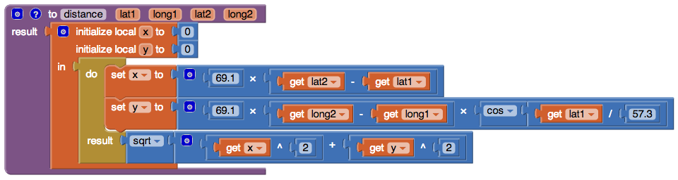

图21-1 计算两点间距离的过程

不必急于探究这个过程中的内部构件，只要知道对于你所使用的编程语言来说，这样的过程扩展了它的功能。如果每个家长每天晚上都要向他的孩子解释“刷牙”的步骤，那么这个孩子到了五年级可能还是不会刷牙。说“刷牙”是一种更有效的方式，而且每个人都会在睡觉之前去刷牙。

同样的道理，在设计或编写一个大型应用时，一旦定义好了distanceBetweenPoints这个过程，你就会忽略它的内部实现细节，而只是简单地使用（或调用）它的名字。这种抽象能力对于解决大型问题来说是至关重要的，可以将大型的软件项目分解成若干个便于管理的代码块。

过程还可以有助于减少错误，因为它们可以省去很多冗余的代码：只要在一处定义了过程，应用中就可以随处调用它。因此，假如应用中要计算你的当前位置与其他10个点之间的最近距离，你不必拷贝粘贴10次图21-1中的块，相反，你只需要定义这个过程，并在需要时调用它即可。此外，那种拷贝粘贴块的方法还非常容易引入错误，因为一旦你想修改程序，就必须找到所有的拷贝，并逐个以相同的方式修改它们。想象一下，你试图在一个有1000行或块的代码中，找到5-10个曾经粘贴过的代码块！与其被迫地拷贝粘贴这写块，不如用过程在一处将代码块封装起来。

最后，过程将有助于建立代码库，让这些代码在其他应用中可以被重用。即便是创建一个非常具体的应用，有经验的程序员总会在必要时设法考虑重用其他应用中的部分代码。有些程序员从未创建过应用，他们只是专注与创建可重用的代码库，以便其他程序员以此来创建他们自己的应用。

# 消除冗余

看一下图21-2中的代码块，能否发现其中的冗余。

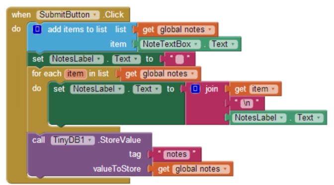  
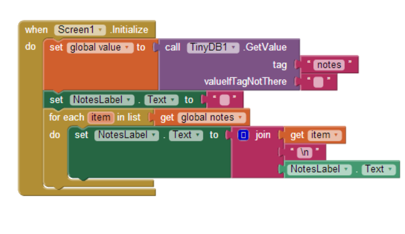  
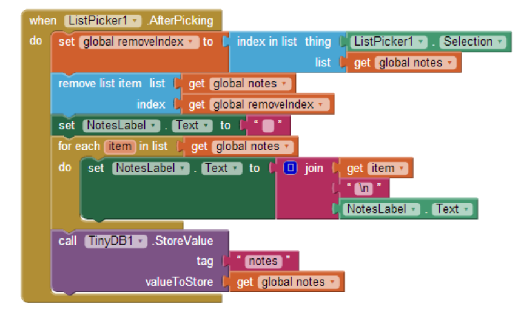

图21-2 “随手记”应用中的冗余代码

这里的冗余代码指与foreach块有关（实际上是整个foreach块以及它上面的”set NotesLabel.Text to”块），例子中的三个foreach的作用都是显示笔记列表，只是使用的场合有所不同：当添加新项、删除某一项，以及应用启动从数据库加载列表时。

作为一个有经验的程序员，一旦看到这样的代码，脑子里会立即敲响警钟，甚至不必等到开始拷贝粘贴第一段程序中的代码，他们知道最好是将这些冗余的代码封装在一个过程里，这样既保证程序有很好的可读性，也可以使后来的修改变得容易。

因此，有经验的程序员会创建一个过程，将冗余代码块放在其中，并在原来使用冗余代码的地方调用这一过程。应用的执行结果完全一样，但更易于维护，也让其他程序员更容易地加以利用。这种代码（块）的重新整理的过程成为重构。

# 定义过程

我们来创建一个过程，实现图21-2中那些冗余代码的功能。在App Inventor中，定义过程几乎与定义变量一样简单：从Procedures抽屉中拖出一个“to procedure”块或“to procedure result”块。如果过程需要通过计算返回一个结果，则使用后者（我们将在本章稍后的部分讨论它）。

图21-3a 点击默认名称“procedure”

图21-3b 将过程名改为“displayList”

在拖出“to procedure”块后，可以修改过程名称：点击默认名称“procedure”并输入新名称。由于冗余代码块的作用是显示笔记列表，因此重构时将过程名设为“displayList”，如图21-3所示。

下一步是向过程中添加块，此时就用现有的冗余块，将它们从事件处理程序中拖出并放在displayList块中，如图21-4所示。

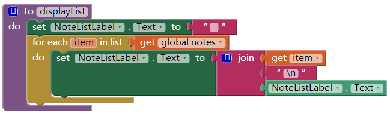

图21-4 封装了冗余代码的过程displayList

现在我们可以用过程来显示笔记列表了，在应用的任何一处，都可以很容易地调用它。

# 调用过程

像“displayList”和“刷牙”这样的过程是一个包含了某种功能的实体，它们只有在被调用时，才能体现出这种功能。因此，以上我们只是创建了过程，却并没有调用它。调用它意味着要运行它，或者说来实现它。

在App Inventor中，可以从Procedures抽屉中拖出一个以“call”开头的块来调用一个过程。每当定义了一个新的过程，procedures抽屉中就会显示一个新的块，即定义一个过程，就是向Procedures抽屉中添加一个新块，如图21-5所示。

图21-5 定义好一个过程后，Procedures抽屉中就会出现一个新的“call” 块

你一直都在用“call”块来调用App Inventor中的预定义函数，如Ball.MoveTo以及Texting.SendMessage。当你定义了一个过程，就相当于创建了自己的块，也相当于你扩展了App Inventor语言，新的“call”块让你可以使用自己的创造。

在“随手记”的例子中，三次拖出“call displayList”块来取代三个事件处理程序中的冗余代码，如，ListPicker1.AfterPicking事件处理程序（删除一条笔记）修改的结果如图21-6所示。

图21-6 使用“call displayList”来调用放在过程中的那些块

# 程序计数器

要理解“call”块的运行机制，要想象应用中有一个指针，它随着块的运行而移动。在计算机科学中，这个指针被称作程序计数器。

程序计数器随着事件处理程序中的块的运行而移动，当它遇到一个“call”块时，它会跳到所遇到的过程中，并开始随着过程中的块的执行而移动，；当过程执行完成，程序计数器再跳回到此前的位置（“call”块处），并从此处开始继续移动。以“随手记”为例，“remove list item”块执行完成后，程序计数器跳到displayList过程中，并随过程中的块（设置NotesLabel.Text属性为空，以及foreach循环）移动；最后程序计数器在回到TinyDB1.StoreValue块。

# 为过程添加参数

过程displayList将冗余代码重整到一处，这使得程序更加容易理解，你可以在更高层次上理解这些事件处理程序，而忽略掉如何显示列表的细节。这样做的另一个好处是，如果想要修改列表的显示方式，就只需修改一处代码（而不是三处）。

就过程的通用性而言，displayList是有局限的，因为该过程是针对特定的列表（notes）而设定的，而且用指定的label（NotesLabel）来显示列表内容，它不能用于显示其他列表，比如应用的用户列表，因为过程中的要素定义的过于具体。

App Inventor以及其他编程语言都提供了一种称为参数的机制，用于构造更为通用的过程。过程为了实现它的预设功能所必须的信息就由参数来提供，以睡前刷牙为例，有可能将牙膏的类型和刷牙时间设定为刷牙过程的参数。

通过点击过程块左上角的蓝色标记，就可以为过程设定参数。对于displayList过程，我们定义了一个名为“list”的参数，如图21-7所示。

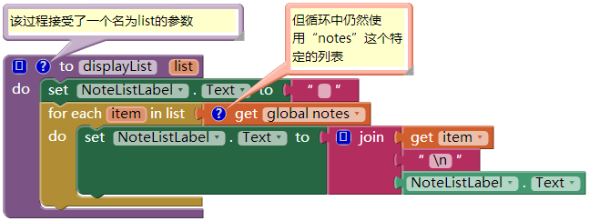

图21-7 在过程中引入了list作为参数

即使是定义了参数，但foreach块中仍然直接引用特定列表“notes”（插入到foreach块的“in list”插槽中）。而我们希望在过程中使用我们传递的参数list，因此将对“global notes”的引用替换成对“get list”的引用。如图21-8所示。

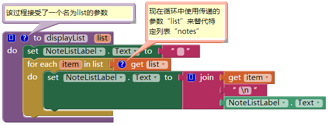

图21-8 现在foreach中使用了传递来的参数“list”

新版本的过程更加通用：在调用displayList时，无论传入什么样的列表，displayList都能显示它。在向过程添加参数时，App Inventor会自动为“call”块添加一个对应的插槽，因此当displayList添加了参数list之后，“call displayList”块就变成图21-9中的样子。

图21-9 现在调用displayList时，需要指明要显示的列表

过程定义中引入的参数list被称为“形式参数”，而“call”块中与之相对应的插槽被称为“实际参数”。当在应用中的某处调用过程时，必须为过程中的每个“形式参数”提供一个“实际参数”。

对于“随手记”的应用来说，将列表“notes”作为实际参数添加到“call”块的list插槽中。ListPicker.AfterSelection的修改结果如图21-10所示。

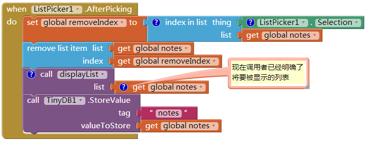

图21-10 在调用displayList时，将notes作为实际参数传入

现在当displayList被调用时，列表notes被传递到过程中，来取代形式参数list。此时，程序计数器随着过程中的每个块的运行，它的指向是参数list，而实际上处理的是变量notes。

图21-11 过程displayList可用于显示任何列表，而不仅仅是notes

由于有了参数，过程displayList可以用于处理任何列表，而不仅仅是notes。例如，如果“随手记”应用可以在一组用户中共享，而你想查看一下用户列表，就可以调用displayList并传入userList参数。如图21-11所示。

# 过程的返回值

关于过程displayList的可重用性，还有一个问题需要讨论——你能猜到是什么吗？如前所述，它可以显示任何数据列表，但也只能在标签NotesLabel中显示。如果你想用其他的界面元素（如另一个label）来显示列表（如userList），该如何是好呢？

图21-12 “procedure result”块

一个方法就是重构过程——将它的功能从“用指定label显示列表”改为“只返回一个文本对象，它可以被显示在任何地方”。为此，需要使用“procedure result”块来取代“procedure”块，如图21-12所示。

你会发现与“procedure”块相比，“procedure result”块的底部有一个额外的插槽，将一个变量放入插槽，这个变量将被返回给调用者。因此，正如调用者可以向过程以参数的方式传入数据一样，过程也可以以值得方式将数据返回给调用者。

图21-13显示了上述过程的改写版本，现在使用的是“procedure result”块。注意，由于过程的作用变了，因此名称也由displayList改为convertListToText（将列表转换为文本）。

图21-13 过程convertListToText返回一个文本对象，调用者可以将其放在任何一个label中

在图21-13所示的块中，变量text用来保存foreach循环中通过遍历列表而生成的文本。用text变量取代之前使用的过于具体的NotesLabel组件。在foreach执行完毕后，变量text包含了列表中的所有项，而且项之间以换行符“n”分隔（即“item1nitem2nite3”）。最后，将变量text插入return插槽，返回给调用者。

在定义“procedure result”时，与“procedure”相比，对应的“call”块看起来略有不同，如图21-14中所做的比较。

图21-14 下面的有返回值的“call”必须插入到某个插槽中

不同的是在“call convertListToText”块的左侧有一个插头，这是因为当“call”块运行时，过程在执行一系列指令后将向“call”块返回一个值，必须有某个插槽可以接收这个返回值。

在这种情况下，调用块“call convertListToText”的返回值可以插入到任何一个label的Text属性中，以notes列表为例，需要显示列表的三个事件处理程序都可以调用这一过程，如图21-15所示。

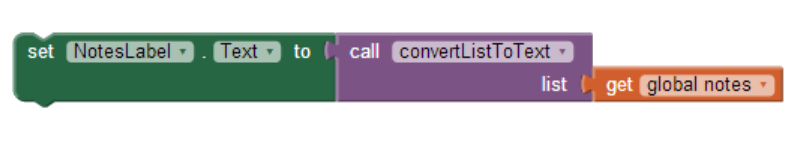

图21-15 将列表notes的内容转换为文本，并用NotesLabel显示出来

更重要的是，由于过程的定义更具通用性，不需要引用任何特定list或label，因此应用中可以使用convertListToText在任何一个label蒸南瓜显示任何一个列表。像图21-16中的例子那样。

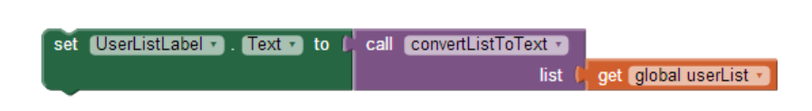

图21-16 这一过程再也不必与一个特定的Label组件捆绑在一起

# 在应用中重用块

通过过程的方式实现代码的重用不必只限于单独的应用，有许多过程，如convertListToText，可以用在你创建的任何应用中。事实上，有许多组织和编程社区都在为他们感兴趣的领域创建过程代码库，例如动画过程的代码库。

通常编程语言会提供一个“import（导入）”功能，可以在任何应用中引入其他的代码库。App Inventor目前没有这项功能，不过正在开发之中。同时，也可以在一个特定的“库应用”中创建一些过程，并复制该应用的代码，作为一个新建项目的基础代码。

# 第二个例子：求两点间距离

在displayList（convertListToText）例子中，我们将过程定义描述为一种消除冗余代码的方法：你开始写代码，随后发现代码存在冗余，于是整理代码消除冗余。无论如何，一个软件的开发人员或开发团队在应用开发的初期都会创建很多过程，同时也考虑到要重用部分代码。这样的规划可以在项目过程中节省大量时间。

考虑一项应用：确定离某人当前位置最近的本地医院，某些东西在紧急情况下会派上用场的。以下是这个应用的高层设计描述：

应用启动时，以英里为单位计算两点之间的距离，起点是当前所在位置，终点是发现的第一家医院。然后再寻找第二家医院，以此类推。在求得若干个距离后，判断最短距离的医院，并显示它所在位置的地址。

从以上描述中，你能断定应用中需要什么样的过程吗？

通常，一段描述中的动词提示了所需的过程。重读一遍描述，正如“等等”所提示的，这是另一个线索。这种情况下，“求出两点之间的距离”与“判断这些距离中最短的”成为两个必需的过程。

现在考虑设计一个过程distanceBetweenPoints（两点间距离）。在设计过程时，首先要确定过程的输入及输出：调用者需要向过程传递实现过程的功能所需的参数，而过程要向调用者返回执行结果。在这里，调用者需要向过程传递两个点的经度及纬度值，如图21-17所示；而过程的任务是以英里为单位返回两点之间的距离。

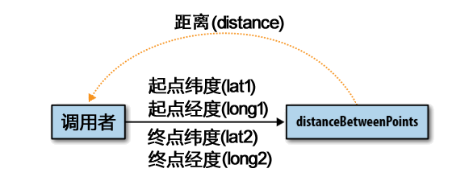

图21-17 调用者想过程传递了4个参数，并收到一个距离

图21-18中显示了我们在本章开始时提到的那个过程，使用公式求得两个GPS坐标点之间的近似英里数。

图21-18 过程distanceBetweenPoints

图21-19显示了对上述过程的两次调用，每次都会求出当前位置与指定医院之间的距离。

第一次调用中，起点为用户当前所在位置的LocationSensor（位置传感器）读数，终点是St. Mary’s hospital（圣玛利亚医院），计算的结果保存在变量distanceStMarys中；第二次调用也类似，只是将终点的数据改为CPMC Hospital（加州太平洋医疗中心医院）的经纬度。

接下来程序比较两个距离并返回最近的医院。但是如果还有更多的医院，那就需要在一个距离列表中进行比较，并找到最小值。依你所学，你能写出这个过程吗？将其命名为findMinimum，接受一个数值列表作为参数，并返回最短距离在列表中的索引值。

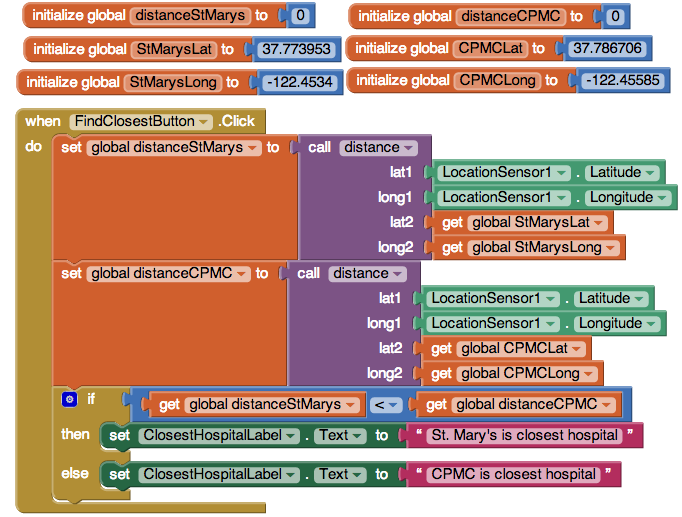

图21-19 两次调用distanceBetweenPoints过程

# 小结

像App Inventor这样的编程语言提供了一个内置功能的基本集，而过程是一种新功能的提取，它扩充了app inventor语言。App Inventor不提供显示列表的块，于是由你来做；那么是否需要一个计算两个GPS坐标间距离的块呢？答案是靠我们自己来创造。

想要建造大型的、可维护的软件，以及在解决复杂问题时免于不断地纠缠于细节之中，则定义高级过程的能力是至关重要的。过程是将代码块封装起来，并起一个名字。在编写过程时，你会关注这些块的细节，但对程序的其他部分而言，这个过程只是一个抽象的名字，你可以在更高层次上来引用它。
