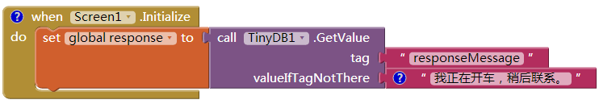
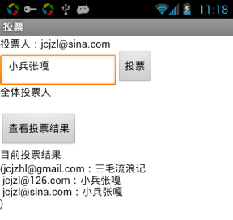
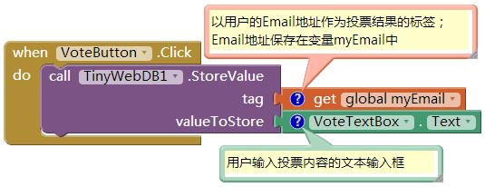
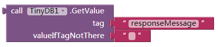
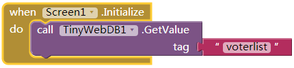
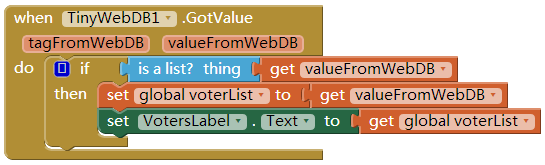
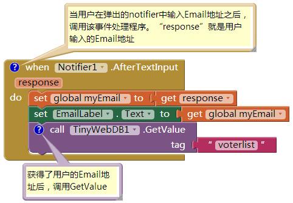
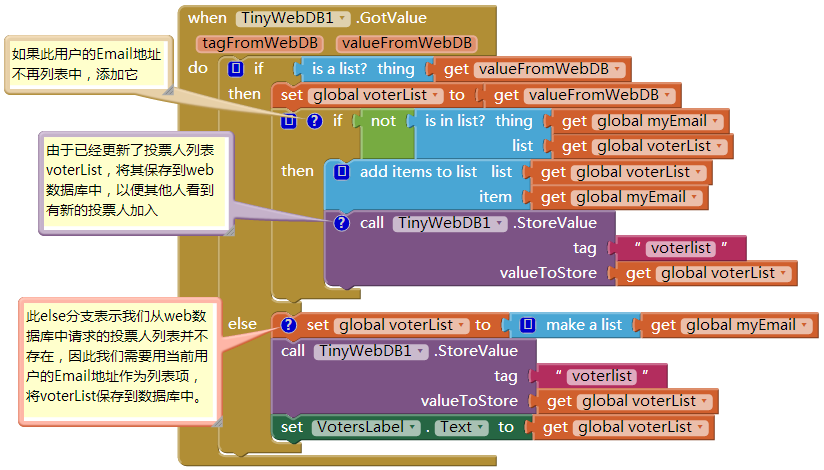
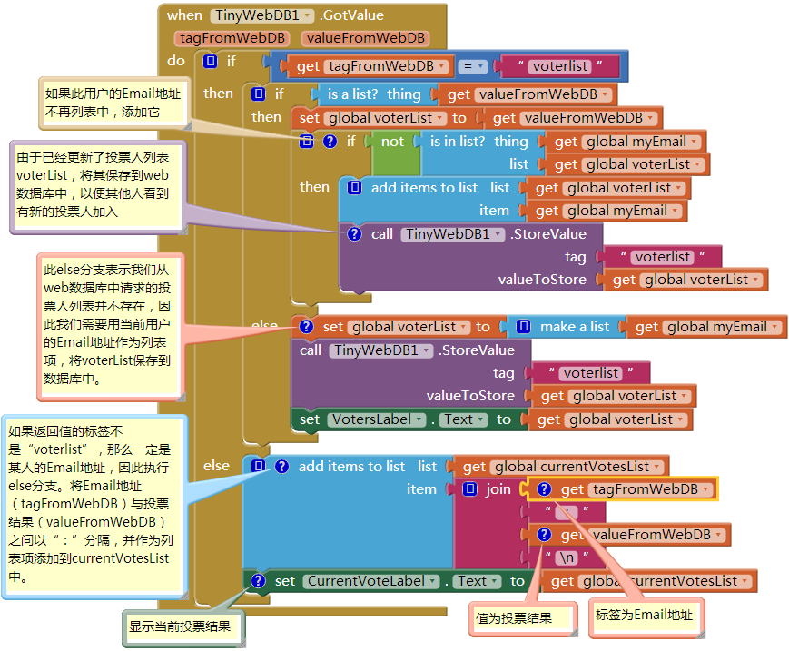
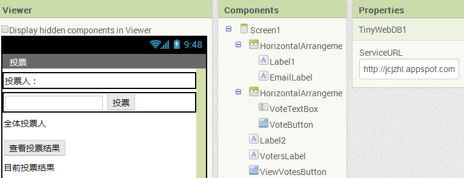

Facebook的数据库中，有每位用户的账户信息、好友列表以及发布的信息，Amazon的数据库中有你能买到的任何东西，而Google的数据库中有互联网上的每个页面的信息。你自己的应用虽然没有那么大的规模，但一个正规的应用都会用到数据库组件。

 
在大多数的编程环境中，编写与数据库通信的应用是一种高级编程技术：要搭建数据库（软件）服务器，如Oracle或MySQL等，并编写程序与数据库建立连接。在大学里，这些内容通常要在软件工程或数据库这样的高级课程中才会涉及。

App Inventor承担了与数据库（以及许多其它有用的事情）有关的这部分繁琐的设置，在这个语言中，提供了数据库组件，将数据库通信简化为单纯的读写操作。应用可以直接将数据保存在Android设备上，也可以保存到集中式网络数据库中，从而实现在不同设备与其他人之间的数据共享。

保存在变量及组件属性中的数据属于临时存储：如果用户在表单中输入某些信息然后关闭应用，那么当应用重新打开时，这些信息将不复存在。想要长期保存信息，就需要将它们保存到数据库中。数据库中的信息被称为永久信息，因为当应用在关闭后重新打开时，数据依然存在。

作为例子，考虑第4章开车不发短信的应用，那个繁忙时自动回复短信的应用。这个应用允许用户输入一条个性化的信息，作为收到短信时的自动回复信息。如果用户将信息改为“我在睡觉，别来烦我”，然后关闭了应用，当重新打开应用时，定制的自动回复信息依然是“我在睡觉，别来烦我”。因此，定制信息必须保存到数据库中，在每次启动应用时，再将信息从数据库提取到应用中。

# 在TinyDB中永久保存数据

App Inventor提供了两个便于操作数据库的组件：TinyDB及TinyWebDB。TinyDB用于直接在Android设备上永久保存数据，它适合于那些极其私人化的应用，如开车不发短信，这类应用不需要让数据在不同设备及人群之间共享。而TinyWebDB则将数据保存到web数据库中，并可实现不同设备之间的共享。能够通过web数据库访问数据，这是多人游戏及应用的基础，用户可以借此分享信息（如第10章的出题应用）。

这两个数据库组件非常相似，但TinyDB更简单些，因此我们先来研究它。首先，不需要任何设置就可以直接使用它，此外，数据直接保存在设备上，并于应用相关联。

使用TinyDB.StroeValue块来实现数据的长期存储，如图22-1所示，这段代码来自于“开车不发短信”。

图22-1 TinyDB.StoreValue块将数据永久保存到设备中

数据库存储中用到了tag-value（标签-值）模式，在图22-1中，数据的标签是“responseMessage”，而值是用户输入的内的自动回复信息，比如“我在睡觉，别来烦我”。

标签是数据的名称，是信息查询的依据，而致才是数据本身。可以将标签理解为钥匙，必须用它从数据库中提取已经存储的数据。

同样，可以将App Inventor的TinyDB数据库理解为一个表，其中包含了许多tag-value对儿，在图22-1中的TinyDB.StoreValue块执行完成后，设备数据库将增加一条输入，如表22-1中所列。

表22-1 存储到数据库中的tag-value对：“responseMessage”-“我在睡觉，别来烦我”

|TAG|	VALUE|
|:------|:---|
|responseMessage|	我在睡觉，别来烦我|

一个应用中可以有许多tag-value对，用来永久保存需要保留的各种数据项。标签必须是文本，而值既可以是单个的数据（一段文本或一个数字），也可以是一个列表。每个标签只能对应一个值，当你使用同一个标签保存一个新值时，将覆盖原来的值。

## 从TinyDB中提取数据

从数据库中提取数据要用到TinyDB.GetValue块。在调用GetValue块时，通过提供标签（tag）来请求特定的数据。在“开车不发短信”中，使用在保存数据时（StoreValue）用过的标签“responseMessage”来请求定制的回复信息。调用GetValue所获得的返回数据，必须插入到一个变量中。

通常要在应用打开时从数据库中提取数据。App Inventor提供了一个特别的事件处理程序Screen.Initialize，应用启动时会触发该程序。需要格外小心地处理数据库为空的情况（如，应用第一次启动时），因此当使用GetValue时，要指定一个“valueIfTagNotThere”参数，一旦数据库为空，则GetValue将返回该参数值。

图22-2中的块显示了在“开车不发短信”中，如何在应用初始化时，使用Screen.Initialize加载数据。

这里将GetValue的返回值写入到ResponseLabel组件中。如果数据库中已经存储过数据，则将读取的数据写入ResponseLabel中，如果没有与标签responseMessage相对应的数据，则将“我正在开车…”写入Label。

图22-2 应用启动时加载数据的一种模式

# 用TinyWebDB保存并共享数据

TinyDB组件将数据保存在Android设备的本地数据库中，这一点适用于那些不需要数据共享的个人应用，例如很多人都可以下载“开车不发短信”应用，但每个人都使用个性化的自动回复信息，这类信息不需要与其他人共享。

当然，更多的应用需要数据共享：像Facebook、Twitter以及像Words With Friends这样流行的多人游戏，这些应用的数据库必须运行在网络上，而非设备上。另一个例子是第10章的“出题/答题”应用，某人在手机上生成了一份测试，并将其保存到网络数据库中，这样其他人就可以在其他手机上加载测验，并回答问题。

TinyWebDB是TinyDB的web版本，可以让应用将数据保存到web上，方法与TinyDB类似，使用StoreValue与GetValue协议。

默认情况下，TinyWebDB组件使用由App Inventor团队创建的web数据库保存数据，从http://appinvtinywebdb.appspot.com
可以访问到该数据库。该网站包括一个数据库，并能响应来自web的保存及提取数据的请求；此外，还提供了一个人类可读的web接口，可以让数据库管理员（也就是你）能够查看到在此保存的数据。

感兴趣的话，可以在浏览器中访问http://appinvtinywebdb.appspot.com
，并检查保存在此的tag-value类型的数据。

这个默认的数据库仅用于开发，对于所有App Inventor程序员提供了有限的空间和权限。由于所有的App Inventor应用都可以使用该数据库，因此不能确保你的数据不被其它的应用所覆盖。

如果你只是在研究学习App Inventor，或者在项目的早期阶段，默认的web数据库就足够了，但如果你想创建正式发布的应用，从某种意义上讲，你需要建立自己的web数据库。由于我们正在学习，因此可以使用默认的数据库。在本章的后面将学习如何创建自己的web数据库，并配置TinyWebDB,来替代默认的数据库。

在这一节中，我们通过一个投票应用（如图22-3所示）来描述TinyWebDB的用法。该应用具有如下特性：

图22-3 投票应用：将投票结果保存到TinyWebDB中

每次应用打开之后，提示用户输入自己的email地址，该地址既是用户名，又是保存到数据库中的投票信息的标签（tag）；
任何时候用户都可以提交新的投票内容，这种情况下，原有的投票内容将被覆盖；
用户可以看到群组中每个人的投票结果；
为简单起见，需要投票的议题在应用之外发布，如课堂上，教师宣布议题并要求每个学生进行电子投票。（注意，这个例子的功能可以扩展，在应用中允许用户输入并提示投票议题。）

## 用TinyWebDB保存数据

TinyWebDB.StoreValue的作用与TinyDB.StoreValue一样，只不过是将数据保存到Web上。在这个投票的例子中，假设用户会在文本框VoteTextBox中输入投票内容并点击按钮VoteButton发送投票结果。将投票结果保存到web数据库中，以便其他人也能看到它，我们将编写如图22-4所示的事件处理程序VoteButton.Click。

图22-4 用VoteButton.Click事件处理程序将投票结果保存到数据库中

用于识别数据的标签是用户的email地址，之前已经被保存到变量myEmail中（稍后将看到），而要保存的值是用户在VoteTextBox输入的内容。因此，如果用户的email地址是“wolber@gmail.com”，而他的投票是“Obama”，则作为整体存入数据库的信息如表22-2所示。

表22-2 记录在数据库中的标签（tag）及值（value）

|TAG|	VALUE|
|:------|:---|
|responseMessage|		Obama|

TinyWebDB.StoreValue块将这个tag-value对发送到位于
http://appinvtinywebdb.appspot.com
的web数据库服务器中。由于这里用的是默认的服务，会显示来自于各种应用的很多数据，因此在第一个显示窗口中，有可能看到，也有可能看不到你的数据。如果看不到，可以用页面上的GetValue链接用特定标签来搜索数据。

用TinyWebDB编程时，使用数据库服务器的web接口来测试是否按要求被保存起来。

## 用TinyWebDB来请求并处理数据

用TinyWebDB提取数据要比TinyDB复杂得多。由于TinyDB的GetValue操作是直接与Android设备上的数据库通信，因而可以立即获得返回值，但使用TinyWebDB的应用则需要跨越网络来请求数据，因此需要分两步来实现。

首先使用TinyWebDB的GetValue请求数据，稍后再来处理TinyWebDB.GotValue事件处理程序。实际上，TinyWebDB.GetValue应该叫做“RequestValue（请求值）”，因为他只是向web数据库发出请求，而请求实际上并不能立即“get（得到）”一个值。为了更清楚地了解二者之间的差别，可以对比图22-5中的TinyDB.GetValue与图22-6中的TinyWebDB.GetValue。

图22-5 TinyDB.GetValue块

图22-6 TinyWebDB.GetValue块

TinyDB.GetValue块立即得到返回值，因此该块的左侧有一个插头以便可以将返回值保存到一个变量或属性中；而TinyWebDB.GetValue块不能立即得到返回值，因此左侧没有插头。

对TinyWebDB而言，当web数据库实现了请求并将数据返回给设备时，将触发TinyWebDB.GotValue事件。因此整个提取数据过程分为两步，首先在一个地方调用TinyWebDB.GetValue，然后再编写TinyWebDB.GotValue事件处理程序，来处理实际接收到的数据。像TinyWebDB.GotValue这样的程序有时被称作回调过程，因为实际上是某些外部实体（这里是web数据库）在处理完你的请求之后，反过来调用你的程序。就像在一家繁忙的咖啡店点餐一样：你点餐，然后等待咖啡师喊你的名字，你才能真正拿到你的饮料。在同一时间，咖啡师会按顺序从每个人手里收取点餐单（而且所有人都在等待自己的名字被喊到）。

## GetValue-GotValue连动

在我们的例子中，需要保存并提取一个投票者的列表，并最终显示所有人的投票结果。

最简单的方案是在应用启动时，在Screen.Initialize事件中发出请求来提取列表数据。如图22-7所示（在本例中，用“voterlist”为标签向数据库发出请求。）

图22-7 在Screen.Initialize事件中请求数据

当应用从数据库收到投票者列表的数据时，TinyWebDB.GotValue事件被触发，图22-8显示了处理这个返回列表的块。

图22-8 使用TinyWebDB.GotValue事件处理程序处理返回的列表

程序GotValue附带了参数valueFromWebDB，其中保存着向数据库请求的数据。像valueFromWebDB这样的事件附带的参数，只在该事件处理程序范围内有效（隶属于该事件处理程序），因此无法在其他事件处理程序中引用该参数。

这一点看似有些费解，但一旦你熟悉了这些保存局部数据的参数，你自然会联想到那些适用范围更大的数据（在整个应用中随处可用）：变量。理解了这一点，也就理解了GotValue中的关键一步：将返回的数据valueFromWebDB转移到一个变量中。这里是将数据转移到变量voterList中，之后可以在其他的事件处理程序中使用该变量。

通常会在GotValue中同时使用if块，原因是，如果数据库中不存在被请求的数据，则返回值为空文本（“”），通常这种情况发生在第一次启动应用时。通过检查valueFromWebDB是否为列表，可以确定是否真的有数据返回。如果valueFromWebDB为空（if的测试结果为假），就不必将其写入变量voterList。

无论是TinyDB还是TinyWebDB，都是以相同的方式来获取数据、检查数据及设置数据（到变量中），不同的是，这里预期会收到一个列表，因此测试环节上略有差别。

## 更为复杂的GetValue/GotValue举例

在相对简单的应用中，图22-8中所示的代码是一种不错的提取数据的方式，但在投票的例子中，我们需要更为复杂的逻辑。说明如下：

应用启动时，程序会提示用户输入Email地址。可以使用Notifier组件弹出窗口来实现这一功能。（Notifier在组件设计器组件面板的User Interface中。）用户输入email后，将其保存为变量；
检查完用户的email之后，调用GetValue来提取投票人列表。你能说出为什么吗？
图22-9显示了向数据库请求数据的更为复杂的方案。

图22-9 在这个更为复杂的方案里，在获得用户的email之后调用GetValue

在应用启动时（Screen1.Initialize），Notifier组件提示用户输入他的email地址；用户输入后（Notifier.AfterTextInput），输入的信息保存到变量中，同时用label显示出来，然后调用GetValue来获得投票人列表。需要注意，这里没有在Screen1.Initialize中直接调用GetValue，因为需要首先设置用户的Email地址。

因此当应用初始化完成后，用这些块来提示用户的Email地址，然后以“voterlist”为标签调用GetValue。当从web上返回列表时，GotValue被触发，以下是后续功能的描述：

GotValue将检查到达的数据是否不为空（有人已经使用这个应用，并建立了投票人列表）。如果返回值中包含数据（投票人列表），则检查此用户的email是否已经在投票人列表中，如果没有，将其添加至列表，并将更新后的列表保存到数据库；
如果数据库中没有投票人列表，我们将以此用户的email作为唯一的项来创建列表。
图22-10中显示了这一功能所需的块。

在这些块中，第一个if通过调用“is a list？”来检测从数据库返回的值，判断其是否不为空。如果不为空，返回的数据放入变量voterList中。切记，voterList中只有每个使用过该应用的用户的Email地址，但我们不确定当前用户是否也在此列表中，因此需要检查一下：如果此用户不在列表中，则用“add item to list”块将其添加至列表，并将更新后的列表保存到web数据库。

图22-10 使用GotValue块处理数据库返回的数据，根据不同的返回结果确定要执行的操作

如果数据库返回的结果不是列表，则执行ifelse块中的“else”分支；这说明还没有人使用过这个应用。此时需要创建一个新的列表voterList，将当前用户的Email地址作为列表的第一项，然后将这个只有一项的列表保存到web数据库中（同时也希望更多人的加入！）。

## 用不同的标签请求数据

到目前为止，投票应用值处理了一个用户列表，每个用户都可以看到其他用户的Email地址，但还不能提取并显示每个用户的投票结果。

此前设定在VoteButton的Click事件中，将用户的Email地址与投票结果以“email地址：投票结果”的方式组成tag-value对提交给web数据库。此时如果已经有两个人投票，那么相应的数据库实体中将包含表22-3中的数据。

表22-3 存储在数据库中的tag-value对
TAG	VALUE
voterlist	[wolver@gmail.com,joe@gmail.com]
wolber@gmail.com	Obama
joe@gmail.com	McCain
当用户点击“ViewVotes”按钮时，应用将从数据库中提取所有投票结果并加以显示。现在假设投票人列表已经提取并保存到变量voterList中，我们可以使用foreach来请求列表中每个人的投票结果，如图22-11所示。

图22-11 使用foreach块请求列表中每位成员的投票结果

这里对变量currentVotesList进行初始化，来清空列表，目的是为了将最新从数据库中获得的投票结果添加到列表中。在foreach中使用TinyWebDB.GetValue来处理列表中的每一个Email地址：以Email地址（voterEmail）为标签向数据库发送请求。需要注意的是，要等到一系列的请求数据返回时触发GotValue事件，才能将投票结果添加到currentVotesList中。

## TinyWebDB.GotValue中处理多标签

我们希望在应用中显示投票结果，事情变得更加复杂了。在点击ViewVotesButton按钮发出请求之后，在TinyWebDB.GotValue中将收到以每个Email地址为标签（tag）的数据，就像“voterlist”标签用于提取用户Email地址列表一样。当应用同时向数据库为不同标签请求多余一项的数据时，就需要在TinyWebDB.GotValue中编写代码来处理所有可能的请求。（你可能想到编写多个GotValue事件处理程序，来分别处理每个请求——知道为什么这样做行不通吗？）

为了处理这种复杂的情况，GotValue事件处理程序可以利用自带的参数tagFromWebDB，它会告诉你当前的返回值来自于哪一个请求。因此，如果标签是“voterlist”，我们可以像之前那样进行处理；如果不是“voterlist”，我们可以假设它是用户列表中某人的Email地址，来源于ViewVotesButton.Click事件处理程序中发出的请求。当这些请求返回时，我们希望将返回的数据——投票人及投票结果——添加到列表currentVotesList中，以便于向用户显示。

图22-12中显示了整个TinyWebDB1.GotValue事件处理程序。

图22-12 TinyWebDB1.GotValue事件处理程序

# 设置Web数据库

本章前面提到过，设立于
http://appinvtinywebdb.appspot.com
的默认web数据库仅供原型设计以及应用的测试，在向真正的用户发布应用之前，需要为应用创建一个专用的数据库。

访问网站http://appinventorapi.com/program-an-api-python/
，按照上面的说明就可以创建web数据库。该网站由本书的作者之一Wolber教授创建，网站提供了示例程序以及设置App Inventor web数据库及API(应用程序接口)的说明。按照说明，你可以下载相关的程序，并且只要对配置文件进行少量修改，就可以使用这些程序。经过设置的代码与之前使用的App Inventor默认数据库相同，它运行在Google的应用引擎上——一个云计算服务，运行在Google服务器上免费的web数据库。这样，你就建起了属于自己的web数据库（与App Inventor的协议兼容），几分钟就可以运行起来，并用它来创建web移动应用。

一旦创建并部署了属于自己的web数据库（因为只有你知道它的URL地址），你就可以用它来创建应用。不过还需要在应用中修改TinyWebDB组件的ServiceURL属性，以便组件可以用新的定制数据库来保存及提取数据。图22-13描述了如何操作。

图22-13 将ServiceURL属性修改为你的定制数据库的URL地址

在这个例子中，ServiceURL被设置为http://usfwebservice.appspot.com
，是本书的作者之一为他的学生们创建的一个web数据库（图22-13中”appsport.com”后面的部分被输入框遮挡住了）。设定了ServiceURL之后，所有的TinyWebDB.StoreValue及TinyWebDB.GetValue的调用都将执行这个特定的URL。

# 小结

通过TinyDB及TinyWebDB组件，App Inventor可以很容易地实现数据的永久存储。数据以标签-值（tag-value）对的方式存储，保存数据时使用的标签也用于之后对数据的提取。TinyDB用于将数据直接保存在设备上；当数据需要在手机之间分享时（如多人游戏或投票应用），就需要使用TinyWebDB。TinyWebDB更为复杂，尤其在获取数据的环节，除了用GetValue来请求数据，还要设置回调过程，即GotValue事件处理程序，同时还要设置web数据库服务。

一旦你可以得心应手地使用数据库——尤其是掌握了获取、检查及设置数据的要点，要不了多久，你就能创建更为复杂的应用了。
