将你的手机指向天空，谷歌星空地图会显示出你正在观看的星群；倾斜手机，可以控制你的游戏；带着你的手机去散步，一款“面包渣儿”应用将记录下你的途经的路线。所有这些应用之所以能够实现，都是因为你所携带的移动设备装备了高科技的传感器，可以探测到位置、方向以及加速度。

本章将再次讨论App Inventor的位置传感器、方向传感器以及加速度传感器等组件，其中将学习全球定位系统（GPS）、方向测量（如倾斜、旋转及摇晃）以及与处理加速度读数相关的数学知识。

# 创建位置感知应用

在智能手机流行之前，计算仅限于桌面电脑。虽然便携式电脑算是移动设备，但与我们今天随身携带的微型设备相比，不可同日而语。计算已经摆脱了实验室及办公室，在地球上随时随地都在发生。

对计算的普遍性产生深刻影响的是一项新的、有趣的数据，它存在于上述的所有应用中，即：当前的位置信息。当人们在世界各地游走时掌握他们的行踪，这件事影响深远，它既有可能对我们的生活产生极大的帮助，但同时也存在侵犯隐私及损害人权的可能。

在“安卓，我的车在哪”的应用中（第7章）就是一个有益的位置感知应用的例子，让我们可以记住之前的地点，以便稍后还能找回来。这是一个个人应用——位置信息就保存在自己的手机数据库中。

同样的理念也适用于群组。例如，一个徒步旅行者小组可能希望在荒野中查看每个组员的去向，或者一个商务团队可能希望在一个大型会议上寻找自己的伙伴。这类应用已经出现在市场上，两个典型的应用就是“谷歌纵横（Latitude）”（www.google.com/latitude）以及Facebook的“签到（Place）”（www.facebook.com/ places）。由于公众对隐私的担忧，这些应用一经面世便备受争议。

另一类位置感知应用使用了增强现实工具。这类应用利用位置及手机的方向，在自然信息基础上，提供增强的叠加信息。因此当你用手机指向一栋建筑物时，你会看到它在房地产市场上的价格，或者你在植物园中欣赏异国花卉时，某个应用会告诉你这株植物的品种。这类应用的早期产品包括世界浏览器（Wikitude——一款增强现实的实景地图导航应用）、手机实景浏览器（Layar——第一款手机版的增强现实浏览器）以及谷歌星空地图。

世界浏览器甚至可以让用户通过网站http://wikitude.me在移动云上添加数据。在网站上，选定地图并标注上你的个人信息，稍后，当你或其他用户在这个位置使用该移动应用时，你发布的信息就会显示出来。

# GPS
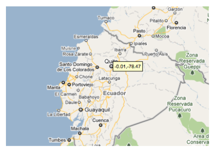

图23-1 位于赤道上的厄瓜多尔首都基多
创建一个位置感知应用，首先需要了解全球定位系统（GPS）的工作原理。GPS数据来自美国政府所保有的卫星系统，只要在视野开阔地带，至少能看到三颗卫星，你的手机就能获得读数。一份GPS读数包括位置的纬度、经度及海拔高度。纬度表示与赤道的距离，赤道以北为正值，以南为负值，范围从-90至90.如23-1显示了厄瓜多尔基多附近的谷歌地图，图中的纬度为-0.01，表示在赤道偏南一点点。

经度是距离本初子午线（零度经线）向东或向西偏离的距离，向东为正值，西为负值，零度经线穿过的最知名的地点就是格林威治，伦敦附近的一座小镇，皇家天文台的所在地。图23-2中的地图标出了格林威治，它的经度为0.0。
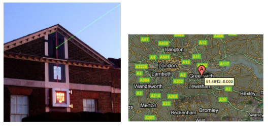

图23-2 格林威治的皇家天文台沿本初子午线射出一道光柱
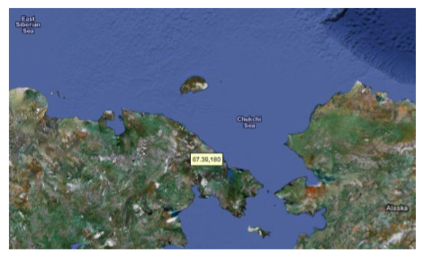

图23-3 在俄罗斯与阿拉斯加边境附近的一点，经度为180
经度值从-180到180，图23-3显示了俄罗斯境内的一点，非常靠近阿拉斯加，它的经度为180.0，这个点可以理解为以格林威治（经度为0.0）为起点绕地球半圈所到达的位置。

# 用App Inventor感知位置

App Inventor为访问GPS信息提供了LocationSensor（位置传感器）组件，该组件具有Latitude（纬度）、Longitude（经度）及Altitude（海拔高度）三个属性，此外它可以与谷歌地图通信，因此还可以获得当前街道地址的信息。

图23-4中的LocationSensor. LocationChanged是位置传感器组件LocationSensor最关键的事件处理程序。

图23-4 LocationSensor1.LocationChanged事件处理程序

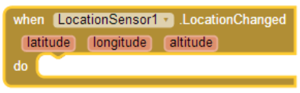

两种情况可以触发LocationChanged事件：传感器第一次收到读数时，以及当位置发生一定变化后收到新的读数时。其中第一次读数通常会延迟几秒钟，有时也会一直没有读数。例如，如果你在室内而且没有连接WiFi，设备将无法获得读数。手机中也有相关的设置，可以为了省电而关闭了GPS，这是无法获得读数的另一个可能的原因。除了这些原因，在LocationSensor.LocationChanged事件被触发之前，不能排除LocationSensor做了不合理的属性设置。

处理这种无法感知位置的情况，有一个方法是创建一个变量lastKnownLocation，并将其初始化为“未知”，然后让LocationSensor.LocationChanged事件处理程序来修改变量的值，如图23-5所示。

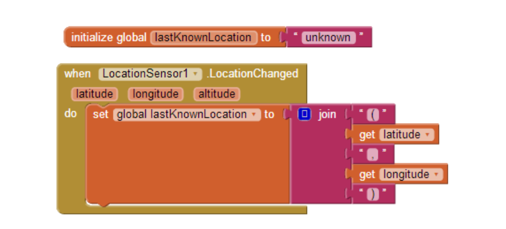

图23-5 变量lastKnownLocation的值会随位置的改变而改变
通过编写以上事件处理程序，在第一次获得读数之前显示“未知”，这样就可以始终显示当前位置，或将位置信息保存到数据库中。这一策略在第4章“开车不发短信”中使用过，即，在自动回复的短信中加入位置信息：“未知”或最后一次获得的读数。

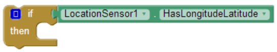

图23-6 用HasLongitudeLatitude块测试传感器是否具有读数
也可以使用LocationSensor.HasLongitudeLatitude块，直接询问传感器是否具有读数。如图23-6所示。

# 检查边界

事件LocationChanged的一种通常的用法是检查设备是否在某个边界之内，或在某个设定区域内。例如，看图23-7中的代码，每次当传感器获得的读数显示某人离开零度经线的距离超过0.1度时，让手机产生震动。

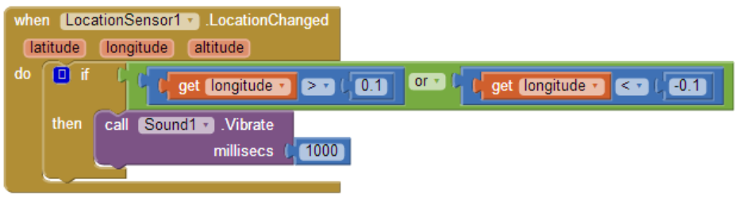

图23-7 如果读书远离了零度经线，则手机发出震动
这种边界检查功能可以有很多应用，例如对于假释犯，如果他们离开家的距离接近规定的合法距离时，应用会发出警告；或者对教师及家长来说，可以监控孩子是否离开了操场。如果你想看到更为复杂的例子，参见第18章中关于条件块的讨论。

# 位置信息的来源：GPS, WiFi以及基站编码

有几种方法可以确定Android设备的位置，最精确的方法是通过卫星，美国政府维护的组成GPS系统的卫星，可精确到数米。但是如果在室内，并有高楼或其他物体遮挡，则无法获得读数。需要在开阔地区并且系统中至少要有三颗卫星。

如果无法使用GPS，或者用户的设备禁用了这一功能，也可以通过无线网络获得位置信息。设备需要在WiFi路由器附近，当然，你获得的经纬度读数是这台WiFi设备的位置信息。

判断设备位置的第三种方式是通过移动网络的基站编码（Cell ID）,基站编码对手机位置的判断来源于手机与附近基站之间通信信号的强弱，这种方式通常不够精确，除非你周围有很多个基站。不过这种方式与GPS或WiFi连接相比，是最省电的。

# 使用方向传感器

游戏中会用到方向传感器（OrientationSensor），用户通过倾斜设备来控制物体的运动。方向传感器也可以用作指南针，确定手机所指的方向。

方向传感器有五个属性，除了航空工程师外，大多数人都不熟悉这些参数：

滚动参数Roll（左-右）：当设备水平时，Roll的值为0°，当设备向左倾斜时，增加到90°，而当设备向右倾斜时，减少到-90°。

倾斜参数Pitch（前-后）：当设备水平时，Pitch为0°，当设备头朝下时，Pitch值增加到90°，当设备翻转至面朝下时，增加到180°。同样，当设备的下端朝下时，Pitch值减小到-90°，当继续翻转至面朝下时，Pitch值为-180°。

方位角参数Azimuth（指南针）：当设备顶端指向正北时，Azimuth的值为0°；指正东时，值为90°；指正南时，值为180°；指正西时，值为270°。

强度参数Magnitude（滚动球的速度）：Magnitude参数的返回值在0-1之间，表示设备的倾斜程度。它的值表示在设备表面滚动的球体所能施加的力的大小。

角度参数Angle（滚动球的角度）：Angle返回设备倾斜的方向。即，在设备表面滚动的球体所能施加的力的方向。

方向传感器同样提供了方向变化事件，每次当方向发生变化时，会触发该事件。为了进一步探索这些属性的意义，写一个应用来描述这些属性如何随设备的倾斜而变化。在用户界面中添加五个方向label，另外五个标签用于显示前面所述的属性当前的值。如图23-8所示添加相关的块。

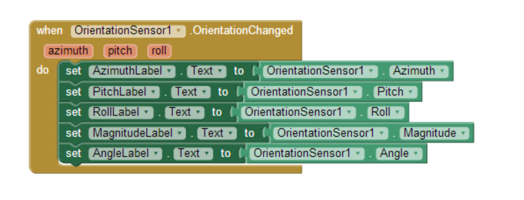

图23-8 显示方向传感器数据的代码块
# 使用滚动参数Roll

现在通过用户对设备的倾斜，来实现图像在屏幕上的左右移动，就像在射击或赛车类游戏中那样。拖入一个Canvas组件，宽度设为“Fill parent”，高度为200像素。然后向Canvas上添加一个ImageSprite组件，并在Canvas下方添加一个名为RollLabel的Label，来显示Roll属性值。如图23-9所示。

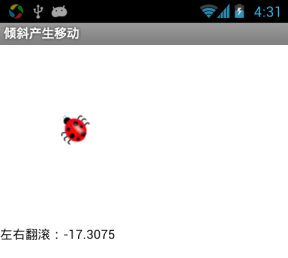

图23-9 滚动操作如何控制图像移动的用户界面
方向传感器OrientationSensor的Roll属性表示手机的倾斜方向：向左或向右（即，如果你正握手机并稍向左倾斜，获得的读数为正值；反之向右倾斜则为负值）。因此，利用图23-10中的事件处理程序，用户可以实现对运动的控制。

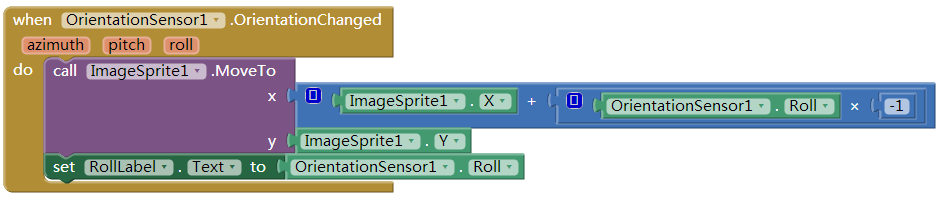

图23-10 利用OrientionChanged事件来响应Roll属性的变化
图中的乘法块让roll属性乘以-1，因为向左倾斜时，roll的值为正，但我们希望物体向左移动（因此x坐标的值变小）。要了解动画应用中的坐标系统的工作原理，参见第17章。

需要注意的是，这段程序是针对纵向模式（正握手机时）编写的，而非横向。事实上，当你过度地倾斜手机时，屏幕会自动转成横向模式，而图像则被卡在屏幕的左边。这是因为当设备向一侧倾斜时，如向左倾斜时，获得的roll属性的读数一直是正值，因此图像的x坐标值也一直在变小，如图23-10所示。

如果App Inventor提供了解决上述问题的方法，应该是（1）在手机上取消屏幕的自动旋转功能；或者（2）区分手机的纵横模式，针对不同模式给出不同的物体运动公式。App Inventor未来会提供这样的支持，但现在你还需要向用户说明应用的运行方式。

# 控制运动的方向及速度

前面的例子中图像可以左右移动，如果想实现任意方向的运动，可以使用OrientationSensor的Angle（角度）及Magnitude（强度）属性，这正是第5章的游戏中让瓢虫移动的属性。

在图23-11中的块是一个测试程序，用户可以通过倾斜设备来实现任意方向的运动（需要两个Label及一个ImageSprite）.

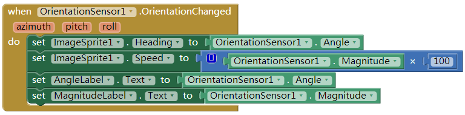

图23-11 用角度和强度来实现移动
试试看，强度属性的值介于0至1之间，代表设备的倾斜程度，在这段测试程序蒸南瓜，倾斜的程度越大，图像移动的越快。

# 手机用作指南针

指南针应用，以及像谷歌星空这样的应用，需要知道手机所指的方向（东南西北），谷歌星空就是根据手机的指向，将方向信息叠加在星座信息上。

属性Azimuth可以用于表示方向。Azimuth的取值介于0°至360°之间：正北为0，正东为90，正南为180，正西为270。因此当Azimuth值为45时，意味着手机指向东北，135时指向东南，225时指向西南，315时指向西北。

图23-12中的块创建了一个简易的指南针，可以用文字显示手机所指的方向（如西北）。

你会发现，程序只能显示四个方向之中的一个：东南、东北、西南、西北。你可以挑战一下自己，看能否修改程序，当手机的指向在某个范围内时，显示四个正方向（正北、正南、正东、正西）。

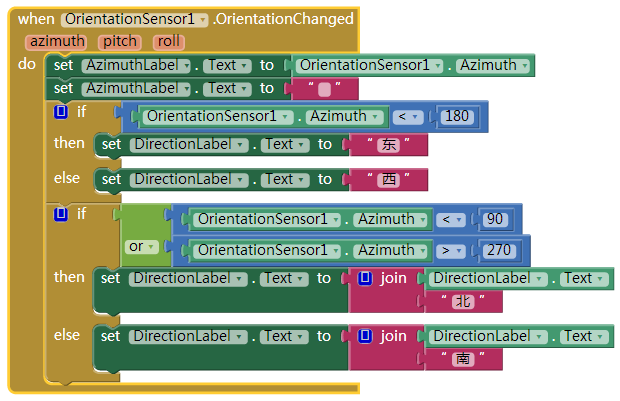

图23-12 编程实现一个简易的指南针
# 加速度传感器

加速度是速度随时间的变化率，如果你踩下油门，车会加速——车速会以一定的比率增加。

在Android手机中内置了加速度计，用于测量加速度，但测量的参照系不是静止的手机，而是自由下落中的手机：如果你让手机下落，它所记录的加速度读数为0。一句话，读数与重力有关。

如果感兴趣相关的物理知识，可以去查阅相关的书籍，但本小节中，我们将充分讨论加速度计，为你建立一个良好的开端，并仔细分析一个能够拯救生命的应用。

# 响应设备的摇晃

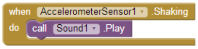

图23-13 手机摇晃时发出声音
如果学习过第1章（Hello猫咪），那么你已经使用过加速度传感器了：使用Accelerometer.Shaking事件，当手机摇晃时，设备发出猫叫声。如图23-13所示的块。

# 使用加速度传感器的读数

像其他传感器一样，加速度计也具备侦测读数变化的事件：AccelerometerSensor.AccelerationChanged，这个事件有三个参数，对应加速度在三个维度上的分量：

xAccel：当设备向右倾斜时，其值为正（即，左侧的边缘在上升）；当设备向左倾斜时，其值为负（设备右侧边缘上升）。

yAccel：当设备的底部上升时，其值为正；当设备顶部上升时，其值为负。

zAccel：设备的显示屏朝上时，其值为正；显示屏朝下时，其值为负。

# 检测自由落体

我们知道，如果加速度的读数为0，那么设备一定在做自由落体运动，基于这一认识，我们可以在AccelerometerSensor.AccelerationChanged事件中，通过检测读数来模拟自由落体事件。这些代码经过反复测试，可以用于老年人的自动求救：一旦侦测到发生跌倒，就会自动向外发送短信。

图23-14中显示了这个应用使用的块，当发生自由落体运动时，给出一个简单的报告（用户可以点击“重置”按钮进行再次检测）。

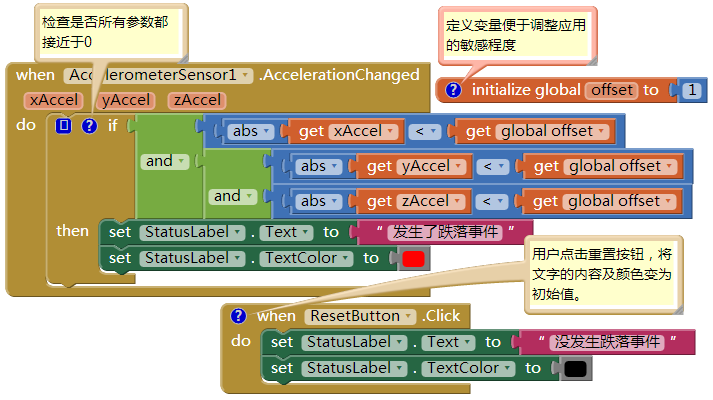

图23-14 当自由落体发生时进行报告
每当传感器获得读数，这些块都要在x、y、z三个维度上进行检查，看是否这些值接近于0（即它们的绝对值小于1）。如果三者都接近于0，应用将改变label的属性，来表示设备正处于自由落体状态。当用户点击“重置”按钮时，显示状态的label又被重新设为初始值（“没发生跌落事件”）。

如果你想试用这个应用，可以从这里下载：http://examples.oreilly.com/ 0636920016632。

用校准值测定加速度

图23-15 校准加速度的读数
加速度传感器的读数用自由落体时的状态进行校准。如果你想测量设备平放在桌上时的加速度的相对值，则必须与标准读数进行校准。校准的意思是与标准值进行核对、判定或检测；在本例中，标准值就是将设备平放在桌上时的读数。

校准需要用户将设备平放在桌面上，然后点击“校准”按钮，这时 应用将读出平面上的加速度值，这些值会在稍后的AccelerationChanged事件中用来判断新读数的偏差，并显示设备是否在某个方向上进行了快速的移动。

图23-15中显示了一个样板应用，让用户校准读数并测试加速度。

可以在此下载并安装这一应用：http://examples.oreilly.com/0636920016632/。运行应用，并将手机放在桌上，点击校准按钮，将显示“在平台上的读数”，此时如果缓慢地拿起手机，“显著变化”区域的读数不会变化（显示“无”）；但如果你快速提起手机，则Z-变化将由“无”变为“有”，如图23-15所示。同样，如果快速沿桌面移动手机，则X或Y也会有显著加速。在图23-16中显示了设置校准初始值的块。

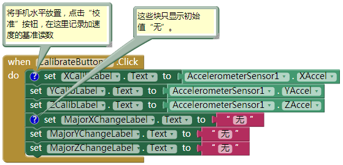

图23-16 校准程序的初始设置
这些块从加速度传感器中获取读数，并显示在三个label中：XCalibLabel、YCalibLabel及ZCalibLabel，并初始化另外三个显示加速度变化结果的label。

当手机水平放置时，加速度计的zAccel读数大约为9.8，而xAccel及yAccel读数约等于0，这些值的偏差表明了加速度计的精确度。获得了基准读数之后，可以通过比较新的测量值与基准值之间的偏差，侦测到手机在x、y或z方向的加速度变化（这种方法与第18章中的边界检测程序相类似）。图23-17显示了这一方法的具体实现。

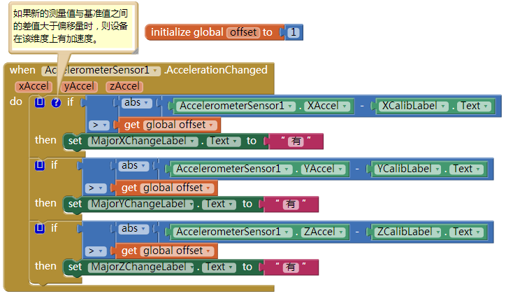

图23-17 用基准值来侦测加速度变化
当设备移动时，将触发这段程序。通过测量新的加速度值，并与静止时的基准值进行比较，从而判断加速度之是否产生了显著变化。假设ZCalib.Text记录的基准值为9.0，此时如果缓慢地拿起手机，那么新的读数将保持在9左右，并且不会报告有显著变化；但如果是快速地拿起手机，则读数会明显增大，此时程序将报告加速度“有”显著变化。

# 小结

传感器是移动应用中最富魅力的部分，因为它们实现了用户与环境之间实实在在的交互。无论是用户体验，还是应用开发，移动计算为我们带来了无限的商机。不过依然要精心地构思一个应用，来决定何时、何地以及如何使用这些传感器。很多人会担心隐私问题，如果应用中涉及到个人的敏感信息，他们可能会放弃使用。尽管如此，在游戏、社交网络、旅行以及其他众多的选项中，仍然有无限多种可能开发出有积极意义的应用来。
