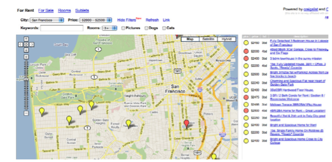
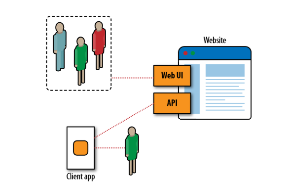
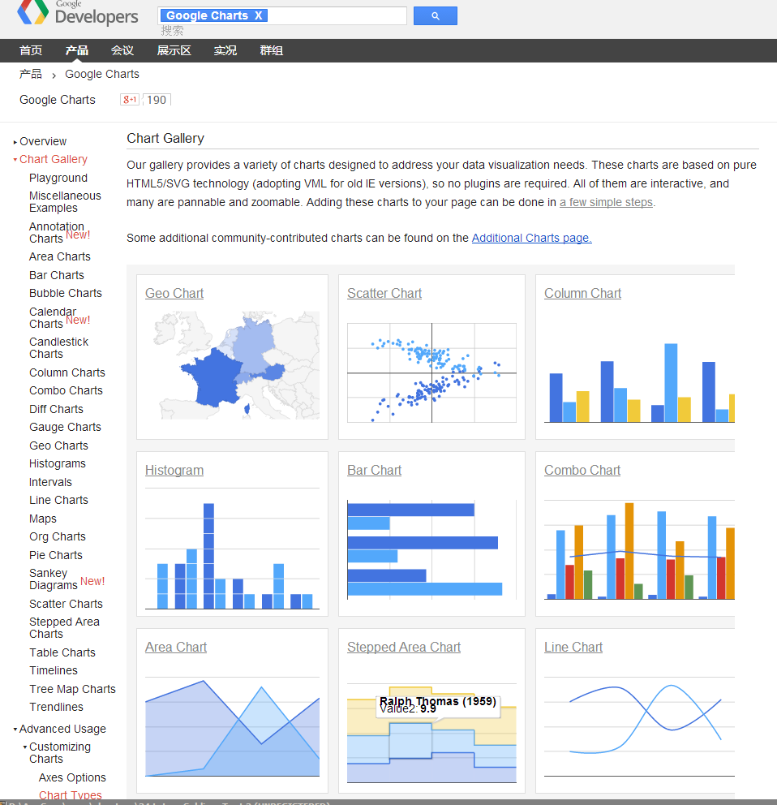
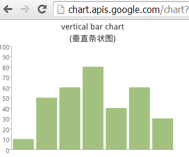
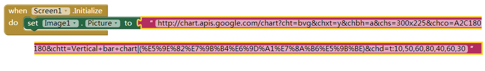
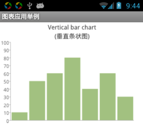
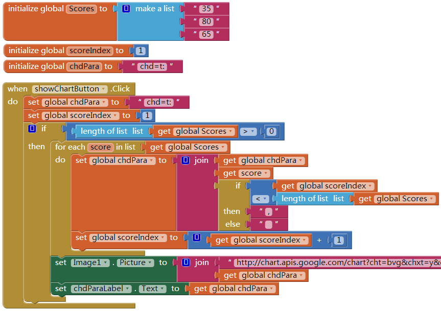
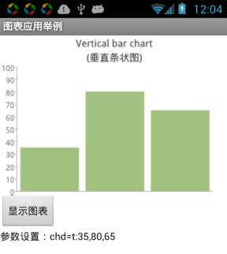
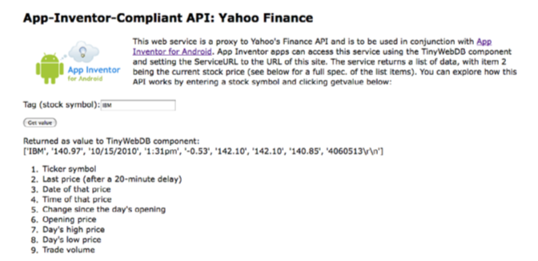

# 第24章 与WEB API通信
十一月 20, 2015 ADMIN	留下评论
移动技术再加上无所不在的网络，已经完全改变了我们生活的这个世界。如今坐在公园里就可以打理你的银行账户，或者在亚马逊书店搜索你正在阅读的图书的评论，或者查阅Twitter，看看世界上其他公园里的人们都在想些什么。手机只能打电话发短信的时代已经过去，它可以让你随时随地访问世界各地的数据。

虽然用手机浏览器可以访问互联网，但由于屏幕太小，而且速度受到限制，因此使用者会感觉不适。如果能够定制应用，有针对性地从网络上提取少部分信息，以适应手机终端的特点，就可以获比浏览器得更具吸引力的替代方案。

本章我们将领略从网络获取信息的各类应用，首先创建一个显示游戏排行榜的（图表）应用，然后以Yahoo财经频道的股票数据为例，讨论如何使用TinyWebDB从网上获取任意类型的信息（不只是图像），最后讨论如何创建属于自己的网络信息源，以用于App Inventor应用。

创新就是对这个世界的重组，以一种新奇的方式将旧的观念和内容组合在一起。埃米纳姆（Eminem，美国说唱歌手）的单曲Slim Shady追随了AC/DC（最著名的澳大利亚摇滚乐队）与Vanilla Ice（美国白人说唱歌手）的风格，并使这种混搭的音乐风行一时。这一类的“模仿”非常普遍，以至于许多艺术家，包括Girl Talk（专攻混搭及数字音乐的美国音乐家）及Negativland（来自美国加州的一个实验音乐乐队），都致力于将旧的内容融入某种新的风格。

无独有偶，在网络及移动世界中，网站及应用混合了来自各种渠道的数据及内容，而且很多网站在设计理念上遵循了互联互通原则（interoperability）。一个典型的混搭网站的例子就是Housing Maps（http://www.housingmaps.com），如图24-1，它从网站Craigslist（http://www.craigslist.org）上采集房屋租赁信息，并与谷歌地图API结合起来，提供一种新型的信息服务。

图24-1 住房地图（Housing Maps）应用将Craigslist的房屋信息与谷歌地图信息叠加起来
谷歌地图不仅仅是可供访问的网站，同时也提供相应的应用程序接口服务（web service API)，这使得“住房地图”这类混搭应用成为可能。我们普通人只能通过浏览器访问http://maps.google.com来查看地图，但像“住房地图”这样的应用可以访问谷歌地图API来实现机器与机器之间的通信。混搭应用处理并组合来自不同站点（如Craislist及Google Maps）的数据，并将它们以一种更有意义的方式呈现出来。

现在，几乎所有流行的网站都提供这种备选方案：机器对机器的访问。提供数据的一方称为网络服务（web service），而客户端应用与网络服务之间的通信协议则称为应用程序接口，或API。事实上，术语API已经成为网络服务（web service）的代名词。

亚马逊网络服务（Amazon Web Service，即AWS）是最早的网络服务之一，由于亚马逊公司向第三方应用开放了它的业务数据，最终导致图书销量的增加。同样，当2007年Facebook发布了它的API时，也吸引了无数人的眼球。Facebook的数据不同于图书广告，那么为什么它甘愿让其他应用“偷走”它的数据，同时也可能拉走它的用户呢（还有广告收入！）？事实上，开放把facebook从一个网站变成了一个平台，这意味着像快乐农场这样的第三方程序，也可以运行在这个平台上，并利用平台的部分功能。现在，没有人能质疑Facebook的成功。到2009年Twitter发布时，API访问已经是意料之中的事情，果然，Twitter也如此行事。现在，如图24-2所示，大多数的网站都同时提供人机访问接口。

图24-2 大多数网站同时具备供人类访问的界面及供客户端应用访问的API
对于我们普通人来说，网络就是一个可供访问的为数众多的网站，而对于程序员来说，它却是一个世界上最大也最丰富的信息数据库。在网络世界里，机器对机器的通信量正在超过人机之间的通信量。

Contents [show]
#访问生成图像的网络API

提示：谷歌图表API现已废弃。在本例中仍可使用它，但总有一天将不可用。尽管如此，本例仍不失为解释URL(链接地址)即其参数的好例子。【原作者给出的网址确已废弃，译者给出了新的网址，现在可用。】

正如在第13章（亚马逊掌上书店）中所见，大多数API都会接受以URL形式发来的数据请求，并会返回数据（通常以标准格式返回数据，如XML[Extensible Markup Language，扩展的标记语言]、JSON[JavaScript Object，JavaScript对象表示法]）。可以使用TinyWebDB组件与这些API进行通信，本章稍后将详细讨论这一重点话题。

不过也有些API返回的结果不是数据，而是图像。本节将讨论如何与生成图像的API进行通信，来拓展App Inventor的用户界面能力。

谷歌图表API就是这样一类服务。通过在URL地址中加入某些数据，向API发出请求，API将返回一个图表，你的应用负责显示这些图表。该服务可以生成多种图表，包括条状图、饼状图、地图及文氏图（Venn Diagram，用封闭曲线所包围的面积来表示集合及其关系的图形）。谷歌图表API成为网络服务（web service）互联互通原则的一个典范，它的目的在于增强其他网站的能力。由于App Inventor没有提供多少所谓的可视化组件，因此能够借用谷歌图表这样的API，对App Inventor来说是至关重要的。

首先要理解发给API的URL地址的格式。访问谷歌图表API网站（https://google-developers.appspot.com/chart/interactive/docs/gallery），你将看到如图24-3的页面。

图24-3 谷歌图表API生成的各类图表
网站提供了完整的说明文档及操作向导，可以交互式地创建图表，并探究如何书写URL地址。向导非常好用，可以通过表单来定义各种类型的图标，并能自动生成你需要的URL地址，你还可以反过来用自己的数据验证这个地址的有效性。让我们开始吧，访问网站，跟随向导来创建图表，然后仔细分析生成这些图表的URL地址的格式。看下面的例子，在浏览器中输入以下URL地址：

tp://chart.apis.google.com/chart?cht=bvg&chxt=y&chbh=a&chs=300×225&chco=A2C180&chtt=Vertical+bar+chart|(垂直条状图)&chd=t:10,50,60,80,40,60,30

你将获得图24-4所示的图表。

图24-4 谷歌图表API根据URL地址生成了这个图表
要想理解之前输入的URL地址，就需要了解URL地址的作用。你会发现其中包含了问号(?)及and符号(&)。其中的?标志着第一个参数的出现，而&号将后续的各个参数分隔开。每个参数都由名称、等号及值组成，因此在上面调用图表API（http://chart.apis.google.com/chart）的例子中，使用了七个参数，其具体内容如表24-1所示。

表24-1 图表API中使用的带参数的URL地址

|参数|	值|	参数的含义|
|---|---|---|
|cht|	bvg|图标的类型为条状图(bar)、垂直的(verbical)、分组的(grouped)。|
|chxt|	y	|在y轴上显示数字|
|chbh|a	|自动设置条的宽度及间隔|
|chs	|300×225	|整个图表尺寸(像素值)|
|chco	|A2C180	|图表中条的颜色(16进制表示法)|
|chd	|t:10,50,60,80,40,60,30	|生成图表的数据，简单的文本格式(t)|
|chtt|	|Vertical+bar+chart(%E5%9E%82%E7%9B%B4%E6%9D%A1%E7%8A%B6%E5%9B%BE)	图表的标题，“+”代表空格,“|”代表换行
译者提醒：表格中图表标题一项换行符“|”后的内容与浏览器中输入的“(垂直条状图)”不同，这是因为App Inventor对中文字符进行了编码的缘故。从浏览器地址栏中复制完整地址，然后粘贴到块编辑器的文本块中，就会自动将中文字变成表格中的字符。如果你强行在文本块中输入“(垂直条状图)”，最终在应用测试时，手机上应该显示中文字符的位置会显示“?”。提醒完毕。

通过修改参数，可以生成不同的图形。想了解更多的图表类型，请查阅下面的API文档：

http:// code.google.com/apis/chart/index.html
##为图表API设置Image.Picture属性

在浏览器中输入上述例子中的URL地址，就可以看到图表API生成的图表，如果想在手机上显示该图表，就需要将Image组件的Picture属性设置为上述的URL。具体操作如下：

创建一个新应用，将Screen1的Title属性设置为“图表应用举例”；
添加Image组件，设置其Width属性为“Fill parent”，Height属性为300；
将Image1.Picture属性设置为上述URL(http://chart.apis.google.com/chart?cht=bvg&chxt=y&chbh=a&chs=300×225&chco=A2C180&chtt=Vertical+bar+chart|(%E5%9E%82%E7%9B%B4%E6%9D%A1%E7%8A%B6%E5%9B%BE)&chd=t:10,50,60,80, 40,60,30)。在组件设计器中无法Picture属性，因为这一属性只接受加载的文件，因此需要在块编辑器中进行设置，如图24-5所示，添加Screen1.Initialize事件处理程序，并在其中设置Image1.Picture属性。

图24-5 应用启动时，设置image组件的picture属性为一个图表API的URL

图24-6 手机应用中显示的图表
在手机或模拟器中将显示图24-6所示的图像。

##动态生成图表API的URL地址

前面的例子显示了如何在应用中生成一个图表，不过例子中的URL使用的是固定数据（10,50,60,80,40,60,30）。通常我们需要用动态数据来生成图表，即，数据保存在变量中。例如，在一个游戏应用中，用户之前的成绩保存在变量Scores中，我们要显示这些成绩。

要创建这样的动态图表，同样需要为图表API生成一个URL，并将变量中的数据植入其中。前面例子的URL中，用于生成图表的数据是固定的，并用参数chd来声明（chd代表图表数据）：

chd=t:10,50,60,80,40,60,30
要生成动态的成绩图表，参数定义的开头是一样的，chd=t；之后的数据要从Scores列表中读取，并将成绩用逗号逐个连接起来。如图24-7中显示的最终的方案。

图24-7 向图表API发送动态生成的URL
我们来详细研究一下些块暗藏机关的块，其中大部分我们之前都使用过。

为了便于理解，我们先编造一组数据，假设之前用户有三次游戏的成绩，保存在列表变量Scores中，分别为35、85、60。
定义了变量chdPara，用来保存URL中列表数据的部分。在showChartButton.Click事件处理程序中，第一行将变量chdPara初始化为“chd=t:”。
定义了变量scoreIndex，用于在foreach循环中跟踪当前正在处理的列表项，在Click事件处理程序中的第二行将其初始化为1；
随后是一个判断，看列表Scores中是否包含列表项（length of list ＞ 0），如果包含列表项，则执行foreach循环：
针对Scores列表中的每一项（成绩值），用参数chdPara的当前值与列表项连接；
然后又是一个判断——检查当前正在处理的列表项是否不为列表的最后一项，如果不是最后一项，则在参数chdPara后面添加一个逗号,如果是最后一项，则不添加任何字符。
在循环的最后一行，将变量scoreIndex的值+1，以便在下一次循环中用于判断列表的最后一项。
循环结束后，将Image1的Picture属性设置为最终的URL，其中第一部分为：http://chart.apis.google.com/chart?cht=bvg&chxt=y&chbh=a&chs=300×225&chco=A2C180&chtt=Vertical+bar+chart|(%E5%9E%82%E7%9B%B4%E6%9D%A1%E7%8A%B6%E5%9B%BE)&，第二部分为变量chdPara。
这里为了跟踪参数值，添加了一个名为chdParaLable的标签，用于显示最终生成的参数。

图24-8 应用在手机中运行的效果
到此为止，我们生成了动态的URL，这样的方式具有普遍的适用性，例如，假设用户在成绩列表中新增了若干项，那么这个程序也是好用的。图24-8显示了在手机中应用运行的结果。

你可以在任何游戏或应用中，采用本例中的方法来显示各种图表，也可以与其他API进行通信，将更多地内容植入到自己的应用中，其中的关键是App Inventor提供了可以获取网络图片的Image组件。

#与网络数据API通信

提示：App Inventor现在提供了一个web组件，可以更容易地访问API数据，虽然下述的TinyWebDB方案仍然有效，但建议查看以下链接中使用web组件的例子：

http://www.appinventor.org/stockmarket-steps
谷歌图表API可以接受请求并返回图片，不过更常见的是返回数据的API，在应用中可以对这些数据进行处理，并根据需要加以利用。例如，在第13章“亚马逊掌上书店”的应用中，返回的数据是图书的列表，其中每项数据包含了书名、最低售价以及书号（ISBN）。

使用App Inventor应用于API通信，并不需要像在图表API的例子中那样，要自己来创建URL，而是更像使用一个网络数据库（见第22章）：只需要在TinyWebDB.GetValue中使用相关的标签即可，实际上是TinyWebDB组件负责生成了访问API的URL。

不过，TinyWebDB并不能访问所有的API，即使是那些返回标准数据的API，如RSS。TinyWebDB只能访问那些“披着App Inventor外衣”的网络服务，并遵从特定的通信协议。幸运的是，已经创建了许多这样的服务，并且还会有更多的服务随之而来。网站http://appinventorapi.com上提供了一些这样的服务。

##探索API的网络接口

本节将学习使用TinyWebDB获取股票价格信息，信息来源于一个App Inventor兼容的API，网址是http://yahoostocks.appspot.com。访问该网址，将看到一个如图23-12所示的web接口（人类可访问的）。

图24-9 App Inventor兼容的雅虎金融API的web接口
在Tag输入框中输入“IBM”或其他股票的代码，网页上将返回股票信息列表，每一项代表一个不同的信息，后面将解释这些数据的含义。

不过，在web页面上查找股票信息并不是什么新鲜事，它的真实目的是为程序员提供一个机器对机器的访问接口，从而实现与API之间的底层通信。

##通过TinyWebDB访问API

图24-10 将ServiceURL属性设置为http://yahoostocks.appspot.com
创建股票查询应用的第一步是在组件设计器中拖入一个TinyWebDB组件，该组件只有一个属性可以设置，即ServiceURL，如图24-10所示，它的默认值为：http://appinvtinywebdb.appspot.com，指向默认的web数据库。而这里我们要访问的雅虎股票API，因此将其设置为http://yahoostocks.appspot.com，与你之前在浏览器地址栏中输入的URL相同。

下一步是调用TinyWebDB.GetValue，向网站请求数据。这个操作可以放在一个Button.Click事件中：当用户在手机的应用界面中输入股票代码并点击“提交”按钮时，执行此调用；或者将其放在Screen.Initialize事件中，在应用启动时，自动获取某个股票的信息。无论哪种情况，都需要为GetValue设置tag——某个股票的代码，如图24-11所示，就像在网站http://yahoostocks.appspot.com上的操作一样。

图24-11 请求股票信息
在第10章的“出题”应用中，我们已经讨论过数据库组件TinyWebDB，它的通信方式是异步的：应用中调用TinyWebDB.GetValue请求数据，之后程序将继续运行，必须为这次请求提供另一个事件TinyWebDB.GotValue的处理程序，当请求的数据从网络服务端返回时，来接收并处理这些数据。通过在用户界面http://yahoostocks.appspot.com上的操作，我们已经知道返回的数据为列表，每个列表项代表股票的不同信息（如，第二项代表股票的收盘价）。

客户端的应用可以利用网络所提供的部分或全部信息，如，如果你想显示股票的当前价格，并与开盘价进行比较，你就可以按照图24-12的方式来组织数据。

图24-12 使用GotValue时间来处理从Yahoo返回的数据
如果从网页http://yahoostocks.appspot.com上直接向API提交请求，你会看到返回列表的第2项的确是股票的当前价格，而第5想是当前价格与当天开盘价之间的差。这个例子只是简单地从API的返回值中提取部分信息，并用两个label显示出来：PriceLabel与ChangeLabel，如图24-13所示。

图24-13 股票应用的运行效果
#创建自己的App Inventor兼容的API

在终端应用与网络之间，TinyWebDB起到了桥梁的作用。App Inventor程序员只需要依照GetValue内置的简单的tag-value协议，就可以实现应用与网络服务之间的通信。这种方式让程序员免于亲手处理那些标准格式的数据，如XML或JSON。

这种方便的代价是，用App Inventor开发的应用只能与少数网络服务通信，这些网络服务遵从TinyWebDB所设定的协议，协议中要求返回特殊格式的数据，因此API不得不提供对应格式的数据，如XML或JSON。如果找不到可用的与App Inventor兼容的API，那么就要靠那些有能力的程序员来创建。

从前，创建API是一件非常困难的事情，不但需要了解编程及网络协议，还要搭建服务器来运行自己创建的服务，另外还需要建立数据库来保存数据。但现在这件事变得容易多了，你可以借助于云计算工具，如谷歌公司的应用引擎（Google’s App Engine）以及亚马逊公司的弹性计算云（Amazon’s Elastic Compute Cloud），来部署自己创建的网络服务。这些平台不仅可以接受委托管理你的服务，还能在不必支付费用的情况下，让数以千计的用户访问你的服务。可以想象，这些平台为创新提供了巨大的支持。

##定制的模板代码

编写API看似令人望而生畏，但令人欣慰的是你不必从零做起。利用某些现成的模板程序让创建App Inventor兼容的API变得非常容易。这些程序由python语言编写，并使用了谷歌应用引擎（App Engine）。模板程序提供了一段样板代码，可以将数据编辑成App Inventor所需要的格式，还提供了一个函数get_value，你可以按自己的需要进行修改。

下载模板程序及使用说明，并将其部署到谷歌应用引擎服务器上，网址是http://appinventorapi.com/using-tinywebdb-to-talk-to-an-api/。你会发现这个链接与第21章创建定制数据库时使用的网址都指向了相同的appinventorapi.com。实际上创建API类似与创建定制数据库，只是不必保存及提取数据，而是通过调用其他服务来获取所需要的数据。

为了创建自己的API，要先下载模板程序，并对几个关键代码做出修改，再上传到谷歌应用引擎。创建一个用TinyWebDB可以访问的API只是几分钟的事情。

以下是从模板程序中选出的一段代码，需要对其进行修改（不必理会那些“#”号后面的文字，它们就像App Inventor中的注释一样，用来说明接下来的代码的功能）：

def get_value(self, tag):

#在这个简单的例子中，仅返回hello:tag，其中的tag来自于客户端应用

value=”hello:”+tag

value = “””+value+”””

# 如果value由多个单词组成，为其添加引号

if self.request.get(‘fmt’) == “html”:

WriteToWeb(self,tag,value )

else:

WriteToPhone(self,tag,value)

这段代码属于一个名为get_value的函数（与App Inventor中的procedure相同）,当你使用TinyWebDB.GetValue函数调用某个API时，需要调用这个函数。tag是函数的参数，并于GetValue中发送的tag相对应。

黑体字的代码是需要修改的部分。默认情况下，该函数从发来的请求中提取tag，并返回“hello：tag”。（也就是说，如果在调用该函数时使用的tag为“joe”，那么函数将返回“hello：joe”）。通过设定变量value的值就可以实现这一点，随后value值将传递给另一个函数：如果请求来自于web，则传给函数WriteToWeb，如果请求来自手机，则传给WriteToPhone。

提示：即使你从未见过Python或其他程序的代码，根据使用App Inventor的经验，你也可以读懂上面的代码。其中第一行“def get_value”是对过程的定义，“vlue=…”行是为变量value赋值，“if…”后面的代码看起来很熟悉。是的，与App Inventor相比，它们的基本概念是相同的，只是用文字取代了块。

为了定制这段代码，需要将粗体字替换成你需要的某种计算，目的是为了给变量value赋值。通常你的API需要调用其他的API(被称为“封装”调用，更具体地说，就是get_value函数将调用其他的API)。

许多API过于复杂，拥有几百个函数以及复杂的用户认证方案。而另一些则相当简单，你可以找到一些例程，并在网络上访问它们，如下节所述。

##封装雅虎金融API

本章所使用的App Inventor专用雅虎股票API就是通过对上述模板程序的修改而获得，该模板程序可以从网上搜索到。为了将雅虎股票API封装成App Inventor可以调用的API，开发者（Wolber教授）在网站http://www.gummy-stuff.org/Yahoo-data.htm【网站地址已经不存在了——译者注】上搜索”Python Yahoo Stocks API”，并发现了如下格式的URL:

http://download.finance.yahoo.com/d/quotes.csv?f=sl1d1t1c1ohgv&e=.cs v&s=IBM
上述URL将一个文本本件“quotes.csv”下载到本地计算机，文件中包含了如下格式的字符串：

“IBM”,183.76,”5/29/2014″,”4:02pm”,+0.68,183.68,183.78,182.33,2759978
之后Wolber教授又在网站http://www.goldb.org/ystockquote.html【该网站可访问，但代码已经更新，找不到本书中采用的代码了。——译者注】上发现了可以访问雅虎股票API的Python代码。通过几次快速的剪切粘贴及编辑，为App Inventor封装的API就创建出来了，具体修改方式如下：

def get_value(self, tag):

# Need to generate a string or list and send it to WriteToPhone/ WriteToWeb

# Multi-word strings should have quotes in front and back

# e.g.,

# value = “””+value+”””

# call the Yahoo Finance API and get a handle to the file that is returned

quoteFile=urllib.urlopen(“http://download.finance.yahoo.com/d/quotes.csv?f=sl1d1t1c1ohgv&e=.csv&s=”+tag)

line = quoteFile.readline() # there’s only one line

splitlist = line.split(“,”) # split the data into a list

# the data has quotes around the items, so eliminate them

i=0

while i＜len(splitlist):

item=splitlist[i]

splitlist[i]=item.strip(‘”‘) # remove ” around strings

i=i+1

value=splitlist

if self.request.get(‘fmt’) == “html”:

WriteToWeb(self,tag,value )

else:

WriteToPhone(self,tag,value)

那行粗体的代码通过对urllib.urlopen函数的调用来访问雅虎API(这是Python语言访问API的方法之一)。在URL中有一个参数f，它表明你想获得的股票数据的类型(这个参数有点像谷歌图表API中的神秘参数)。数据保存在变量line中，其余的代码将返回值分解为列表，移除每个列表项中的引号，并将结果发给请求者（电脑上的web页面或手机上的App Inventor应用）。

#小结

大多数网站以及许多移动应用并非孤岛，它们遵从互联互通原则，利用其它网站的功能来实现自己的目标。在App Inventor中，可以创建独立的应用，如游戏、测验等，但这还远远不够，你迟早会遇到访问web的问题。是否可以为我平时等车的公交车站写一个应用，来预计下一班车何时到达呢？是否可以让应用给我facebook中的部分好友发送短信呢？再有，应用是否能够发tweet呢？App Inventor中有两种方式可以连接到网络：①将Image.Picture属性设置为某个返回图像的URL;②使用TinyWebDB从某些专用的API上获取数据。

App Inventor不支持对任意API的访问，程序员需要创建遵从特定协议的“封装”API来实现对web的访问。一旦有了封装的API，App Inventor程序员就可以像访问数据库一样，使用TinyWebDB.GetValue来访问需要的API。实际上，相对于编写App Inventor应用来说，编写API对程序员来说是一个更大的挑战，但如果你有兴趣学习，可以查阅一些Python的书籍及课程（O’Reilly出版社有若干这类的书），然后就可以开练了。

文章导航
