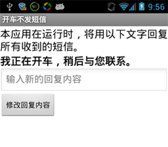
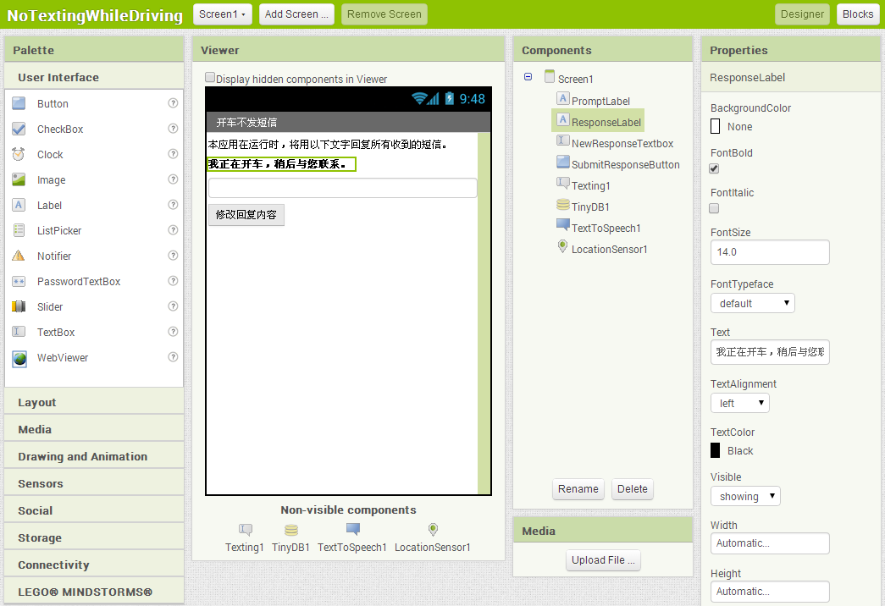
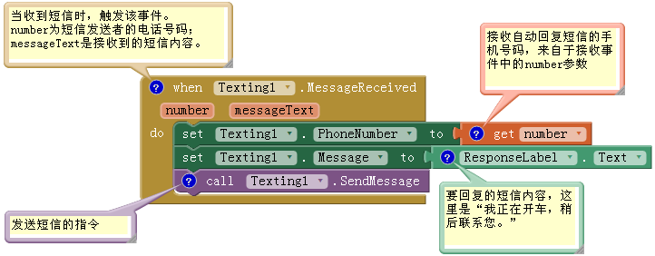
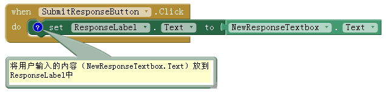
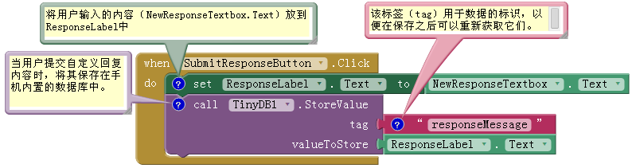
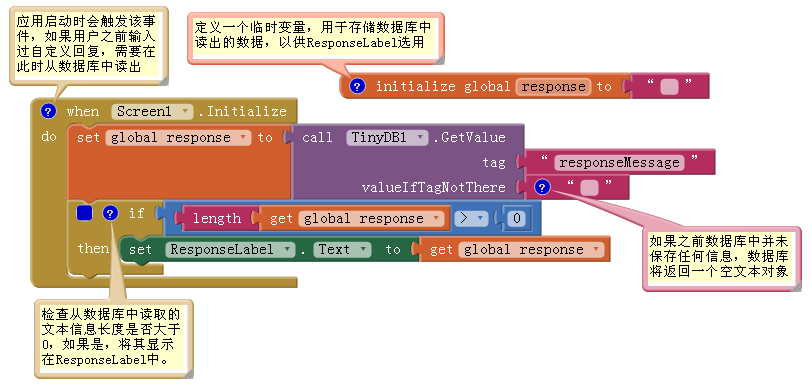
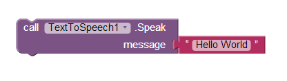
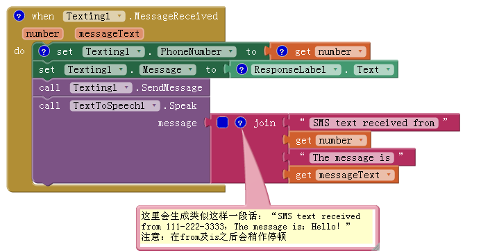
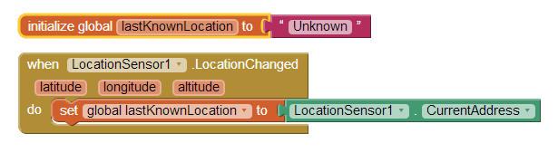
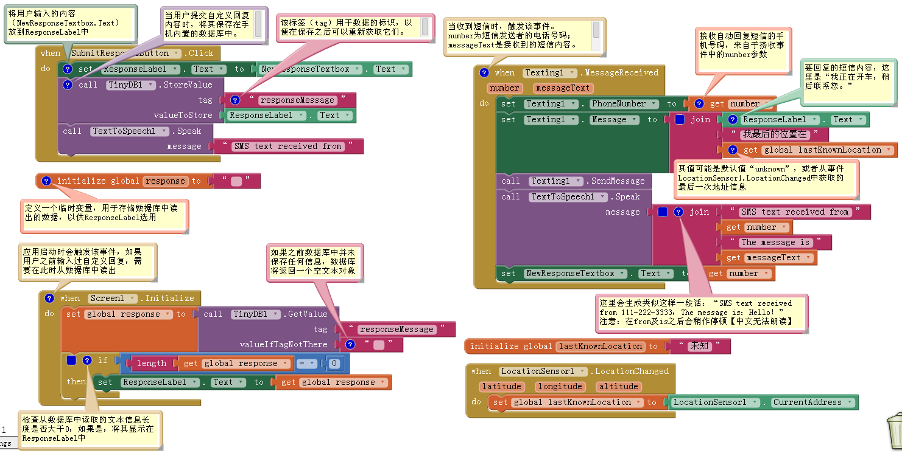

# 学习内容

相比前几章来说，这是一个更加复杂的应用，因此我们每次只完成一项功能，从自动回复开始。以下是将要学习的内容：

* Texting组件：具有收发短信功能；
* TextBox组件：用于提交自定义回复信息（需要与Button组件配合使用）；
* TinyDB数据库组件：用于保存自定义信息，即使应用已经关闭，信息也不会丢失；
* Screen.Initialize事件：在应用启动时加载自定义回复内容；
* Text-to-Speech组件：用于大声朗读文字；
* LocationSensor组件：报告司机的当前位置。
# 准备开始

 
本应用的运行，需要手机上Text-To-Speech（TTS）模块的支持。该模块包含在Android 2或更高的版本中，如果你的操作系统是Android 1.x，需要从Google Play下载。在手机上：

1.   打开Google Play应用；
2.  搜索TTS；
3.  选择应用Text-To-Speech Extended并安装。

TTS模块安装后，可以测试其功能。对于Android2以上版本，在”设置->辅助功能”中打开“文字转换语音输出”功能，根据需要设置默认语言及语速，然后选择“收听示例”。如果没听到任何声音，请确认手机音量已调高；还可以更改TTS引擎默认属性设置，来改变声音效果。 TTS模块设置完成后，登陆App Inventor网站开始新项目“NoTextingWhileDriving”（项目名中不能有空格），然后设置屏幕的标题为“开车不发短信”，最后通过WiFi与测试手机（AI伴侣）连接。

# 设计组件

应用的用户界面很简单：一个显示自动回复内容的Label，一个编辑自动回复信息的文本输入框和一个提交输入结果的按钮。还需要拖入一个Texting组件、一个TinyDB组件、一个TextToSpeech组件以及一个LocationSensor组件，这些组件都将出现在“不可视组件”区。你可以在图4-2中看到上述组件在设计器中的截图。

图4-2 组件设计器中的“开车不发短信”应用
将表4-1中列出的组件拖到预览窗口中，创建出图4-2中所示的用户界面。

表4-1 “开车不发短信”应用中的全部组件

| 组件类型	| 面板中分组 |	命名	| 作用 |
| ------- | :-------: | :-------: | -------: |
| Label	| UserInterface |	PromptLabel | 让用户了解应用的功能 |
| Label	| User Interface	| ResponseLabel	| 显示即将发送的自动回复信息
| TextBox	| User Interface	| NewResponseTextbox	| 用户在此处输入定制的回复信息 |
| Button	| User Interface	| SubmitResponseButton	| 用户点击来提交、保存回复信息 |
| Texting	| Social	| Texting1	| 处理短信事务 |
| TinyDB	Storage	| TinyDB1	| 将自动回复信息保存在数据库中 |
| TextToSpeech |	Media	| TextToSpeech1	| 大声朗读来信 |
| LocationSensor |	Sensors |	LocationSensor1 |	感知电话所在位置 |
按照以下方式设置组件属性：

* 设置PromptLabel的Text属性为“当本应用正在运行时，将用下面的文字来回复所有收到的短信。”
* 设置ResponseLabel的Text属性为“我正在开车，稍后与您联系。”并勾选FontBold（粗体字）属性；
* 设置NewResponseTextbox的Text属性为“”（让文本框为空，等待用户输入）；
* 设置NewResponseTextbox的Hint（提示）属性为“输入新的回复内容”，Width设为“Fill Parent”；
* 设置SubmitResponseButton的Text属性为“修改回复内容。”
# 为组件添加行为

从基本的自动回复行开始，再逐步添加更多功能。

# 编程实现自动回复

自动回复功能需要用到App Inventor的Texting组件，可以把它想象成一个藏在手机里的小矮人，它知晓如何收发短信。该组件用Texting.MessageReceived事件块来响应“收到短信”，拖出该事件块，并在块内放入一些命令块，看看当你收到短信时，会发生什么事情。这里我们希望能够自动回复预先编辑好的内容。 发送短信的操作需要调用Texting1.SendMessage块，将其放在Texting1.MessageReceived块内。Texting1.SendMessage块只能发送短信，至于要发什么内容，以及发给谁，需要在调用之前，由你来告诉它：表4-2列出了自动回复行为所需要的块，而图4-3显示了它们在块编辑器中的样子。

表4-2 自动回复短信所需要的块

| 块的类型	| 所在抽屉	| 功能 |
|-------|:-------|:-------|
|Texting1.MessageReceived	| Texting	| 手机收到短信时会启动该事件的处理程序 |
| set Texting1.PhoneNumber | to	Texting	| 在发送短信前设置接收者电话号码 |
| get number	| Variables	| 获取短信发送者的电话号码 |
| set Texting.Message to	| Texting	| 设置要发送的短信内容 |
| ResponseLabel.Text	| ResponseLabel	| 用户预输入的短信内容 |
| call Texting1.SendMessage	| Texting	|发送短信 |

图4-3 对收到的短信进行自动回复
# 块是作用

手机收到短信将触发Texting1.MessageReceived事件。如图4-3所示，发送者的手机号保存在参数number中，短信内容保存在参数messageText中。自动回复就是要向发送者发送一条短信，为此要先设置Texting组件的两个关键属性：PhoneNumber及Message。PhoneNumber设置为发送者的手机号，Message设置为ResponseLabel中显示的内容：“我正在开车，稍后与您联系。”设置完成之后，调用Texting. SendMessage实现自动回复。 注释是编程工作的重要组成部分，它可以告诉其他程序员那些与代码有关的重要信息。在块上单击右键，在快捷菜单中选择“Add Comment”（添加注释），此时块的左上方会出现蓝色问号，点击蓝色问号，会弹出文本输入框，可供输入注释信息；点击蓝色问号还可以隐藏注释信息。注释在应用中不是必须的，这里添加注释是为了介绍每个块的功能。 很多人用注释来记录创建应用的过程；注释可以解释程序的功能，但不会改变程序的行为。无论是你自己今后要修改程序，还是其他人要对程序做个性化设置，注释都是非常重要的。“没有不变的软件”已经成为共识，因此，代码的注释是软件工程中非常重要的环节，尤其像App Inventor这样的开源软件。

 

测试： 需要用第二部手机来测试程序。如果没有，可以注册申请Google Voice或其他类似的服务，并从注册的服务中给你的手机发送短信。用第二部手机给正在运行本应用的手机发短信，第二部手机是否收到了回信？
# 输入一个定制的回复

下面来添加更多的程序块，允许用户输入自定义的回复内容。在组件设计器中，已经添加了名为NewResponseTextbox的TextBox组件，用于输入自定义回复信息，当用户点击SubmitResponseButton时，NewResponseTextbox中的内容被复制到ResponseLabel中，这就是自动回复短信的内容。表4-3列出了在ResponseLabel中显示新的回复内容所需的块。

表4-3 显示自定义回复所需的块

| 块的类型	| 所在抽屉	| 功能 |
|-----|:-----|:-----|
| SubmitResponseButton.Click	| SubmitResponseButton	| 点击按钮提交新的回复信息 |
| set ResponseLabel.Text to	| ResponseLabel	| 为该Label设置新的文本内容 |
| NewResponseTextbox.Text	| NewResponseTextbox	| 用户在这里输入新的回复内容 |
# 块的作用

一个典型的输入表单 的作用是：首先在文本框中输入文字，然后单击提交按钮来通知系统做处理。图4-4显示了用户点击“修改回复内容”按钮时， SubmitResponseButton.Click事件被触发。

图4-4 将用户输入的信息设置为自动回复内容
事件处理程序将用户在NewResponseTextbox中输入的文字复制到ResponseLabel中，而ResponseLabel保存的是自动回复信息，因此要确保新输入的信息显示在ResponseLabel中。

测试：输入一段自定义信息并提交，然后用第二部手机发送短信到测试手机上，看看这次自动回复的是新定制的内容吗？
将定制回复保存到数据库中

你创建了一个伟大的应用，却留下了一个陷阱：用户输入了定制回复，然后关闭应用，当再次启动应用时，定制回复却不见了（取而代之的是默认回复）。这种状况可不是用户所期望的，他们希望在重启应用时，定制的内容还在，为此需要信息的永久保存。 你可能认为数据放在ResponseLabel组件的Text属性中，也应该算作“储存”，但实际上组件属性中的数据是临时数据，就像人的短时记忆，只要应用关闭，数据就会被“忘记”。如果希望应用能永久记住某些数据，就需要将数据从短时记忆（组件的属性或变量）转移到永久记忆中（数据库）。 要永久地保存数据，需要使用TinyDB组件，它可以将数据存储在Android设备内置的数据库中。TinyDB提供两个功能： StoreValue（保存值）和getValue（获取值）。前者允许应用将信息存储在设备数据库中，而后者则允许应用重新读取已存储的信息。 对于多数应用，可以采取如下策略：

每当用户提交新值，将其存储到数据库；
应用启动时，从数据库中加载数据并将其赋给一个变量或属性。
为了实现数据的永久保存，必须修改SubmitResponseButton.Click事件处理程序，表4-4中列出了所需要的程序块。

表4-4 用TinyDB数据库存储定制回复所需要的块

| 块的类型	| 所在抽屉	| 功能 |
|-----|:-----|:-----|
| TinyDB1.StoreValue	| TinyDB1	| 将用户的定制信息保存在手机内置的数据库中 |
| "responseMessage"	| Text	| 以此作为保存数据的标签 |
| ResponseLabel.Text	| ResponseLabel	| 已设定的回复信息显示在这里 | 
# 块的作用

TinyDB从ResponseLabel的Text属性中提取内容，并将其保存在数据库中。如图4-5所示，向数据库中保存数据时，要为数据设置一个tag（标签），本例中的tag是“responseMessage”。可以把tag想象成数据在数据库中的存放地址，是数据的唯一标识。在下节中你将看到，必须使用相同的tag（“responseMessage”）才能将数据从数据库中读取出来。

图4-5 永久保存自定义回复信息
# 应用启动时读取定制信息

将定制回复信息保存在数据库中，以便用户再次启动应用时，保存的数据可以被重新读取出来。App Inventor提供了一个特殊的事件块：Screen1.Initialize，当应用启动时，将触发该事件（我们在第3章MoleMash中使用过）。将Screen.Initialize块拖出来，并将某些程序块放在其中，那么这些程序块会在应用启动时逐一执行。 在本应用中，Screen1.Initialize事件的处理程序会检查数据库中是否存放了自定义回复内容。如果是，则使用TinyDB.GetValue函数加载存储的内容。实现这一功能所需的块见表4-5。

表4-5 应用启动时用于加载数据的块

| 组件类型	| 所在抽屉	| 作用 |
|-------|:-------|:-------|
| Initialize global response to| 	Variables	| 用于存放数据库中读出的定制回复信息 |
| “” |	Text	| 变量的初始值可以是任意值 |
| Screen1.Initialize	| Screen1	| 应用启动时会触发该事件 |
| set global response to	| Variables	| 用从数据库中读出的值为该变量赋值 |
| TinyDB1.GetValue	| TinyDB1	| 从数据库中读取已存储的定制回复信息 |
| “responseMessage”	| Text	| 插入TinyDB.GetValue的tag插槽，与之前TinyDB.StoreValue使用相同文本 |
| If	| Control	| 判断读出的数据中是否包含文字 |
| >	| Math	| 检查读出的数据长度是否大于0 |
| Length(text)	| Text	| 检查文本类型数据的长度 |
| get global response	| Variables	| 从变量中读出的数据（定制回复信息） |
| 数字0 |	Math	| 用于比较长度 |
| set ResponseLabel.Text to	| ResponseLabel |	如果读出的数据有内容，放在label中 |
| get global response	 | Variables	| 从变量中读出的数据（定制回复信息）|
# 块的功能

如图4-6所示，要想理解这些块的功能，必须设想用户的使用过程：首次打开应用，输入自定义回复，随时退出并再次打开应用。用户首次启动应用时，数据库中没有定制回复可供加载，因此ResponseLabel中显示的是默认回复。再次启动时，才有可能从数据库中加载定制回复，并将其显示在ResponseLabel中。

图4-6 应用启动时从数据库中加载定制回复
应用启动时触发Screen1.Initialize事件，并用tag “responseMessage”来调用TinyDB1.GetValue，该tag与之前用户存储定制回复时采用的tag相同。读出的值放在变量response中，并对其进行检验，然后才能在ResponseLabel中显示。想想看，为什么从数据库中读出的数据，在向用户显示之前，要经过检验呢？如果数据库中不存在与指定tag相对应的数据，TinyDB将返回空文本；而第一次启动应用时，数据是不存在的，直到用户输入了自定义回复，数据才会有。由于变量response中保存了数据库返回值，因此可以用if块来检查其长度是否大于0。如果大于0 ，说明的确从TinyDB读出了定制回复信息，就会将信息显示在ResponseLabel中；如果长度不大于0，说明之前没有保存过定制回复信息，因此将不修改ResponseLabel的显示内容（保留默认自动回复内容）。

测试：上述功能无法进行实时测试，因为每次连接“AI伴侣”启动应用时，数据库都会被清空。因此需要选择“build->App（provide QR code）”，然后扫描条码，将应用下载安装到手机上。安装之后，在NewResponseTextbox中输入新的回复信息并单击SubmitResponseButton按钮；关闭应用并重新启动它，这次定制回复信息出现了吗？
# 大声读出收到的短信

本节将修改应用：收到短信后，手机将大声朗读发送者的电话号码以及短信内容。开车收到短信，虽然有自动回复功能，但你还是禁不住想知道短信的内容。使用text-to-speech功能，就可以手不离方向盘而收听到短信的内容。 Android设备提供了text-to-speech功能，而App Inventor提供了一个TextToSpeech组件，它可以读出任何text（文本信息 ）（注意，此处“text”指的是一般意义上的字/word：一串字母、数字以及标点符号组成的文本，而不是短信文本 。） 在本章的“准备开始”部分，我们要求你从Android Market下载一个text-to-speech的模块。如果你还没做，现在该去做了。根据需要安装并配置完模块之后，就可以在App Inventor中使用TextToSpeech组件了。

图4-7 会说“Hello World”的块
TextToSpeech组件的使用非常简单，只需调用它的Speak函数并插入要朗读的文字即可。例如，图4-7中的函数会说“Hello World”。
在本应用中，朗读的内容则更为复杂，既要包含短信发送者的电话号码，也要包含短信内容，而不只是像“Hello World”那样的静态文本。这里要用到极为重要的join块，它可以将若干文本片段（或数字以及其他字符）连接成单一的文本对象。 在之前的Texting.MessageReceived事件处理程序中，加入对TextToSpeech.Speak的调用。在之前的事件处理程序中，通过适当设置Texting组件的PhoneNumber和Message属性，然后发送回复信息。现在需要加入表4-6中所列出的块来扩展该事件的处理程序。

表4-6 朗读收到的短信所需的块

| 块的类型	| 所在抽屉	| 功能 |
|------|:------|:------|
|TextToSpeech1.Speak	| TextToSpeech1	| 大声读出收到的短信 |
| join	| Text	| 连接生成将被朗读的文字 |
| “SMS text received from”	| Text	| 被读出的第一段话 |
| get number	| Variables |	获得短信发送者的电话号码 |
|  “. The message is”	| Text	| 在读完电话号码之后稍加停顿，然后说”The message is” |
| get messageText |	Variables |	获得收到的短信文本 |
# 块的功能

在自动回复动作完成之后，将调用TextToSpeech1.Speak函数，如图4-8的下半部分所示。你可以在TextToSpeech1.Speak函数的消息槽中插入任何文本对象。在这种情况下，join块用来生成被读出的内容。它将几段文字串连在一起，最后生成类似这样的信息：“SMS text received from 111-222-3333. The message is：hello.”

图4-8大声读出收到的短信

 

测试：你需要第二部手机来测试应用。用第二部手机发送文字【必须是英文】到你的测试手机上。你的手机大声读出信息了吗？它是否照常发送自动回复？
# 在回复中加入位置信息

像Facebook的Places以及Google的Latitude等类型的应用，都是利用GPS信息来帮助人们跟踪彼此的位置信息。这样的应用最令人担忧的是隐私问题，原因之一是它引发了人们对“老大哥”的恐惧，这里的“老大哥”指的是那些设法跟踪其公民下落的集权政府。但是使用位置信息的应用的确非常有用，试想一个迷路的小孩，或者那些在森林里迷路的徒步旅行者。 在“开车不发短信”的应用中，位置跟踪让回复的短信再多一点内容，而不只是“我正在开车”，回复的信息可以是这样的：“我正在北京东直门内大街209号开车”。对于那些正在等待朋友或家人到来的人来说，这些额外的信息非常有益。 App Inventor提供了LocationSensor（位置传感器）组件，作为手机的GPS （Global Positioning System全球定位系统）功能的接口。除了纬度和经度信息，LocationSensor也可以接入到谷歌地图，为司机提供当前位置的地址信息。 值得注意的是，LocationSensor并不总在读取信息，因此务必要恰当地使用这一组件。具体地讲，应用只对LocationSensor.LocationChanged事件做出响应，而两种情况会触发LocationChanged事件：①当手机的位置传感器第一次收到位置信息时；②随着手机的移动，产生新的位置信息时。使用表4-7中列出的块，具体方法是：当LocationChanged事件触发时，将当前地址信息保存到变量lastKnownLocation中，再将变量值插入到自动回复信息中。

表4-7设置位置传感器的块

| 块的类型	| 所在抽屉	| 功能 |
|------|:------|:------|
| Initialize global lastKnownLocation to	| Variables	| 创建一个变量来保存最后读取的地址信息 |
| “未知”	| Text	| lastKnownLocation的默认值 |
| LocationSensor1.LocationChanged |	LocationSensor1	| 位置传感器第一次读到位置信息，或每次位置信息变化时触发该事件 |
| set global lastKnownLocation to |	Variables	| 设置变量值，稍后会用到 |
| LocationSensor1.CurrentAddress	| LocationSensor1	| 当前地址信息，如：”北京市东城区东直门内大街209号” |

图4-9每当传感器收到GPS位置信息时，用变量记录手机的位置
# 块的功能

当位置传感器首次读取位置信息时，LocationSensor1.LocationChanged事件被触发，随着设备的移动，还会生成新的位置信息，事件将被再次触发。由于自动回复信息中要包括地址信息，因此，通过调用LocationSensor1.CurrentAddress函数 来获取地址信息，并将其保存在lastKnownLocation变量中，如图4-9所示。在后台，这个函数会调用谷歌地图（通过API 来调用，将在第24章学到），并根据传感器获得的经纬度信息来确定最近的街区地址。 注意，这些块只完成了一半的工作，还要将位置信息插入自动回复信息中，再回复给发件人。

发送带有位置信息的回复

用变量lastKnownLocation中的值对Texting1.MessageReceived事件处理程序加以修改，向自动回复信息中添加位置信息。表4-8列出了所需要的块。

表4-8在自动回复中显示位置信息的块

| 块的类型	| 所在抽屉	| 功能 | 
|-----|:-----|:-----|
| join	| Text	| 多段文本的连接器 |
| ResponseLabel.Text |	ResponseLabel |	不包含位置信息的定制回复信息 |
| “我最后的位置在：”	| Text	| 原定制信息之后的位置信息提示词 |
| global lastKnownLocation	| Variables	| 地址信息，如：“北京市东城区东直门内大街209号” |
# 块的功能

向回复中添加位置信息需要LocationSensor1.LocationChanged事件与变量lastKnownLocation的协作。如图4-10所示，并非直接发送ResponseLabel.Text中的信息，而是使用join块将若干段信息整合起来：原有的自动回复信息+“ 我的最后位置在：”+变量lastKnownLocation。

图4-10 在回复信息中加入位置信息
变量lastKnownLocation的默认值是“未知”，所以如果位置传感器尚未产生位置信息，则自动回复的第二部分内容为“我的最后位置在：未知”。如果已经产生了位置信息，则自动回复的第二部分内容有可能是这样：“我的最后位置在：北京市东城区东直门内大街209号”

测试：用第二部手机发送短信到运行应用的手机上，第二个手机是否接收到了带有位置信息的自动回复？如果没有，请确保你已经开启了第一部手机的GPS定位功能。
# 完整的应用：开车不发短信

图4-11中显示了“开车不发短信”最终的块的配置

图4-11 完整的“开车不发短信”应用（同时显示所有注释）
# 改进

当应用已经付诸使用，你也许会想到做一些改进，例如：

* 编写另一个版本，允许用户针对某些特定来信号码定制回复内容。你需要增加一个条件(if)块，来检查这些来信的手机号。有关条件块（if）的更多信息，请参见第18章；
* 再编写一个版本，根据用户是否在某个纬度/经度范围内，来回复定制信息。这样，如果应用判断你在房间222，它会回复“鲍勃在222房间，现在不能回复短信。”有关LocationSensor以及确定边界的更多信息，请参见第23章；
* 另一个版本，当短信发送者的手机号码在某个“通知”列表中时，发出提醒铃声。关于如何使用列表，请参阅第19章。
# 小结

下面是本章涉及到的一些概念：

* Texting组件：既可以用来发短信，也可以处理收到的信息。在调用Texting.SendMessage之前，需要为Texting组件设置PhoneNumber及Message属性。为了回复收到的短信，需要为Texting.MessageReceived事件编写处理程序；
* TinyDB组件：用于将信息永久存储在手机数据库中，以便每次应用启动时都可以加载保存过的数据。有关TinyDB的更多信息，请参见第22章；
* TextToSpeech组件：对于所提供的任何文本对象，都可以大声朗读出来（限英文）；
* join块：用于将若干片段的文字拼凑（或连接）成单一的文本对象中；
* LocationSensor组件：可以报告手机的纬度、经度及当前的街道地址。为了确认它是否收到了位置信息，可以访问LocationSensor.LocationChanged事件处理程序中的相关参数。该事件在第一次收到位置信息时被触发，并在每次位置信息更新后被再次触发。有关LocationSensor的更多信息，请参见第23章。

如果你想对短信处理应用做进一步探索，请参考第11章的Broadcast Hub（广播中心）应用。  

# 附录

## 背景知识

Text-To-Speech 缩写为TTS,直译为“从文本到语音”，是语音合成技术的一种应用，可以将文字信息实时转换为语音。在本章中使用了Android设备的此项功能，但遗憾的是，目前Google的TTS引擎尚不支持中文的转换，因此学员测试时还需使用英文。

# 英汉对照

* text: 文本[名词]
* text: 发短信[动词]
* initialize: 初始化
* location: 位置
* sensor: 传感器
* tiny: 微小的
* DB: database数据库
* social: 社交的
* storage: 存储
* prompt: 提示
* response: 响应
* receive: 接收
* submit: 提交
* hint: 提示
* variable: 变量
* phone: 电话
* number: 数字,号码
* call: 调用,呼叫
* message: 消息
* send: 发送
* add: 增加
* comment: 注释,评论
* voice: 声音
* store: 存放
* value: 值
* tag: 标签
* global: 全球的,全局的
* control: 控制
* math: 数学
* length: 长度
* provide: 提供
* code: 编码
* GPS: 全球定位系统(Global Positioning System)
* change: 改变
* last: 最后的
* current: 当前的,现在的
# 资源下载

NoTexting.aia NoTexting.apk
